# On-premises VPN Gateway Configuration Examples

Your on-premises VPN gateway connects with the IBM VPN gateway. You may need to modify the configuration of the on-premises gateway that you are using. 

* [Configuring IBM VPN with strongSwan](onpremises_gateway.html#strongswan)
* [Configuring IBM VPN with Vyatta](onpremises_gateway.html#vyatta)
* [Configuring IBM VPN with SoftLayer Gateway Appliance Service (GaaS)](onpremises_gateway.html#gaas)
* [Configuring IBM VPN with Cisco ASA](onpremises_gateway.html#cisco)

##Configuring IBM VPN with strongSwan
{: #strongswan} 

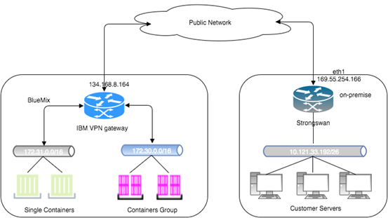

To use IBM VPN with strongSwan, configure as follows:

1. [Configure IBM VPN service](index.html#ibm-vpn).  
2. [Configure the gateway](index.html#gateway).  
3. [Configure site connection](index.html#site). Following is an example configuration.  
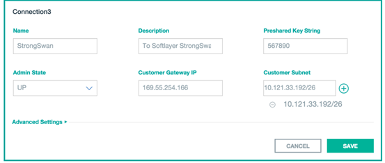
4. Configure strongSwan.  
	**Note:** The following example is based on Ubuntu 14.10.  
	1. Install strongSwan:  
		```
		root@rdmnm:~# sudo apt-get install strongswan  
		root@rdmnm:~# ipsec version  
		Linux strongSwan U5.1.2/K3.13.0-55-generic  
		Institute for Internet Technologies and Applications  
		University of Applied Sciences Rapperswil, Switzerland  
		See 'ipsec --copyright' for copyright information.		
		```  
	2. Configure IPSec:  
		* Edit the file: **/etc/ipsec.conf**  
			```
			root@rdmnm:~# more /etc/ipsec.conf  
						
			config setup
					  
			conn %default  
			 ikelifetime=60m  
			 keylife=20m  
			 rekeymargin=3m  
			 keyingtries=1  
			 mobike=no  
			 keyexchange=ikev1  
			 dpdaction=clear  
			 dpddelay=2s  
			include /etc/ipsec.all.conf  
			```
				
		* Add the file: **/etc/ipsec.all.conf**  
			```
			root@rdmnm:~# more /etc/ipsec.all.conf  
							
			conn all  
			  auto=route  
			  esp=aes128-sha1-modp1024!  
			  ike=aes128-sha1-modp1024!  
			  right=%any  
			  left=169.55.254.166  
			  leftauth=psk  
			  rightauth=psk  
			  rightsubnet=172.31.0.0/16,172.30.0.0/16  
			  leftsubnet=192.168.3.0/24  
			  rightid=%any  
			  leftid=169.55.254.166  
			  ikelifetime=3600s  
			  aggressive=no  
			  keyexchange=ikev1  
			  lifetime=3600s  
			  dpddelay=30s  
			  dpdaction=hold  
			  dpdtimeout=120s  
			```
	
		* Edit file: **/etc/ipsec.secrets** 
 
			```  
			root@rdmnm:~# more   /etc/ipsec.secrets  
				  : PSK "567890"
			```

	3. Restart IPSec:

		```
		root@rdmnm:~# ipsec restart
		```  
	4. Verify configuration:
		* Run the following command on the strongswan server to verify IPSec status:

			```  
			root@rdmnm:~# ipsec status
			Security Associations (1 up, 0 connecting):
			         all[1914]: ESTABLISHED 48 minutes ago, 169.55.254.166[169.55.254.166]...134.168.8.164[134.168.8.164]
			         all{20}:  INSTALLED, TUNNEL, ESP in UDP SPIs: cb9c3056_i 1595f835_o
			         all{20}:   192.168.3.0/24 === 172.30.0.0/16 
			         all{19}:  INSTALLED, TUNNEL, ESP in UDP SPIs: c6e4ed78_i 8765e42d_o
			         all{19}:   192.168.3.0/24 === 172.31.0.0/16
			```

		* Verify IBM VPN IPSec connection status:

			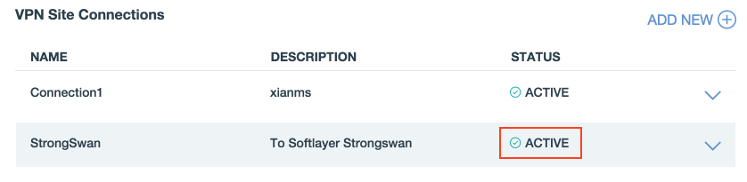

###Troubleshooting

Check the strongSwan syslog:

```
tail -f /var/log/syslog
Nov 25 08:03:40 rdmnm charon: 12[IKE] received draft-ietf-ipsec-nat-t-ike-03 vendor ID
Nov 25 08:03:40 rdmnm charon: 12[IKE] received draft-ietf-ipsec-nat-t-ike-02\n vendor ID
Nov 25 08:03:40 rdmnm charon: 12[IKE] received draft-ietf-ipsec-nat-t-ike-02 vendor ID
Nov 25 08:03:40 rdmnm charon: 12[IKE] received draft-ietf-ipsec-nat-t-ike-00 vendor ID
Nov 25 08:03:40 rdmnm charon: 12[IKE] 129.41.253.120 is initiating a Main Mode IKE_SA
```

##Configuring IBM VPN with Vyatta
{: #vyatta} 


1. [Configure IBM VPN service](index.html#ibm-vpn).
2. [Configure the gateway](index.html#gateway).
3. [Configure site connection](index.html#site). Following is an example configuration.  
	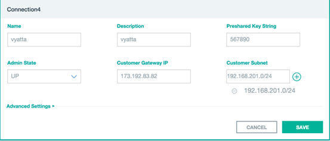
4. Configure Vyatta.  

	1. Use SSH to login to the Vyatta appliance:  
		```
		ssh vyatta@173.192.83.82  
		vyatta@vpn:~$ show version  
		Version:      VSE6.7R7  
		Description:  Brocade Vyatta 5415 vRouter 6.7 R7  
		Copyright:    2006-2015 Vyatta, Inc.  
		Built by:     autobuild@vyatta.com  
		Built on:     Thu Mar 26 23:12:48 UTC 2015  
		Build ID:     1503262314-56309bf  
		System type:  Intel 64bit  
		Boot via:     image  
		HW model:     X9SCI/X9SCA  
		HW S/N:       0123456789  
		HW UUID:      002590D2-A0A8-0607-0025-90D2A0A80E0F  
		Uptime:       20:12:17 up 2 days, 23:28,  2 users,  load average: 0.33, 0.27, 0.24  
		```  
	2. Enter configuration mode:  
		```
		vyatta@vyatta: configure
		vyatta@vyatta#
		```  
	3. Configure interface-bonding IP addresses:  
		```
		Set interface bonding bond0 address 192.168.201.2/24
		Set interface bonding bond1 address 173.192.83.82/29
		```  
	4. Enable VPN on bond1:  
		```
		set vpn ipsec ipsec-interfaces interface bond1
		```  
	5. Configure IKE group:  
		```
		set vpn ipsec ike-group bm-ike lifetime 28800  
		set vpn ipsec ike-group bm-ike proposal 1 dh-group 2  
		set vpn ipsec ike-group bm-ike proposal 1 encryption aes128  
		set vpn ipsec ike-group bm-ike proposal 1 hash sha1  
		```  
	6. Configure ESP group:  
		```
		set vpn ipsec esp-group bm-esp compression disable  
		set vpn ipsec esp-group bm-esp lifetime 3600  
		set vpn ipsec esp-group bm-esp mode tunnel  
		set vpn ipsec esp-group bm-esp pfs dh-group2  
		set vpn ipsec esp-group bm-esp proposal 2 encryption aes128  
		set vpn ipsec esp-group bm-esp proposal 2 hash sha1  
		```  
	7. Establish connection with the remote site:   
		```
		set vpn ipsec site-to-site peer 129.41.255.27 authentication id 173.192.83.82  
		set vpn ipsec site-to-site peer 129.41.255.27 authentication remote-id 129.41.255.27  
		set vpn ipsec site-to-site peer 129.41.255.27 authentication mode pre-shared-secret  
		set vpn ipsec site-to-site peer 129.41.255.27 authentication pre-shared-secret 567890  
		set vpn ipsec site-to-site peer 129.41.255.27 connection-type response  
		set vpn ipsec site-to-site peer 129.41.255.27 default-esp-group bm-esp  
		set vpn ipsec site-to-site peer 129.41.255.27 ike-group bm-ike  
		set vpn ipsec site-to-site peer 129.41.255.27 local-address any  
		set vpn ipsec site-to-site peer 129.41.255.27 tunnel 1 local prefix 192.168.201.0/24  
		set vpn ipsec site-to-site peer 129.41.255.27 tunnel 1 remote prefix 172.31.0.0/16  
		
		Where:  
			The 129.41.255.27 is the IBM cloud gateway;  
			The 172.31.0.0/16 is the container subnet behind IBM gateway.  
		```
	8. Commit and confirm the configuration:  
		```  
		vyatta@vpn# show vpn  
		 ipsec {
		     esp-group bm-esp {
		         compression disable
		         lifetime 3600
		         mode tunnel
		         pfs dh-group2
		         proposal 2 {
		             encryption aes128
		             hash sha1
		         }
		     }
		     ike-group bm-ike {
		         lifetime 28800
		         proposal 1 {
		             dh-group 2
		             encryption aes128
		             hash sha1
		         }
		     }
		     ipsec-interfaces {
		         interface bond1
		     }
		     nat-networks {
		     }
		     site-to-site {
		         peer 129.41.255.27 {
		             authentication {
		                 id 173.192.83.82
		                 mode pre-shared-secret
		                 pre-shared-secret 567890
		                 remote-id 129.41.255.27
		             }
		             connection-type initiate
		             default-esp-group bm-esp
		             ike-group bm-ike
		             local-address any
		             tunnel 1 {
		                 local {
		                     prefix 192.168.201.0/24
		                 }
		                 remote {
		                     prefix 172.31.0.0/16
		                 }
		             }
		         }
		     }
		 }
		[edit]
		
		vyatta@vpn# commit
		vyatta@vpn# confirm   
		```
	9. Verify the configuration:  
		```	
		vyatta@vpn:~$ show vpn  ipsec status  
		IPSec Process Running PID: 5633  
		  
		1 Active IPsec Tunnels  
		  
		IPsec Interfaces :  
		        bond1   (no IP on interface statically configured as local-ip for any VPN peer)  
		vyatta@vpn:~$ show vpn  ipsec policy  
		src 192.168.201.0/24 dst 172.31.0.0/16   
		        dir out priority 1891 ptype main  
		        tmpl src 173.192.83.82 dst 129.41.255.27  
		                proto esp reqid 16384 mode tunnel  
		src 172.31.0.0/16 dst 192.168.201.0/24  
		        dir fwd priority 1891 ptype main  
		        tmpl src 129.41.255.27 dst 173.192.83.82  
			                proto esp reqid 16384 mode tunnel  
		src 172.31.0.0/16 dst 192.168.201.0/24  
		        dir in priority 1891 ptype main   
		        tmpl src 129.41.255.27 dst 173.192.83.82  
		                proto esp reqid 16384 mode tunnel  
		src ::/0 dst ::/0  
		        socket out priority 0 ptype main  
		src ::/0 dst ::/0  
		        socket in priority 0 ptype main  
		src ::/0 dst ::/0  
		        socket out priority 0 ptype main  
		src ::/0 dst ::/0  
		        socket in priority 0 ptype main  
		src 0.0.0.0/0 dst 0.0.0.0/0  
		        socket out priority 0 ptype main  
		src 0.0.0.0/0 dst 0.0.0.0/0  
		        socket in priority 0 ptype main  
		src 0.0.0.0/0 dst 0.0.0.0/0  
		        socket out priority 0 ptype main  
		src 0.0.0.0/0 dst 0.0.0.0/0  
		        socket in priority 0 ptype main  
		src 0.0.0.0/0 dst 0.0.0.0/0  
		        socket out priority 0 ptype main  
		src 0.0.0.0/0 dst 0.0.0.0/0  
		        socket in priority 0 ptype main  
		src 0.0.0.0/0 dst 0.0.0.0/0  
		        socket out priority 0 ptype main  
		src 0.0.0.0/0 dst 0.0.0.0/0  
		        socket in priority 0 ptype main  
		src 0.0.0.0/0 dst 0.0.0.0/0  
		        socket out priority 0 ptype main  
		src 0.0.0.0/0 dst 0.0.0.0/0  
		        socket in priority 0 ptype main  
		src 0.0.0.0/0 dst 0.0.0.0/0  
		        socket out priority 0 ptype main  
		src 0.0.0.0/0 dst 0.0.0.0/0  
		        socket in priority 0 ptype main  
		src 0.0.0.0/0 dst 0.0.0.0/0  
		        socket out priority 0 ptype main  
		src 0.0.0.0/0 dst 0.0.0.0/0  
		        socket in priority 0 ptype main   
		vyatta@vpn:~$   
		vyatta@vpn:~$ show vpn ipsec sa   
		  
		Peer ID / IP							Local ID / IP               
		------------  							-------------
		129.41.255.27                           173.192.83.82                          
		  
		Tunnel  State  Bytes Out/In   Encrypt  Hash  NAT-T  A-Time  L-Time  Proto
		------  -----  -------------  -------  ----  -----  ------  ------  -----
		1       up     0.0/0.0        aes128   sha1  no     1359    3600    all  
		```  

	10. Check IBM VPN connection status:

	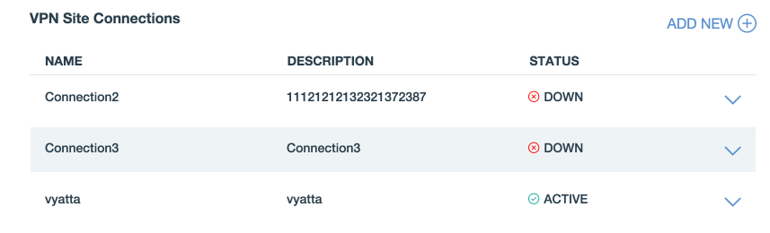

###Troubleshooting

Check Vyatta syslog:
		
```
vyatta@vpn# run show log vpn ipsec 
Nov 19 00:26:07 vpn pluto[5876]: failed to load pkcs11 module '/usr/lib/opensc-pkcs11.so'
Nov 19 00:26:07 vpn pluto[5876]: including NAT-Traversal patch (Version 0.6c) [disabled]
Nov 19 00:26:07 vpn pluto[5876]: loaded plugins: test-vectors curl ldap aes des sha1 sha2 md5 random x509 pkcs1 pgp dnskey pem openssl gmp hmac xauth attr kernel-netlink resolve 
Nov 19 00:26:07 vpn pluto[5876]: fe80::200:5eff:fe00:101
Nov 19 00:26:07 vpn pluto[5876]: 10.41.203.130
Nov 19 00:26:07 vpn pluto[5876]: bond0v1
Nov 19 00:26:07 vpn pluto[5876]: fe80::200:5eff:fe00:101
Nov 19 00:26:07 vpn pluto[5876]: 173.192.83.86
```

##Configuring IBM VPN with SoftLayer Gateway Appliance Service (GaaS)
{: #gaas} 


1. Configure SoftLayer GaaS:

	1. Open [https://gateway-as-a-service.com/gaas/ui/](https://gateway-as-a-service.com/gaas/ui/).  
	2. Login by using your SoftLayer account credentials.  
	3. Select **Manage Tunnels**.  
	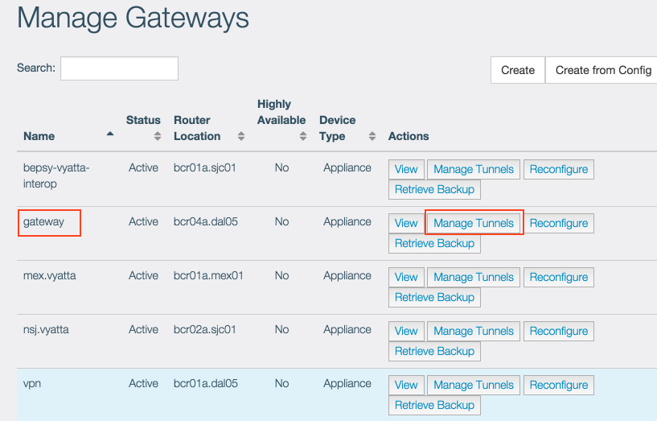  
	4. Select **Add Tunnel**.  
	  
	5. Do not change the default configuration. Select **Next**.  
	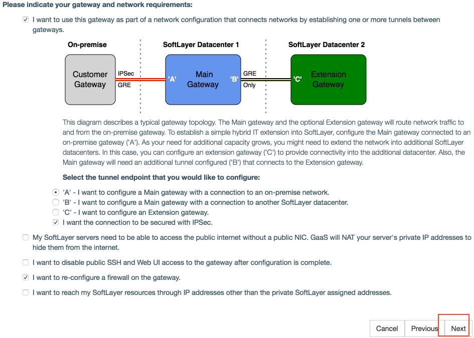  
	6. Select the private VLAN and select **Next**.  
	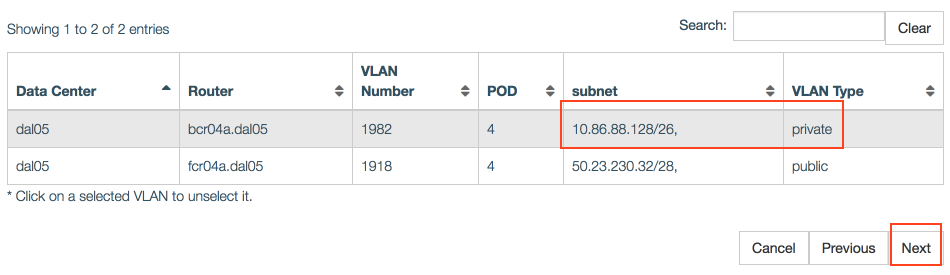  
	7. Edit the network configuration details as follows:  
		* Public IP address on on-premises gateway: Enter the IBM VPN gateway public IP address.  
		* On-premises Subnet: Enter the IBM VPN gateway subnet.  
		* Delete the GRE tunnel subnet address.   
		* Select **Advanced IPSec Configuration**. Configure as follows:  
			* IPSec Encryption: aes-128  
			* Diffie-Hellman group: 2  
			* ESP - Perfect Forward Security: Enable  
			* Pre-shared Secret: Enter the preshared secret key that you had used while configuring IBM VPN.  
		* Select **Next**.  
	8. Select the firewall. Select **Next**.  
	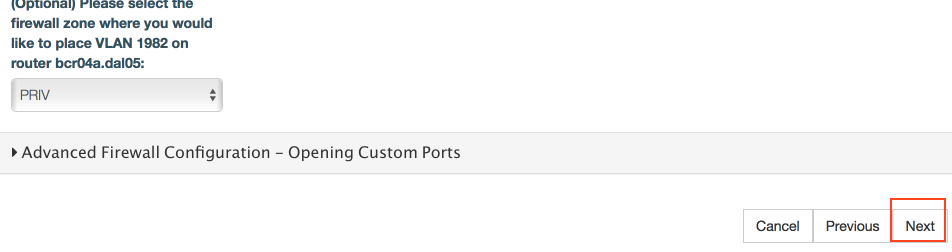
	9. Select the check box to agree with the gateway configuration overwrite.
	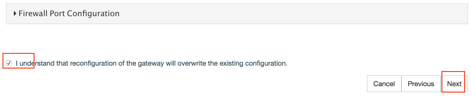  
	10. Select **Next**.  
	11. Select **Finish**.  
	12. Select **Details** to view the request status.  
	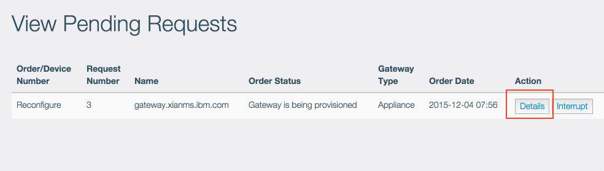  
	13. Wait until all parameters are configured.  
	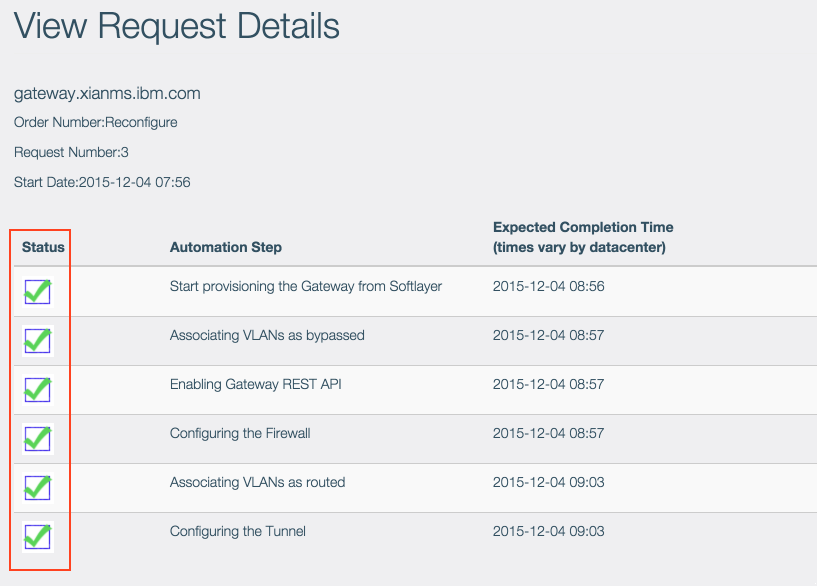

2. [Configure IBM VPN service](index.html#ibm-vpn).
3. [Configure the gateway](index.html#gateway).
4. [Configure site connection](index.html#site). Following is an example configuration.  
	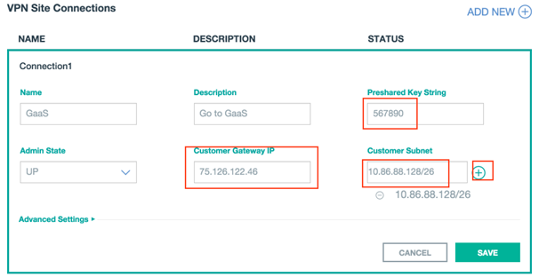
5. Verify the configuration.
	1. Run the following command on Vyatta to verify IPSec connection status:  
		```
		vyatta@gateway# run show vpn ipsec sa
		Peer ID / IP                            Local ID / IP               
		------------                            -------------
		134.168.0.224                           75.126.122.46                          
		
		    Tunnel  State  Bytes Out/In   Encrypt  Hash  NAT-T  A-Time  L-Time  Proto
		    ------  -----  -------------  -------  ----  -----  ------  ------  -----
		    1       up     0.0/0.0        aes128   sha1  yes    978     3600    all
		    2       up     0.0/0.0        aes128   sha1  yes    768     3600    all

		[edit]
		vyatta@gateway# run show vpn ipsec policy 
		src 10.86.88.128/26 dst 172.31.0.0/16 
		        dir out priority 1883 ptype main 
		        tmpl src 75.126.122.46 dst 134.168.0.224
		                proto esp reqid 16384 mode tunnel
		src 172.31.0.0/16 dst 10.86.88.128/26 
		        dir fwd priority 1883 ptype main 
		        tmpl src 134.168.0.224 dst 75.126.122.46
		                proto esp reqid 16384 mode tunnel
		src 172.31.0.0/16 dst 10.86.88.128/26 
		        dir in priority 1883 ptype main 
		        tmpl src 134.168.0.224 dst 75.126.122.46
		                proto esp reqid 16384 mode tunnel
		src 10.86.88.128/26 dst 172.30.0.0/16 
		        dir out priority 1883 ptype main 
		        tmpl src 75.126.122.46 dst 134.168.0.224
		                proto esp reqid 16388 mode tunnel
		src 172.30.0.0/16 dst 10.86.88.128/26 
		        dir fwd priority 1883 ptype main 
		        tmpl src 134.168.0.224 dst 75.126.122.46
		                proto esp reqid 16388 mode tunnel
		src 172.30.0.0/16 dst 10.86.88.128/26 
		        dir in priority 1883 ptype main 
		        tmpl src 134.168.0.224 dst 75.126.122.46
		                proto esp reqid 16388 mode tunnel
		src ::/0 dst ::/0 
		        socket out priority 0 ptype main 
		src ::/0 dst ::/0 
		        socket in priority 0 ptype main 
		src ::/0 dst ::/0 
		        socket out priority 0 ptype main 
		src ::/0 dst ::/0 
		        socket in priority 0 ptype main 
		src 0.0.0.0/0 dst 0.0.0.0/0 
		        socket out priority 0 ptype main 
		src 0.0.0.0/0 dst 0.0.0.0/0 
		        socket in priority 0 ptype main 
		src 0.0.0.0/0 dst 0.0.0.0/0 
		        socket out priority 0 ptype main 
		src 0.0.0.0/0 dst 0.0.0.0/0 
		        socket in priority 0 ptype main 
		src 0.0.0.0/0 dst 0.0.0.0/0 
		        socket out priority 0 ptype main 
		src 0.0.0.0/0 dst 0.0.0.0/0 
		        socket in priority 0 ptype main 
		src 0.0.0.0/0 dst 0.0.0.0/0 
		        socket out priority 0 ptype main 
		src 0.0.0.0/0 dst 0.0.0.0/0 
		        socket in priority 0 ptype main 
		src 0.0.0.0/0 dst 0.0.0.0/0 
		        socket out priority 0 ptype main 
		src 0.0.0.0/0 dst 0.0.0.0/0 
		        socket in priority 0 ptype main 
		src 0.0.0.0/0 dst 0.0.0.0/0 
		        socket out priority 0 ptype main 
		src 0.0.0.0/0 dst 0.0.0.0/0 
		        socket in priority 0 ptype main 
		src 0.0.0.0/0 dst 0.0.0.0/0 
		        socket out priority 0 ptype main 
		src 0.0.0.0/0 dst 0.0.0.0/0 
		        socket in priority 0 ptype main 
		src 0.0.0.0/0 dst 0.0.0.0/0 
		        socket out priority 0 ptype main 
		src 0.0.0.0/0 dst 0.0.0.0/0 
		        socket in priority 0 ptype main 
		src 0.0.0.0/0 dst 0.0.0.0/0 
		        socket out priority 0 ptype main 
		src 0.0.0.0/0 dst 0.0.0.0/0 
		        socket in priority 0 ptype main 
		src 0.0.0.0/0 dst 0.0.0.0/0 
		        socket out priority 0 ptype main 
		src 0.0.0.0/0 dst 0.0.0.0/0 
		        socket in priority 0 ptype main 
		src 0.0.0.0/0 dst 0.0.0.0/0 
		        socket out priority 0 ptype main 
		src 0.0.0.0/0 dst 0.0.0.0/0 
		        socket in priority 0 ptype main 
		src 0.0.0.0/0 dst 0.0.0.0/0 
		        socket out priority 0 ptype main 
		src 0.0.0.0/0 dst 0.0.0.0/0 
		        socket in priority 0 ptype main 
		src ::/0 dst ::/0 
		        socket in priority 0 ptype main 
		src ::/0 dst ::/0 
		        socket out priority 0 ptype main 
		src ::/0 dst ::/0 
		        socket in priority 0 ptype main 
		src ::/0 dst ::/0 
		        socket out priority 0 ptype main 
		src ::/0 dst ::/0 
		        socket in priority 0 ptype main 
		src ::/0 dst ::/0 
		        socket out priority 0 ptype main 
		src 0.0.0.0/0 dst 0.0.0.0/0 
		        socket in priority 0 ptype main 
		src 0.0.0.0/0 dst 0.0.0.0/0 
		        socket out priority 0 ptype main 
		src 0.0.0.0/0 dst 0.0.0.0/0 
		        socket in priority 0 ptype main 
		src 0.0.0.0/0 dst 0.0.0.0/0 
		        socket out priority 0 ptype main 
		src 0.0.0.0/0 dst 0.0.0.0/0 
		        socket in priority 0 ptype main 
		src 0.0.0.0/0 dst 0.0.0.0/0 
		        socket out priority 0 ptype main
		
		vyatta@gateway# run ping 172.31.0.1 interface 10.86.88.129
		PING 172.31.0.1 (172.31.0.1) from 10.86.88.129 : 56(84) bytes of data.
		64 bytes from 172.31.0.1: icmp_req=1 ttl=64 time=1.99 ms
		64 bytes from 172.31.0.1: icmp_req=2 ttl=64 time=1.79 ms
		^C
		--- 172.31.0.1 ping statistics ---
		2 packets transmitted, 2 received, 0% packet loss, time 1001ms
		rtt min/avg/max/mdev = 1.794/1.896/1.998/0.102 ms
		```
	2. Check the IPSec connection status on IBM VPN GUI:
	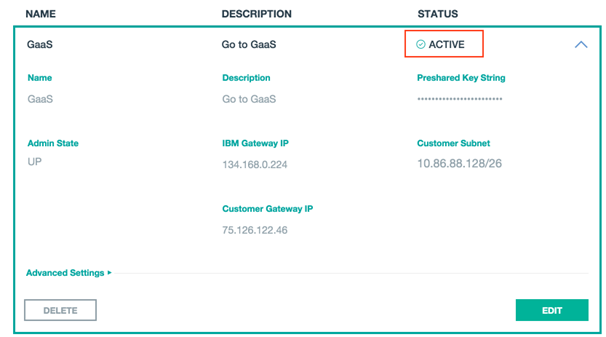

###Troubleshooting
Check Vyatta syslog:  

```
vyatta@gateway# tail -f /var/log/messages 
Dec  4 08:03:31 gateway pluto[24560]: "peer-134.168.0.224-tunnel-1" #1: Peer ID is ID_IPV4_ADDR: '134.168.0.224'
Dec  4 08:03:31 gateway pluto[24560]: "peer-134.168.0.224-tunnel-1" #1: ISAKMP SA established
Dec  4 08:03:31 gateway pluto[24560]: "peer-134.168.0.224-tunnel-2" #5: initiating Quick Mode PSK+ENCRYPT+TUNNEL+PFS+UP {using isakmp#1}
Dec  4 08:03:31 gateway pluto[24560]: "peer-134.168.0.224-tunnel-1" #6: initiating Quick Mode PSK+ENCRYPT+TUNNEL+PFS+UP {using isakmp#1}
Dec  4 08:03:31 gateway pluto[24560]: "peer-134.168.0.224-tunnel-2" #5: sent QI2, IPsec SA established {ESP=>0x03d9db46 <0xcb02ea03 NATOA=0.0.0.0}
Dec  4 08:03:31 gateway pluto[24560]: "peer-134.168.0.224-tunnel-1" #6: sent QI2, IPsec SA established {ESP=>0x21605ff5 <0xc69ae517 NATOA=0.0.0.0}
Dec  4 08:03:33 gateway Keepalived_vrrp: Warning: Failed to connect to the agentx master agent ([NIL]): 
Dec  4 08:04:34 gateway Keepalived_vrrp: last message repeated 9 times
Dec  4 08:05:34 gateway Keepalived_vrrp: last message repeated 8 times
Dec  4 08:06:34 gateway Keepalived_vrrp: last message repeated 8 times
```

##Configuring IBM VPN with Cisco ASA
{: #cisco}


1. [Configure IBM VPN service](index.html#ibm-vpn).
2. [Configure the gateway](index.html#gateway).
3. [Configure site connection](index.html#site).
4. Configure Cisco ASA. See the following configuration example.

		object network 10.2-network 
		 subnet 10.2.0.0 255.255.0.0
		http 10.2.0.0 255.255.0.0 inside
		ssh 10.2.0.0 255.255.0.0 inside
		
		interface Ethernet0/0
		 nameif outside
		 security-level 0
		 ip address 62.95.35.53 255.255.255.248 
		
		object network A_62.95.35.53 
		 host 62.95.35.53
		
		access-list out-in extended permit gre any host 62.95.35.53 
		access-list out-in extended permit tcp any host 62.95.35.53 eq pptp 
		access-list outside_1_cryptomap extended permit ip object 10.2-network 
		object network NETWORK_OBJ_172.31.0.0_16 
		 subnet 172.31.0.0 255.255.0.0
		object network Bluemix31 
		 subnet 172.31.0.0 255.255.0.0
		 description Bluemix 172.31.0.0 VPN 
		
		nat (inside,outside) source static 10.2-network 10.2-network destination static NETWORK_OBJ_172.31.0.0_16 NETWORK_OBJ_172.31.0.0_16
		nat (outside,inside) source static NETWORK_OBJ_172.31.0.0_16 NETWORK_OBJ_172.31.0.0_16 destination static 10.2-network 10.2-network
		
		crypto ipsec transform-set ESP-AES-256-MD5 esp-aes-256 esp-md5-hmac 
		crypto ipsec security-association lifetime seconds 28800
		crypto ipsec security-association lifetime kilobytes 4608000
		crypto map outside_map0 1 set transform-set ESP-AES-128-SHA
		crypto map outside_map 1 match address outside_1_cryptomap
		crypto map outside_map 1 set pfs group5
		crypto map outside_map 1 set peer 134.168.6.5 
		crypto map outside_map 1 set transform-set ESP-AES-128-SHA
		crypto map outside_map 1 set nat-t-disable
		crypto map outside_map interface outside
		crypto isakmp identity address
		crypto isakmp enable outside
		crypto isakmp policy 1
		 authentication pre-share
		 encryption aes
		 hash sha
		 group 1
		 lifetime 86400
		
		group-policy IPsec internal
		group-policy IPsec attributes
		 vpn-tunnel-protocol IPSec l2tp-ipsec 
		
		tunnel-group 134.168.6.5 type ipsec-l2l
		tunnel-group 134.168.6.5 general-attributes
		 default-group-policy IPsec
		tunnel-group 134.168.6.5 ipsec-attributes
		 pre-shared-key bluemix

