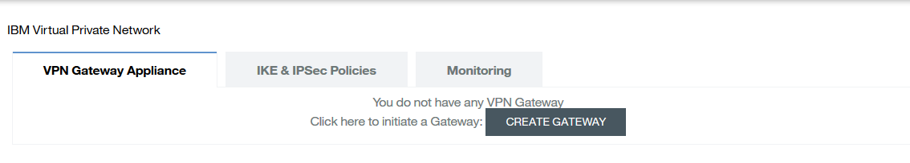

{:new_window: target="_blank"}
{:shortdesc: .shortdesc}
{:screen:.screen}
{:codeblock:.codeblock}

#Configuring your Communication Channel
{: #configure}  
*Last updated: 25 February 2016*

Start using IBM VPN by completing the following configurations.

## Configuring VPN Gateway
{: #gateway}

Complete these steps to select the IBM containers and configure a gateway. 

Select **CREATE GATEWAY**. A default gateway is created. If required, edit the gateway configuration as shown in the following steps.

1. Select **EDIT**.  
2. Specify the gateway name.  
2. Select the containers or groups with which you want to use the VPN service.  
3. Select **SAVE**.  

### Configuring IKE and IPSec Policies
{: #policies}

**Note:** You can use the default IKE and IPSec policies or configure custom policies. If you want to use the default policies, proceed to [Configuring Site Connection](vpn_configuring.html#site).

  
Select the **IKE & IPSec Policies** tab.

####Configure IKE Policy
{: #ike}

To configure IKE policy:

1. Select **ADD NEW**.  
2. Specify the following details:
	* **Name**: Name of the IKE policy
	* **Authorization Algorithm**: sha1; cannot be changed  
	* **Encryption Algorithm**: Select from drop-down. Values: aes-128 (default), aes-192, aes-256, 3des
	* **Key Lifetime**: Lifetime value (in seconds) of the IKE security association. Range: 60-86400. Default Value: 86400
	* **PFS**: Diffie-Hellman (DH) group identifier. Values: Group2, Group5, Group14. Default value: Group2
	* **Negotiation Mode**: Main; cannot be changed
	* **Version**: IKEV1; cannot be changed
3. Select **SAVE**.

####Configure IPSec Policy
{: #ipsec}

To configure IPSec policy:

1. Select **ADD NEW**.  
2. Specify the following details:
	* **Name**: Name of the IPSec policy  
	* **Authorization Algorithm**: sha1; cannot be changed  
	* **Encryption Algorithm**: Select from drop-down. Values: aes-128 (default), aes-192, aes-256, 3des
	* **Key Lifetime**: Lifetime value (in seconds) of the security association. Range: 60-86400. Default Value: 3600
	* **PFS**: Diffie-Hellman (DH) group identifier. Values: Group2, Group5, Group14. Default value: Group2
	* **Transform Protocol**: ESP; cannot be changed
	* **Encapsulation Mode**: Tunnel; cannot be changed
3. Select **SAVE**.  

## Configuring Site Connection
{: #site}

Provide the details to establish a connection between your data center or SoftLayer server, and the IBM cloud.

1. Select the **VPN Gateway Appliance** tab.
2. Select **ADD NEW** in the **VPN Site Connections** section.
3. Specify the following site connection details:  
	* **Name**: Name of the connection  
	* **Description**: Description of the connection (optional)  
	* **Preshared Key String**: Preshared (secret) key to be used for authentication
	* **Admin State**: Status of the VPN connection. Select from drop-down: UP or DOWN. Default value: UP  
	* **Customer Gateway IP**: Remote endpoint IP address of the VPN tunnel  
	* **Customer Subnet**: Remote subnet address in CIDR format. Select the plus sign to save the subnet details.
4. (Optional) Configure the following **Advanced Settings** parameters:  
	* **IKE Policy**: Select the IKE policy.  
	* **Keep Alive Interval**: Keepalive interval in seconds. Send keepalive messages at the configured interval to check liveliness of the peer. Default value: 15. Range: 5-86399
	* **Action on dead peer**: Action to be taken when the peer is detected as dead.  
	Values: 
		* hold (default value): the security association (SA) is put on hold 
		* clear: the SA is deleted
		* disabled: the SA is disabled
		* restart: the SA is renegotiated
		* restart-by-peer: all SAs with the dead peer are renegotiated  
	* **IPSec Policy**: Select the IPSec policy.
	* **Keep Alive Timeout**: Timeout value in seconds after which the session is terminated. Default value: 120. Range: 6-86400. The keep alive timeout value must be higher than the keep alive interval value.
5. Select **SAVE**.

**Note:** You will see a ***pending create*** message when the connection is being established. When you see this message, refresh the screen a few times to see the connection active message.

**Important:** If you are using a web application, you must bind the web application to the Docker container you are using. This binding is required for the traffic to pass through the IPSec VPN tunnel.
