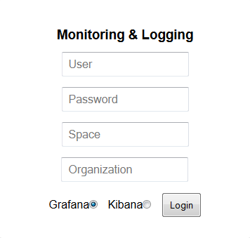
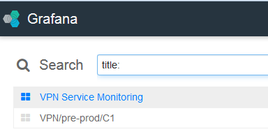

{:new_window: target="_blank"}
{:shortdesc: .shortdesc}
{:screen:.screen}
{:codeblock:.codeblock}

# Monitoring Status and Traffic Flow
{: #monitor}  
*Last updated: 23 February 2016*  

Use the monitoring feature to view the connection status and rate of traffic flow between your on-premises or SoftLayer server VPN gateway, and IBM VPN gateway. 
{:shortdesc}

##Monitoring on Service Dashboard
{: #dashboard}

Select the **Monitoring** tab to view the following connection statistics.

* **Connection Status:** Status of the VPN connection between your on-premises or SoftLayer server VPN gateway and IBM VPN gateway. Values: 1=UP, -1=DOWN 
* **Outbound Traffic Rate in bytes/second and packets/second:** Rate of traffic from IBM VPN gateway to your on-premises or SoftLayer server VPN gateway.  
* **Inbound Traffic Rate in bytes/second and packets/second:** Rate of traffic from your on-premises or SoftLayer server VPN gateway to IBM VPN gateway.  

The monitoring statistics are displayed as graphs with data from the last 48 hours. The graphs are automatically updated every 20 minutes. However, you can fetch the latest data any time by switching away from the monitoring tab and returning to it.

**Note:** The graphs use Coordinated Universal Time (UTC) time and not the local time.

##Monitoring on Logmet
{: #logmet}

Use [Logmet](https://logmet.{DomainName}) to view detailed connection statistics. 

1. Log in with your Bluemix credentials and the space and org name where you have created the IBM VPN service instance.  
	
2. Select the folder icon on the top right.
	
3. Select **VPN Service Monitoring** from the list of dashboards to view the graphs. The graphs use local time.  
	 

**Note:** You must select the **Monitoring** tab on the IBM VPN service dashboard at least once to send a query to Logmet to create the VPN service dashboard in Logmet. Logmet takes up to 10 minutes after you establish the VPN connection to show the connection statistics.

