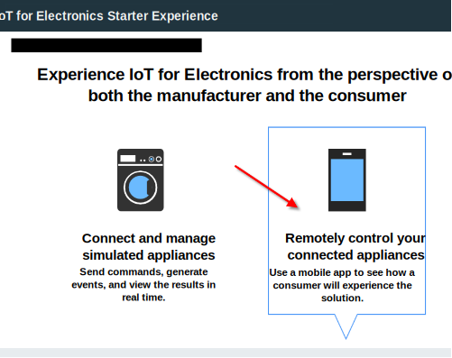
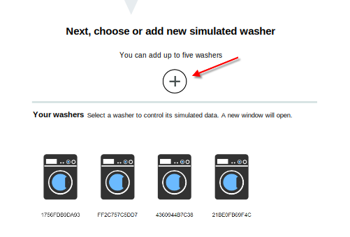
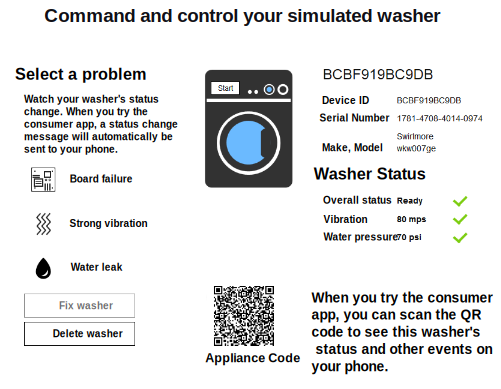

---

copyright:
  years: 2016, 2017
lastupdated: "2017-03-10"
---

<!-- Common attributes used in the template are defined as follows: -->
{:new_window: target="blank"}
{:shortdesc: .shortdesc}
{:screen: .screen}
{:codeblock: .codeblock}
{:pre: .pre}

# Using the starter app
Create simulated appliances in the {{site.data.keyword.iotelectronics_full}} starter app. Experience how an enterprise manufacturer can monitor appliances that are connected to the {{site.data.keyword.iot_short_notm}}. Manually interact with the simulated appliance to trigger alerts, notifications, and actions.
{:shortdesc}

## Opening the starter app
{: #iot4e_openApp}

1. In your {{site.data.keyword.Bluemix_notm}} dashboard, start your {{site.data.keyword.iotelectronics}} starter application by clicking the starter application tile.

    

2. Wait for the *Your app is running* status message in the header and then click **View App** to display the starter app.

    

## Creating simulated appliances
{: #create_sim}

In the starter app, you can create and control simulated appliances as the appliance manufacturer or as a consumer. Status and event data for these simulated appliances are stored and can be viewed in {{site.data.keyword.iot_full}}.

1. Select one of the following options:
    - **Connect and manage simulated appliances** to create simulated appliances as the appliance manufacturer
    - **Remotely control your connected appliances** to create simulated appliances and connect with the [sample mobile app](iotelectronics_config_mobile.html) as the appliance owner.

    

2. Scroll to the section that is labeled **Next, choose or add new simulated washer** and click the + icon. A new washer is created.

    

3. To view your washer details click a washer. In the command and control panel, start the washer or click the different types of failures to view status changes. You can also view the status changes and control the washer from your mobile app.

  

# Related Links
{: #rellinks}

## API documentation
{: #api}
* [{{site.data.keyword.iotelectronics}} API](http://ibmiotforelectronics.mybluemix.net/public/iot4eregistrationapi.html)
* [{{site.data.keyword.iot_short}} API](https://developer.ibm.com/iotfoundation/recipes/api-documentation/)

## Components
{: #general}

* [{{site.data.keyword.iotelectronics}} documentation](iotelectronics_overview.html)
* [{{site.data.keyword.iot_full}} documentation](https://console.ng.bluemix.net/docs/services/IoT/index.html)
*  [{{site.data.keyword.amashort}} documentation](https://console.ng.bluemix.net/docs/services/mobileaccess/overview.html)
* [{{site.data.keyword.sdk4nodefull}} documentation](https://console.ng.bluemix.net/docs/runtimes/nodejs/index.html#nodejs_runtime)

## Samples
{: #samples}
* [Sample mobile app](https://console.ng.bluemix.net/docs/starters/IotElectronics/iotelectronics_config_mobile.html)
