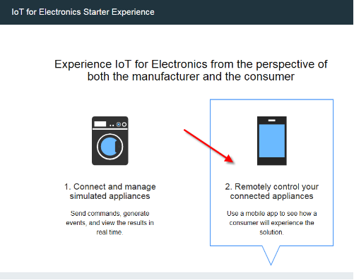
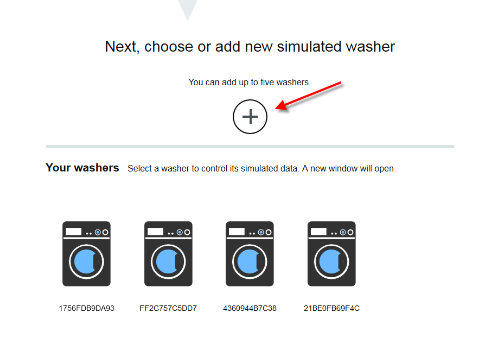
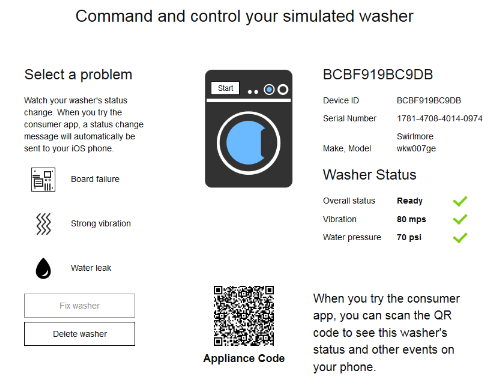

---

copyright:
  years: 2016

---

{:new_window: target="\_blank"}

{:shortdesc: .shortdesc}

# Using the starter app
*Last updated: 15 September 2016*
{: .last-updated}

Create simulated appliances in the {{site.data.keyword.iotelectronics_full}} starter app. Experience how an enterprise manufacturer can monitor appliances that are connected to the {{site.data.keyword.iot_short_notm}}. Manually interact with the simulated appliance to trigger alerts, notifications, and actions.
{:shortdesc}

## Opening the starter app
{: #iot4e_openAppMain}

Because the method of opening the starter app varies slightly depending on which version of the {{site.data.keyword.Bluemix_notm}} console you use, you should read the instructions for the appropriate version.

You can determine which version you are using by looking for the following options:
  - [New {{site.data.keyword.Bluemix_notm}}](#iot4e_openApp). If you are using the New {{site.data.keyword.Bluemix_notm}} experience, **Try the New Bluemix** is *not* displayed in the header section.
  - [Classic {{site.data.keyword.Bluemix_notm}}](#iot4e_openApp_c). If you are using the Classic {{site.data.keyword.Bluemix_notm}} experience, **Try the New Bluemix** appears in the heading section.  

**Tip:** To switch to the Classic {{site.data.keyword.Bluemix_notm}} experience, click your user name in the header section and then scroll down and click **Switch to Classic**. To switch to the New {{site.data.keyword.Bluemix_notm}} experience, click **Try the New Bluemix** in the header section.

### Opening the starter app in the New {{site.data.keyword.Bluemix_notm}} experience.
{: #iot4e_openApp}
1. In your {{site.data.keyword.Bluemix_notm}} dashboard, start your {{site.data.keyword.iotelectronics}} starter application by clicking the starter application tile.

    

2. Wait for the *Your app is running* status message in the header and then click **View App** to display the starter app.  

    

### Opening the starter app in the Classic {{site.data.keyword.Bluemix_notm}} experience.
{: #iot4e_openApp_c}

1. In your {{site.data.keyword.Bluemix_notm}} dashboard, start your {{site.data.keyword.iotelectronics}} starter application by clicking the starter application tile.

    

2. Wait for the *Your app is running* status message in the App Health section and then, in the main window, by the application name, click the **Routes** URL to display the starter app.  

    

## Creating simulated appliances
{: #iot4eCreateAppliances}

In the starter app, you can create and control simulated appliances as the appliance manufacturer or as a consumer. Status and event data for these simulated appliances are stored and can be viewed in {{site.data.keyword.iot_full}}.

1. Select one of the following options:
    - **Connect and manage simulated appliances** to create simulated appliances as the appliance manufacturer
    - **Remotely control your connected appliances** to create simulated appliances and connect with the [sample mobile app](iotelectronics_config_mobile.html) as the appliance owner.

    

2. Scroll to the section that is labeled **Next, choose or add new simulated washer** and click the + icon. A new washer is created.

    

3. To view your washer details, issue commands, and cause failures, click a washer.

  

# Related Links
{: #rellinks}

## API documentation
{: #api}
* [{{site.data.keyword.iotelectronics}} API](http://ibmiotforelectronics.mybluemix.net/public/iot4eregistrationapi.html)
* [{{site.data.keyword.iot_short}} API](https://developer.ibm.com/iotfoundation/recipes/api-documentation/)

## Components
{: #general}

* [{{site.data.keyword.iotelectronics}} documentation](iotelectronics_overview.html)
* [{{site.data.keyword.iot_full}} documentation](https://new-console.ng.bluemix.net/docs/services/IoT/index.html)
*  [{{site.data.keyword.amashort}} documentation](https://new-console.ng.bluemix.net/docs/services/mobileaccess/overview.html)
* [{{site.data.keyword.sdk4nodefull}} documentation](https://new-console.ng.bluemix.net/docs/runtimes/nodejs/index.html#nodejs_runtime)

## Samples
{: #samples}
* [Sample mobile app](https://new-console.ng.bluemix.net/docs/starters/IotElectronics/iotelectronics_config_mobile.html)
