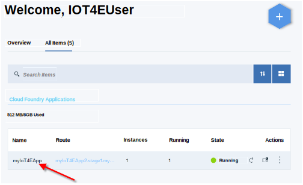

---

copyright:
  years: 2017
lastupdated: "2017-06-07"
---

<!-- Common attributes used in the template are defined as follows: -->
{:new_window: target="\_blank"}
{:shortdesc: .shortdesc}
{:screen: .screen}
{:codeblock: .codeblock}
{:pre: .pre}

# Configuring appliance registration
{: #config}

The {{site.data.keyword.iotelectronics_full}} starter supports customized validation and POST actions during appliance registration with Node-RED. Sample Node-RED flows are provided to help you get started.

The sample flows
  - run a pre-registration validation on an appliance.
  - issue a post-registration command to the appliance after successful registration.

{: shortdesc}

## Before you begin

Before you begin, you must deploy an instance of the {{site.data.keyword.iotelectronics}} in your {{site.data.keyword.Bluemix_notm}}  organization. Deploying an instance automatically deploys the component applications, services, and Node-RED sample registration flows. You must also [configure the {{site.data.keyword.iot_full}} dashboard](iotelectronics_notifications.html#iot4e_enabledashboard) to enable registration. applications, services, Node-RED sample notification flow, and sample rule.

## Viewing and customizing the sample Node-RED registration flows
{: #viewFlow}

You can edit the Node-RED sample flows to customize the validation criteria or to send different commands to your appliances. For more information about programming with Node-RED, see the [Node-RED documentation ](https://nodered.org/docs/){:new_window}.

Perform the following steps to access the Node-RED flow:

  1. In your {{site.data.keyword.Bluemix_notm}} dashboard, start your {{site.data.keyword.iotelectronics}} starter application by clicking the starter application.

    

  2. Wait for the *Your app is running* status message in the header and then click **View App** to display the starter app.

    

  3. In the browser, add `/red` to the end of the URL, for example, `https://mywebapp.mybluemix.net/red`. Node-RED is displayed.

  4. Click the **Pre-Registration Samples** tab to view the sample flows. Edit the nodes to customize the validation details or the commands that are sent to the registered appliance.

## Enabling the pre-registration and post-registration flows

To enable the registration flows:

  1. In your {{site.data.keyword.Bluemix_notm}} dashboard, open the {{site.data.keyword.iotelectronics}} service by clicking the service name. The Welcome page is displayed.

    **Tip:** The service name ends with `ibmiotforelectronics` and is described as *IoT for Electronics* in the Service Offering column.
  2. For pre-registration validation, in the Pre-Registration fields of the Configure Appliance Registration section, enter the following information:

    - **Method**: POST
    - **URL**: https://*mywebapp*.mybluemix.net/api/validate
    - **Username**: *no entry needed*
    - **Password**: *no entry needed*

  3. To send commands to an appliance after registration, in the Post-Registration fields of the Configure Appliance Registration section, enter the following information:

    - **Method**: POST
    - **URL**: https://*mywebapp*.mybluemix.net/api/sendCommand
    - **Username**: *no entry needed*
    - **Password**: *no entry needed*

  3. Click **Update** to save your entries.

## Understanding the validation and command flow nodes
{: #understandingNodes}

The sample validation and command flows are documented in the flow itself. Click the *Info* nodes to display full documentation. A brief summary of the information is provided in the following tables.

**Validation flow**

|Node| Description|
|-----|-----|
|Validate API  |  Creates a RESTful API that is used as a pre-registration action to validate appliance metadata.|
|Define validations |Specifies which appliance attributes to validate. When you are registering multiple appliances at the same time, specify generic attributes, such as Appliance Type or Model. When you you are registering a single appliance, you can use specific attributes to validate, such as serial number or appliance ID. |
|Send response | Sends the response to the Registration app, which performs the action that is defined in the **Define validations** node.|

**Command flow**

|Node| Description|
|-----|-----|
|Send Command API  |  Creates a RESTful API that is used as a post-registration action to send a command to the appliances after registration.|
|Define command | Specifies which command to send to the appliances that were successfully registered. |
|Send response |   Sends the response to the Registration app, which performs the action that is defined in the **Define command** node. |
