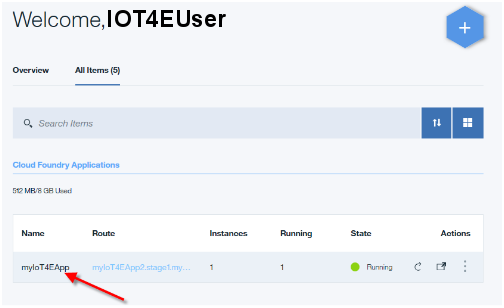
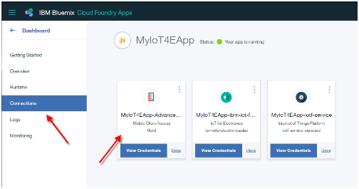
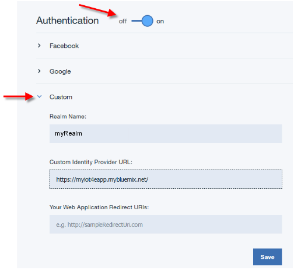

---

copyright:
  years: 2016

---

<!-- Common attributes used in the template are defined as follows: -->
{:new_window: target="\_blank"}
{:shortdesc: .shortdesc}
{:screen:.screen}
{:codeblock:.codeblock}

# Configuring mobile connectivity and security
{: #iot4e_configureMCA}

*Last updated: 19 September 2016*
{: .last-updated}

Enable mobile communications and security by configuring {{site.data.keyword.amafull}}. This task is required to use the sample mobile app and only needs to be performed once.
{:shortdesc}

## Before you begin

Before you begin, you must complete the following tasks:
  - Deploy an instance of the {{site.data.keyword.iotelectronics}} starter in your {{site.data.keyword.Bluemix_notm}}
 organization. Deploying an instance of the starter automatically deploys the component applications and services, including {{site.data.keyword.amafull}}.

  - Because the configuration process varies slightly depending on which version of the {{site.data.keyword.Bluemix_notm}} console you use, you should read the instructions for the appropriate version.

  You can determine which version you are using by looking for the following options:
    - [New {{site.data.keyword.Bluemix_notm}}](#configMCAnew). If you are using the New {{site.data.keyword.Bluemix_notm}} experience, the **Go to the Classic Experience** option appears in the heading section of the dashboard.
    - [Classic {{site.data.keyword.Bluemix_notm}}](#configMCAclassic). If you are using the Classic {{site.data.keyword.Bluemix_notm}} experience, the **Try the New Bluemix** option appears in the heading section.

## Configuring {{site.data.keyword.amashort}} in the New {{site.data.keyword.Bluemix_notm}} experience
{: #configMCAnew}

  1. If you just deployed the {{site.data.keyword.iotelectronics}} starter, the Getting Started tab of the starter app is displayed, and you should proceed to the next step of these instructions. If the starter app is not displayed, open your {{site.data.keyword.Bluemix_notm}} dashboard and start your {{site.data.keyword.iotelectronics}} starter application by clicking the starter application tile.

    

  2. On the **Connections** tab, click the {{site.data.keyword.amashort}} service to open it.

    

  3. On the **Setup Authentication** page, locate the URL of your {{site.data.keyword.iotelectronics}} starter app by clicking **Mobile options**. Copy the URL that is located in the **Route** field.

      

  4. In the **Custom section of the **Setup Authentication** page, click **Configure**.

         

  5. Enter the following authentication credentials, then click **Save**:
    - **Realm name**: Enter **myRealm**.
    - **Custom Identity Provider Url**: Enter the URL that you copied previously to identify your {{site.data.keyword.iotelectronics}} starter app in the following format: **https://<*myIoT4eStarterApp*>.mybluemix.net**
    - **Your Web Application Redirect URIs**: Leave this field blank.

        

  6. Return to the Connections tab of the {{site.data.keyword.iotelectronics}} starter console by clicking the name of the starter app, which is located in the heading section.

   

## Configuring {{site.data.keyword.amashort}} in the Classic {{site.data.keyword.Bluemix_notm}} experience
{: #configMCAclassic}

1. In your {{site.data.keyword.Bluemix_notm}} dashboard, start your {{site.data.keyword.iotelectronics}} starter application by clicking the starter application tile.

    

2. In your instance of {{site.data.keyword.iotelectronics}}, click the {{site.data.keyword.amashort}} service to open it.   

  

2. On the **Setup Authentication** page, locate the URL of your {{site.data.keyword.iotelectronics}} starter app by clicking **Mobile options**. Copy the URL that is located in the **Route** field.

    

3. In the **Custom section of the **Setup Authentication** page, click **Configure**.

   

4. Enter the following authentication credentials, then click **Save**:
   - **Realm name**: Enter **myRealm**.
   - **Custom Identity Provider Url**: Enter the URL that you copied previously to identify your {{site.data.keyword.iotelectronics}} starter app in the following format: **https://<*myIoT4eStarterApp*>.mybluemix.net**
   - **Your Web Application Redirect URIs**: Leave this field blank.

      

5. Return to the Connections tab of the {{site.data.keyword.iotelectronics}} starter console, as follows:
  1. Display the menu by clicking the double arrows beside **Back to the Dashboard** option in the heading section.
  2. Click **Overview** to return to the starter console.  

    
