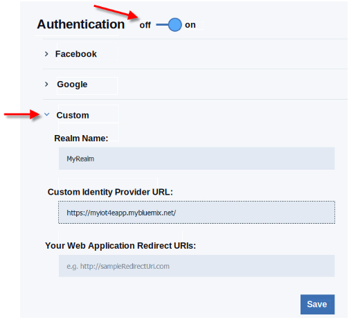

---

copyright:
  years: 2016, 2017
lastupdated: "2016-11-29"

---

<!-- Common attributes used in the template are defined as follows: -->
{:new_window: target="\_blank"}
{:shortdesc: .shortdesc}
{:screen:.screen}
{:codeblock:.codeblock}

# Configuring mobile connectivity and security
{: #iot4e_configureMCA}

Enable mobile communications and security by configuring {{site.data.keyword.amafull}}. This task is required to use the sample mobile app and only needs to be performed once.
{:shortdesc}

Before you begin, you must deploy an instance of the {{site.data.keyword.iotelectronics}} starter in your {{site.data.keyword.Bluemix_notm}}
 organization. Deploying an instance of the starter automatically deploys the component applications and services, including {{site.data.keyword.amafull}}.

1. In the {{site.data.keyword.Bluemix_notm}} dashboard, open the {{site.data.keyword.iotelectronics}} application.

   **Tip:** The application is located in the Applications section of your {{site.data.keyword.Bluemix_notm}} dashboard. Be sure to click the name and not the route.

    

2. Copy the URL of the {{site.data.keyword.iotelectronics}} web app by right-clicking **View App** and selecting **Copy Link Location**.

3. On the **Connections** tab, click the {{site.data.keyword.amashort}} service to open it.

3. On the {{site.data.keyword.amashort}} Authentication page, enable authentication by clicking **On**.

4. In the **Custom** section, enter the following authentication credentials:

    - **Realm name**: `myRealm`

    - **Custom Identity Provider Url**: Paste the URL of the API application that you copied in the first step in the following format:   **https://<*myIoT4eStarterApp*>.mybluemix.net**.

    **Important:** Be sure that the URL uses the secure protocol `https` even if the value that you copied uses `http`.

    - **Your Web Application Redirect URIs**: Leave this field blank.

   

5. Save your settings. You can now return to the {{site.data.keyword.iotelectronics}} service console or your {{site.data.keyword.Bluemix_notm}} console.
