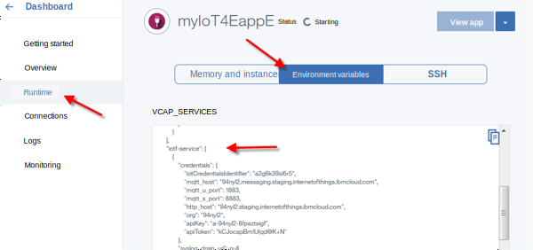
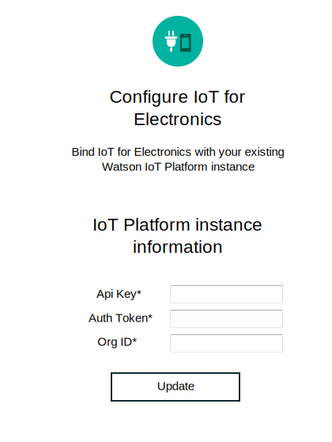

---

copyright:
  years: 2016, 2017
lastupdated: "2017-05-30"
---

<!-- Common attributes used in the template are defined as follows: -->
{:new_window: target="\_blank"}
{:shortdesc: .shortdesc}
{:screen: .screen}
{:codeblock: .codeblock}
{:pre: .pre}

# Using the dashboard to manage your data and devices
{: #iot4e_dashboard}
View data from your registered devices and manage your devices and users on
{{site.data.keyword.iot_full}} with the {{site.data.keyword.iotelectronics}} dashboard.
{:shortdesc}

Use the {{site.data.keyword.iotelectronics}} dashboard to
- View appliances registered in your organization
- Map users to appliances
- Perform bulk actions such as adding and deleting large numbers of appliances
- Extract appliance data

## Enabling the dashboard
{: #iot4e_enabledashboard}

Enable the {{site.data.keyword.iotelectronics}} dashboard within {{site.data.keyword.iot_full}} by performing the following steps.

  **Note:** Before you begin, you must deploy an instance of the {{site.data.keyword.iotelectronics}} starter in your {{site.data.keyword.Bluemix_notm}} organization. Deploying an instance of the starter automatically deploys the component applications and services, including {{site.data.keyword.iot_short_notm}}.

1. Add a new role to the {{site.data.keyword.iot_short_notm}} API key.
  1. Open your {{site.data.keyword.Bluemix_notm}} dashboard and click the name of the {{site.data.keyword.iot_short_notm}} service.  

    **Tip:** The service name ends with `iotf-service` and is described as *Internet of Things Platform* in the Service Offering column.
  2. On the Welcome page, click **Launch**.
  3. On the menu, select **Apps** , and then click the edit icon  beside the API key.
  4. Click **Add another role** and select **Operations Application**.
  5. Click **Save**.

    

2. Locate the {{site.data.keyword.iot_short_notm}} organization ID, API key, and authentication code.
  1. Return to the {{site.data.keyword.Bluemix_notm}} dashboard.
  2. Open the {{site.data.keyword.iotelectronics}} application.

    **Tip:** The application is located in the Applications section of your {{site.data.keyword.Bluemix_notm}} dashboard. Be sure to click the name and not the route.
  3. Display the environment variables by clicking **Runtime** and then selecting **Environment Variables**.
  4. Scroll to the section labeled `iotf-service`. Copy the following values. They are required in the next step.

    - `org` - the {{site.data.keyword.iot_short_notm}} organization ID
    - `apiKey` - the {{site.data.keyword.iot_short_notm}} API key
    - `apiToken` - the {{site.data.keyword.iot_short_notm}} authentication token  

    

3. Enter the {{site.data.keyword.iot_short_notm}} credentials in the {{site.data.keyword.iotelectronics}} service.

  1. Return to the {{site.data.keyword.Bluemix_notm}} dashboard.
  2. Open the {{site.data.keyword.iotelectronics}} service by clicking the service name.

    **Tip:** The service name ends with `ibmiotforelectronics` and is described as *IoT for Electronics* in the Service Offering column.
  3. On the Welcome page, enter the API key, authentication token, and org ID that you located in the previous step.
  4. Click **Update** to save your entries.

    

4. You can now [open the {{site.data.keyword.iotelectronics}} dashboard](#iot4e_opendashboard) in {{site.data.keyword.iot_short_notm}}.

## Opening the dashboard
{: #iot4e_opendashboard}

**Important:** Before you can use the dashboard for the first time, you must [enable it](#iot4e_enabledashboard).

To open the dashboard
1. Open your {{site.data.keyword.Bluemix_notm}} dashboard and click the name of the {{site.data.keyword.iot_short_notm}} service.  

    **Tip:** The service name ends with `iotf-service` and is described as *Internet of Things Platform* in the Service Offering column.
2. On the Welcome page, click **Launch**.
3. On the menu, select **Electronics**.
