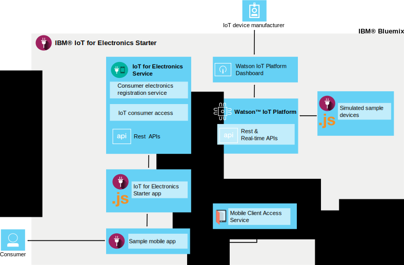

---

copyright:
  years: 2016, 2017
lastupdated: "2017-04-06"
---

<!-- Common attributes used in the template are defined as follows: -->
{:new_window: target="\_blank"}
{:shortdesc: .shortdesc}
{:screen: .screen}
{:codeblock: .codeblock}
{:pre: .pre}

# About {{site.data.keyword.iotelectronics}}
{: #iotelectronics_about}

{{site.data.keyword.iotelectronics_full}} is a fully integrated IoT production instance that lets your apps communicate with and consume data that is collected by your connected appliances, sensors, and gateways.
{:shortdesc}

{{site.data.keyword.iotelectronics}} uses the {{site.data.keyword.iot_full}} service to connect your smart electronic appliances with the applications that you develop. It also uses {{site.data.keyword.iot_short_notm}} to help you analyze and understand the data from your appliances. You can establish rules to identify conditions that need attention and define automated responses, such as sending email, executing a Node-RED workflow, or connecting to web services.

## Finding the starter
{: #iot4eFindingStarter}
You can find the {{site.data.keyword.iotelectronics}} starter in the [Boilerplates section](https://console.{DomainName}/catalog/starters/iot-for-electronics-starter/) of the {{site.data.keyword.Bluemix_notm}} catalog.

## What you can do with {{site.data.keyword.iotelectronics}}
{: #Features_iote}
Quickly explore the features of the {{site.data.keyword.iotelectronics}} solution by using simulated appliances and data.

### Connect simulated appliances
Create simulated appliances and connect them to the platform to see streaming live data. Use a web-based app to simulate how an appliance receives commands and performs operations. Mimic failures to generate notices and alerts. For the purposes of demonstration, washers are used as the simulated appliance within the {{site.data.keyword.iotelectronics}} starter. The appliance you choose to connect could be any type of smart electronics device.

### Try a sample consumer mobile app
Use your iOS or Android mobile device to see how an appliance owner can interact with the appliance. Send commands to the appliance and receive updates from the appliance by using the platform and {{site.data.keyword.Bluemix_notm}}. Mimic failure events and view the results in the mobile app.

### Connect your own electronic appliances
Connect your own appliances securely to the cloud and start customizing your own apps. A set of verified examples and recipes is available that you can modify and use for proofs of concept, testing, and experimentation.

## What's in the {{site.data.keyword.iotelectronics}} starter
{: #whatsInStarter}
The starter boilerplate deploys the integrated {{site.data.keyword.iotelectronics}} solution.  All components are bound and deployed automatically for you. The starter app lets you quickly explore the features of the solution by using simulated appliances and data. The sample mobile app shows you how a consumer can register, receive alerts, and control a connected appliance. You can use the samples as starting points for creating your own applications and collecting data from your own appliances. The following services and applications are included in the solution:

The {{site.data.keyword.iotelectronics}} starter uses the {{site.data.keyword.iotelectronics}} service and APIs to connect with {{site.data.keyword.iot_short_notm}}. The starter app and sample mobile app communicate with the {{site.data.keyword.iotelectronics}} service. The following components are included in the starter:

**{{site.data.keyword.iotelectronics}} service** supports user and appliance registration and notifications.

**{{site.data.keyword.iot_full}}** lets your apps communicate with and use data that is collected by your connected appliances, sensors, and gateways.

**{{site.data.keyword.sdk4nodefull}}** enables you to develop, deploy, and scale server-side JavaScript&reg; apps and provides enhanced performance, security, and serviceability.

**{{site.data.keyword.appid_full}}** adds authentication to your mobile and web apps and protects your back-end systems.

**Sample mobile app** lets you view the status of and communicate with a simulated appliance by using your mobile device such as a smart phone or tablet. Find out how to get the mobile app in [Using the Mobile app](iotelectronics_config_mobile.html).
