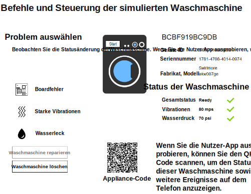

---

copyright:
  years: 2016, 2017
lastupdated: "2017-03-15"
---

<!-- Common attributes used in the template are defined as follows: -->
{:new_window: target="\_blank"}
{:shortdesc: .shortdesc}
{:screen: .screen}
{:codeblock: .codeblock}
{:pre: .pre}

# Starter-App verwenden
Erstellen Sie simulierte Appliances in der {{site.data.keyword.iotelectronics_full}}-Starter-App und bekommen Sie einen Eindruck davon, wie ein EM (Enterprise Manufacturer) Appliances überwachen kann, die mit der {{site.data.keyword.iot_short_notm}} verbunden sind. Sie können manuell mit der simulierten Appliance interagieren, um Alerts, Benachrichtigungen und Aktionen auszulösen.
{:shortdesc}

## Starter-App öffnen
{: #iot4e_openApp}

1. Starten Sie in Ihrem {{site.data.keyword.Bluemix_notm}}-Dashboard Ihre {{site.data.keyword.iotelectronics}}-Starteranwendung, indem Sie auf die Kachel für die Starteranwendung klicken.

    

2. Warten Sie, bis die Statusnachricht *Ihre App ist aktiv* im Header angezeigt wird, und klicken Sie anschließend auf **App anzeigen**, um die Starter-App anzuzeigen.

    

## Simulierte Appliances erstellen
{: #create_sim}

In der Starter-App können Sie simulierte Appliances wie der Appliancehersteller oder ein Konsument erstellen und steuern. Status- und Ereignisdaten für diese simulierten Appliances werden gespeichert und können in {{site.data.keyword.iot_full}} angezeigt werden.

1. Wählen Sie eine der folgenden Optionen aus:
    - **Verbinden und verwalten simulierter Appliances** zur Erstellung simulierter Appliances wie der Appliancehersteller
    - **Steuern der eigenen verbundenen Appliances per Fernzugriff** zur Erstellung simulierter Appliances sowie zur Herstellung einer Verbindung mit dem [Beispiel einer mobilen App](iotelectronics_config_mobile.html) wie der Applianceeigner.

    

2. Blättern Sie bis zu dem Abschnitt mit dem Titel **Wählen Sie nun eine simulierte Waschmaschine aus oder erstellen Sie eine neue Waschmaschine** und klicken Sie auf das Plussymbol. Es wird eine neue Waschmaschine erstellt.

    

3. Um Details zu Ihrer Waschmaschine anzuzeigen, klicken Sie auf eine Waschmaschine. Starten Sie die Waschmaschine über das Befehls- und Bedienfeld oder klicken Sie auf die unterschiedlichen Fehlertypen, um die Statusänderungen anzuzeigen. Sie können außerdem sowohl die Statusänderungen anzeigen als auch die Waschmaschine über Ihre mobile App steuern.

  
