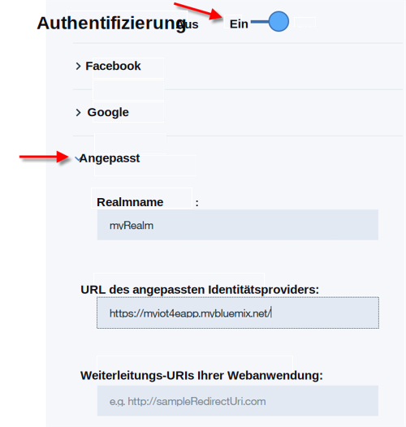

---

copyright:
  years: 2016
lastupdated: "2016-11-29"

---

<!-- Common attributes used in the template are defined as follows: -->
{:new_window: target="\_blank"}
{:shortdesc: .shortdesc}
{:screen:.screen}
{:codeblock:.codeblock}

# Mobile Konnektivität und Sicherheit konfigurieren
{: #iot4e_configureMCA}

Ermöglichen Sie die mobile Kommunikation und Sicherheit, indem Sie {{site.data.keyword.amafull}} konfigurieren. Diese Task ist für die Verwendung des Beispiels für eine mobile App erforderlich und muss nur ein einziges Mal durchgeführt werden.
{:shortdesc}

Bevor Sie starten, müssen Sie eine Instanz des {{site.data.keyword.iotelectronics}}-Starters in Ihrer {{site.data.keyword.Bluemix_notm}}-Organisation
 bereitstellen. Durch die Bereitstellung einer Instanz des Starters werden die Komponentenanwendungen und Services einschließlich {{site.data.keyword.amafull}} automatisch bereitgestellt.

1. Wenn Sie nur den {{site.data.keyword.iotelectronics}}-Starter bereitgestellt haben, wird die Registerkarte 'Einführung' der Starter-App angezeigt und Sie müssen mit dem nächsten Schritt dieser Anweisungen fortfahren. Wird die Starter-App nicht angezeigt, öffnen Sie Ihr {{site.data.keyword.Bluemix_notm}}-Dashboard und starten Sie Ihre {{site.data.keyword.iotelectronics}}-Starteranwendung durch Klicken auf den Namen der Starteranwendung.

    

2. Kopieren Sie die URL der {{site.data.keyword.iotelectronics}}-Web-App, indem Sie mit der rechten Maustaste auf **App anzeigen** klicken und die Option zum Kopieren der Linkposition auswählen.

3. Klicken Sie auf der Registerkarte **Verbindungen** auf den Service {{site.data.keyword.amashort}}, um ihn zu öffnen.

3. Aktivieren Sie die Authentifizierung auf der Seite für die {{site.data.keyword.amashort}}-Authentifizierung, indem Sie auf **Ein** klicken.

4. Geben Sie im Abschnitt **Angepasst** die folgenden Authentifizierungsnachweise ein:

    - **Realmname**: `myRealm`

    - **URL des angepassten Identitätsproviders**: Fügen Sie die URL der API-Anwendung, die Sie im ersten Schritt kopiert haben, im folgenden Format ein:   **https://<*myIoT4eStarterApp*>.mybluemix.net**.  

    **Wichtig:** Stellen Sie sicher, dass die URL das sichere Protokoll `https` nutzt, auch wenn für den von Ihnen kopierten Wert `http` verwendet wird.

    - **Weiterleitungs-URIs Ihrer Webanwendung**: Lassen dieses Feld leer.

     

5. Speichern Sie Ihre Einstellungen. Sie können nun zur {{site.data.keyword.iotelectronics}}-Servicekonsole oder zu Ihrer {{site.data.keyword.Bluemix_notm}}-Konsole zurückkehren.
