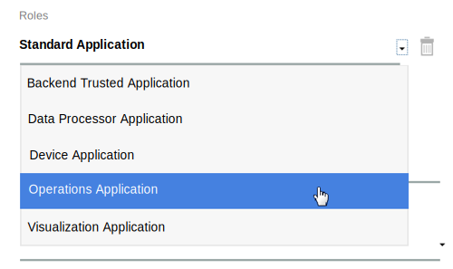

---

copyright:
  years: 2016, 2017
lastupdated: "2017-03-15"
---

<!-- Common attributes used in the template are defined as follows: -->
{:new_window: target="\_blank"}
{:shortdesc: .shortdesc}
{:screen: .screen}
{:codeblock: .codeblock}
{:pre: .pre}

# Eigene Daten und Geräte verwalten
{: #iot4e_dashboard}
Sie können Daten über Ihre registrierten Geräte anzeigen und die Geräte und Benutzer über die
{{site.data.keyword.iot_full}} mit dem {{site.data.keyword.iotelectronics}}-Dashboard verwalten.
{:shortdesc}

Verwenden Sie das {{site.data.keyword.iotelectronics}}-Dashboard, um folgende Aktionen durchzuführen:
- In Ihrer Organisation registrierte Appliances anzeigen
- Benutzer Appliances zuordnen
- Massenaktionen durchführen, z. B. große Anzahlen an Appliances hinzufügen und löschen
- Appliancedaten extrahieren

## Das Dashboard öffnen
{: #iot4e_opendashboard}

**Wichtig:** Bevor Sie das Dashboard zum ersten Mal verwenden können, müssen Sie es [aktivieren](#iot4e_enabledashboard).

Gehen Sie wie folgt vor, um das Dashboard zu öffnen:
1. Öffnen Sie Ihr {{site.data.keyword.Bluemix_notm}}-Dashboard und klicken Sie auf den Namen des {{site.data.keyword.iot_short_notm}}-Service.  

    **Tipp:** Der Servicename endet mit `iotf-service` und wird als *Internet of Things Platform* in der Spalte mit den Serviceangeboten beschrieben.
2. Klicken Sie auf der Begrüßungsseite auf die Option zum Starten.
3. Wählen Sie im Menü **Electronics** aus.

## Das Dashboard aktivieren
{: #iot4e_enabledashboard}

Aktivieren Sie das {{site.data.keyword.iotelectronics}}-Dashboard in {{site.data.keyword.iot_full}}; führen Sie dazu die folgenden Schritte aus.

  **Hinweis:** Bevor Sie starten, müssen Sie eine Instanz des {{site.data.keyword.iotelectronics}}-Starters in Ihrer {{site.data.keyword.Bluemix_notm}}-Organisation bereitstellen. Durch die Bereitstellung einer Instanz des Starters werden die Komponentenanwendungen und Services einschließlich {{site.data.keyword.iot_short_notm}} automatisch bereitgestellt.

1. Fügen Sie eine neue Rolle zum {{site.data.keyword.iot_short_notm}}-API-Schlüssel hinzu.
  1. Öffnen Sie Ihr {{site.data.keyword.Bluemix_notm}}-Dashboard und klicken Sie auf den Namen des {{site.data.keyword.iot_short_notm}}-Service.  

    **Tipp:** Der Servicename endet mit `iotf-service` und wird als *Internet of Things Platform* in der Spalte mit den Serviceangeboten beschrieben.
  2. Klicken Sie auf der Begrüßungsseite auf die Option zum Starten.
  3. Wählen Sie im Menü die Option **Apps**  aus und klicken Sie anschließend neben dem API-Schlüssel auf das Symbol zum Bearbeiten .
  4. Klicken Sie auf die Option zum Hinzufügen einer weiteren Rolle und wählen Sie die Option **Operations Application** (Operationsanwendung) aus.
  5. Klicken Sie auf die Option zum Speichern.

    

2. Suchen Sie nach der {{site.data.keyword.iot_short_notm}}-Organisations-ID, dem API-Schlüssel und dem Authentifizierungscode.
  1. Kehren Sie zum {{site.data.keyword.Bluemix_notm}}-Dashboard zurück.
  2. Öffnen Sie die {{site.data.keyword.iotelectronics}}-Anwendung.

    **Tipp:** Die Anwendung befindet sich im entsprechenden Abschnitt Ihres {{site.data.keyword.Bluemix_notm}}-Dashboards. Klicken Sie auf den Namen und nicht auf die Route.
  3. Zeigen Sie die Umgebungsvariablen an, indem Sie auf **Laufzeit** klicken und anschließend **Umgebungsvariablen** auswählen.
  4. Blättern Sie zum Abschnitt mit der Bezeichnung `iotf-service`. Kopieren Sie die folgenden Werte. Sie sind für den nächsten Schritt erforderlich.

    - `org` - Die ID der {{site.data.keyword.iot_short_notm}}-Organisation
    - `apiKey` - Der {{site.data.keyword.iot_short_notm}}-API-Schlüssel
    - `apiToken` - Das {{site.data.keyword.iot_short_notm}}-Authentifizierungstoken  

    

3. Geben Sie die Berechtigungsnachweise für {{site.data.keyword.iot_short_notm}} im Service {{site.data.keyword.iotelectronics}} ein.

  1. Kehren Sie zum {{site.data.keyword.Bluemix_notm}}-Dashboard zurück.
  2. Öffnen Sie den Service {{site.data.keyword.iotelectronics}}, indem Sie auf den Servicenamen klicken.

    **Tipp:** Der Servicename endet mit `ibmiotforelectronics` und wird als *IoT for Electronics* in der Spalte mit den Serviceangeboten beschrieben.
  3. Geben Sie auf der Begrüßungsseite den API-Schlüssel, das Authentifizierungstoken sowie die Organisations-ID ein, die Sie im vorherigen Schritt lokalisiert haben.
  4. Klicken Sie auf die Option zum Aktualisieren, um Ihre Eingaben zu speichern.

    

4. Sie können das [{{site.data.keyword.iotelectronics}}-Dashboard nun](#iot4e_opendashboard) in {{site.data.keyword.iot_short_notm}} öffnen.
