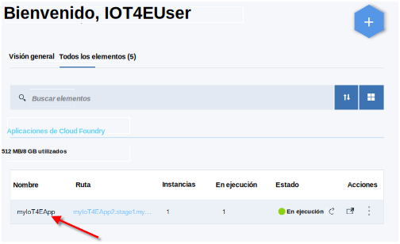
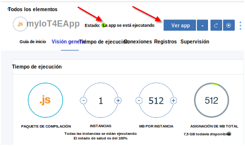
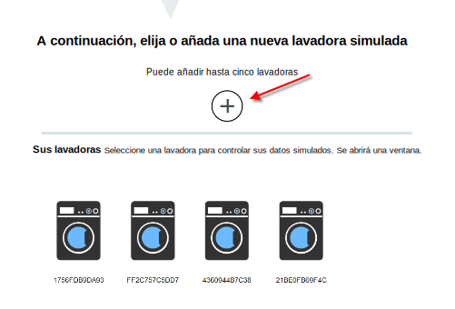
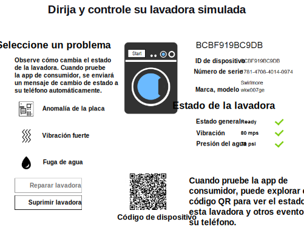

---

copyright:
  years: 2016, 2017
lastupdated: "2017-03-10"
---

<!-- Common attributes used in the template are defined as follows: -->
{:new_window: target="blank"}
{:shortdesc: .shortdesc}
{:screen: .screen}
{:codeblock: .codeblock}
{:pre: .pre}

# Utilización de la app de inicio
Cree dispositivos simulados en la app de inicio de {{site.data.keyword.iotelectronics_full}}. Experimente cómo una empresa de producción puede supervisar dispositivos conectados a {{site.data.keyword.iot_short_notm}}. Interactúa manualmente con el dispositivo simulado para desencadenar alertas, notificaciones y acciones.
{:shortdesc}

## Apertura de la app de inicio
{: #iot4e_openApp}

1. En el panel de control de {{site.data.keyword.Bluemix_notm}}, inicie la aplicación de inicio de {{site.data.keyword.iotelectronics}} pulsando el mosaico correspondiente.

    

2. Espere a que aparezca el mensaje de estado *La app está ejecutándose* en la cabecera y, a continuación, pulse **Ver app** para mostrar la app del iniciador.

    

## Creación de dispositivos simulados
{: #create_sim}

En la app de inicio, puede crear y controlar dispositivos simulados como fabricante de dispositivo o como consumidor. El estado y los datos de sucesos de estos dispositivos simulados se almacenan y se pueden ver en {{site.data.keyword.iot_full}}.

1. Seleccione una de las opciones siguientes:
    - **Conectar y gestionar dispositivos simulados** para crear dispositivos simulados como fabricante de dispositivo
    - **Controlar de forma remota los dispositivos conectados** para crear dispositivos simulados y conectarse con la [app para móvil de ejemplo](iotelectronics_config_mobile.html) como propietario de dispositivo.

    

2. Desplácese a la sección con la etiqueta **A continuación, elija o añada una nueva lavadora simulada** y pulse el icono +. Se crea una nueva lavadora.

    

3. Para ver los detalles de la lavadora, pulse una lavadora. En el panel de mandato y control, inicie la lavadora o pulse los distintos tipos de error para ver los cambios de estado. También puede ver los cambios de estado y controlar la lavadora desde la app móvil. 

  

# Enlaces relacionados
{: #rellinks}

## Documentación de la API
{: #api}
* [API de {{site.data.keyword.iotelectronics}}](http://ibmiotforelectronics.mybluemix.net/public/iot4eregistrationapi.html)
* [API de {{site.data.keyword.iot_short}}](https://developer.ibm.com/iotfoundation/recipes/api-documentation/)

## Componentes
{: #general}

* [Documentación de {{site.data.keyword.iotelectronics}}](iotelectronics_overview.html)
* [Documentación de {{site.data.keyword.iot_full}}](https://console.ng.bluemix.net/docs/services/IoT/index.html)
*  [Documentación de {{site.data.keyword.amashort}}](https://console.ng.bluemix.net/docs/services/mobileaccess/overview.html)
* [Documentación de {{site.data.keyword.sdk4nodefull}}](https://console.ng.bluemix.net/docs/runtimes/nodejs/index.html#nodejs_runtime)

## Ejemplos
{: #samples}
* [App para móvil de ejemplo](https://console.ng.bluemix.net/docs/starters/IotElectronics/iotelectronics_config_mobile.html)
