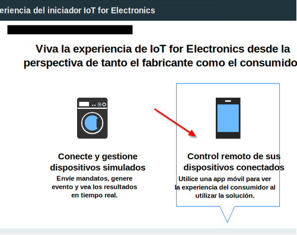
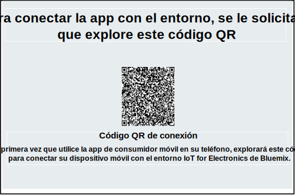

---

copyright:
  years: 2016, 2017
lastupdated: "2017-03-10"
---

<!-- Common attributes used in the template are defined as follows: -->
{:new_window: target="blank"}
{:shortdesc: .shortdesc}
{:screen: .screen}
{:codeblock: .codeblock}
{:pre: .pre}

# Utilización de la app para móvil
{: #iot4e_using_mobile}

Empiece a utilizar la app para móvil de {{site.data.keyword.iotelectronics_full}} para ver cómo puede recibir alertas, enviar mandatos y comprobar el estado de los dispositivos conectados usando su dispositivo móvil, caso de un smartphone o una tablet.
{:shortdesc}

Antes de utilizar la app para móvil, debe completar las siguientes tareas:
  - Despliegue una instancia del iniciador de {{site.data.keyword.iotelectronics}} en su organización de {{site.data.keyword.Bluemix_notm}}. Al desplegar una instancia del iniciador, se despliegan automáticamente las aplicaciones de componente y los servicios del iniciador.
  - [Habilite las comunicaciones móviles y la seguridad](iotelectronics_config_mca.html) configurando {{site.data.keyword.amafull}}.

Para empezar con la app para móvil, realice las tareas siguientes:
1. [Descargue la app para móvil](#iot4e_downloadmobile) a su dispositivo móvil.
2. [Conecte la app para móvil al entorno de {{site.data.keyword.iotelectronics}}](#iot4e_connecting_mobile) y registre los dispositivos.

## Descarga de la app para móvil
{: #iot4e_downloadmobile}
Puede obtener la app para móvil de dispositivos móviles iOS o Android.
- **Dispositivo iOS** - Descargue la app del App Store de Apple.  En su dispositivo móvil, abra el App Store y busque "ibm iot". Elija **IBM IoT for Electronics** e instálela.  Si no, puede instalarla en su dispositivo móvil mediante [iTunes](https://itunes.apple.com/us/app/ibm-iot-for-electronics/id1103404928?ls=1&mt=8).
- **Dispositivos Android** - Descargue la app del Play Store de Google. En su dispositivo móvil, abra el App Store y busque "ibm iot". Elija **IBM IoT for Electronics** e instálela.

## Conexión de la app para móvil
{: #iot4e_connecting_mobile}

Para conectar la app para móvil a su entorno y registrar sus dispositivos, realice las siguientes tareas:

1. Abra la app de inicio de {{site.data.keyword.iotelectronics}}. Para obtener instrucciones, consulte [Apertura de la app de inicio](iot4ecreatingappliances.html#iot4e_openAppMain).

2. Seleccione **Controlar de forma remota los dispositivos conectados**.

    

3. Cree una o varias lavadoras desplazándose a la sección con la etiqueta **A continuación, elija o añada una nueva lavadora simulada** y pulsando a continuación el icono +. Se crea una nueva lavadora.

    

4.	Desplácese por el código QR de conexión y explórelo utilizando el dispositivo móvil. El código QR de Conexión se encuentra en la sección con la etiqueta **Para conectar la app con el entorno, se le solicitará que explore este código QR**.

  

5. En el dispositivo móvil, escriba sus credenciales de inicio de sesión. El ID de usuario y la contraseña pueden tener cualquier longitud. Recuerde las credenciales de inicio de sesión para sesiones futuras. Ahora su dispositivo móvil está registrado en el entorno de {{site.data.keyword.iotelectronics}} y puede registrar dispositivos individuales.

6. En el sistema, desplácese hasta una lavadora simulada y púlsela para visualizar sus datos y el código QR de dispositivo.

  

7.	Utilice el dispositivo móvil para explorar el código QR de la lavadora. Ahora la lavadora está registrada y su estado correspondiente se muestra en su dispositivo móvil.

**Qué hacer a continuación**
Ahora puede ver alertas y controlar la lavadora mediante el dispositivo móvil. Siga estos pasos para probarlo:
  - En el sistema, seleccione un problema con la lavadora, como la anomalía de la placa o la vibración fuerte. El problema envía una alerta a su dispositivo móvil.
  - En el dispositivo móvil, pulse **Iniciar lavado** para iniciar la máquina. Puede ver el cambio de estado de la lavadora en el sistema a medida que avanza por los ciclos de lavado correspondientes.
