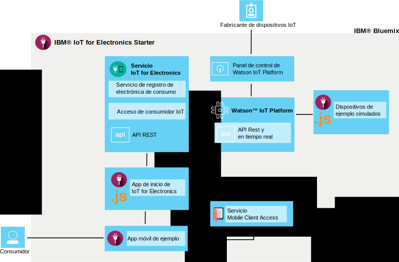

---

copyright:
  years: 2016, 2017
lastupdated: "2017-03-15"
---

<!-- Common attributes used in the template are defined as follows: -->
{:new_window: target="\_blank"}
{:shortdesc: .shortdesc}
{:screen: .screen}
{:codeblock: .codeblock}
{:pre: .pre}

# Acerca de {{site.data.keyword.iotelectronics}}
{: #iotelectronics_about}

{{site.data.keyword.iotelectronics_full}} es una instancia de producción IoT completamente integrada que permite a sus apps comunicarse y consumir datos recopilados por los dispositivos, sensores y pasarelas conectados.
{:shortdesc}

{{site.data.keyword.iotelectronics}} utiliza el servicio {{site.data.keyword.iot_full}} para conectar los dispositivos electrónicos inteligentes con las aplicaciones que desarrolla. También utiliza {{site.data.keyword.iot_short_notm}} para ayudarle a analizar y a entender los datos desde los dispositivos. Puede establecer reglas para identificar condiciones que necesiten atención y definir respuestas automatizadas, tales como enviar correo electrónico, ejecutar un flujo de trabajo Node-RED o conectarse a servicios web.

## Búsqueda del iniciador
{: #iot4eFindingStarter}
Puede encontrar el iniciador {{site.data.keyword.iotelectronics}} en la [sección Contenedores modelo](https://console.{DomainName}/catalog/starters/iot-for-electronics-starter/) del catálogo {{site.data.keyword.Bluemix_notm}}.

## Lo que puede hacer con {{site.data.keyword.iotelectronics}}
{: #Features_iote}
Explorar rápidamente las características de la solución {{site.data.keyword.iotelectronics}} utilizando dispositivos y datos simulados.

### Conectar dispositivos simulados
Cree dispositivos simulados y conéctelos a la plataforma para ver datos activos en modalidad continua. Utilice una app basada en web para simular cómo el dispositivo recibe los mandatos y realiza las operaciones. Imite anomalías para generar avisos y alertas. Para fines de demostración, las lavadoras se utilizan como el dispositivo simulado dentro del iniciador de {{site.data.keyword.iotelectronics}}. El dispositivo que elija para conectarse puede ser cualquier tipo de dispositivo electrónico inteligente.

### Probar una app para móvil de consumidor de ejemplo
Utilice su dispositivo móvil iOS o Android para ver cómo puede interactuar un propietario de dispositivo con el dispositivo. Envía mandatos al dispositivo y recibe actualizaciones del dispositivo utilizando la plataforma y {{site.data.keyword.Bluemix_notm}}. Imite sucesos de error y vea los resultados en la app para móvil.

### Conectar sus propios dispositivos electrónicos
Conéctese a sus propios dispositivos de forma segura en la nube e inicie la personalización de las apps. Hay disponible un conjunto de recetas y ejemplos verificados que puede modificar y utilizar para las pruebas de concepto, la realización de pruebas y la experimentación.

## Qué se incluye en el iniciador de {{site.data.keyword.iotelectronics}}
{: #whatsInStarter}
El contenedor modelo de iniciador despliega la solución de {{site.data.keyword.iotelectronics}} integrada.  Todos los componentes se enlazan y despliegan automáticamente. La app de inicio le permite explorar rápidamente las características de la solución utilizando dispositivos y datos simulados. La app para móvil de ejemplo muestra la forma en que un consumidor puede registrar, recibir alertas y controlar un dispositivo conectado. Puede utilizar los ejemplos como puntos de partida para crear sus propias aplicaciones y recopilar datos de sus propios dispositivos. Los siguientes servicios y aplicaciones se incluyen en la solución:

El iniciador de {{site.data.keyword.iotelectronics}} utiliza el servicio de {{site.data.keyword.iotelectronics}} y las API para conectarse con {{site.data.keyword.iot_short_notm}}. La app de inicio y la app para móvil de ejemplo se comunican con el servicio de {{site.data.keyword.iotelectronics}}. Los siguientes componentes se incluyen en el iniciador:

**El servicio de {{site.data.keyword.iotelectronics}}** da soporte al registro y a las notificaciones de usuarios y dispositivos.

**{{site.data.keyword.iot_full}}** permite que sus apps se comuniquen y utilicen datos recopilados por dispositivos conectados, sensores y pasarelas.

**{{site.data.keyword.sdk4nodefull}}** le permite desarrollar, desplegar y escalar apps de JavaScript&reg; del lado del servidor y proporciona una mejora en el rendimiento, la seguridad y la capacidad de servicio.

**App para móvil de ejemplo** le permite ver el estado de un dispositivo simulado utilizando un dispositivo móvil, como por ejemplo, un smartphone o una tablet. Descubra cómo obtener la app para móvil en [Utilización de la app para móvil](iotelectronics_config_mobile.html).
