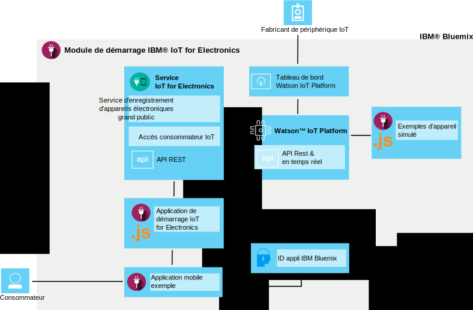

---

copyright:
  years: 2016, 2017
lastupdated: "2017-03-10"
---

<!-- Common attributes used in the template are defined as follows: -->
{:new_window: target="blank"}
{:shortdesc: .shortdesc}
{:screen: .screen}
{:codeblock: .codeblock}
{:pre: .pre}

# A propos de {{site.data.keyword.iotelectronics}}
{: #iotelectronics_about}

{{site.data.keyword.iotelectronics_full}} est une instance de production IoT entièrement intégrée qui permet à vos applications de communiquer avec et de consommer des données collectées par vos appareils connectés, vos capteurs et vos passerelles.
{:shortdesc}

{{site.data.keyword.iotelectronics}} fait appel au service {{site.data.keyword.iot_full}} pour connecter vos appareils électroniques intelligents aux applications que vous développez. Il utilise également {{site.data.keyword.iot_short_notm}} pour faciliter l'analyse et la compréhension des données issues de vos appareils. Vous pouvez établir des règles identifiant des conditions nécessitant votre attention et définir des réponses automatisées, comme l'envoi d'un courrier électronique, l'exécution
d'un flux de travaux Node-RED ou la connexion à des services Web.

## Recherche du module de démarrage
{: #iot4eFindingStarter}
Le module de démarrage {{site.data.keyword.iotelectronics}} se trouve dans la [section Conteneurs boilerplate](https://console.{DomainName}/catalog/starters/iot-for-electronics-starter/) du catalogue {{site.data.keyword.Bluemix_notm}}.

## Fonctions d'{{site.data.keyword.iotelectronics}}
{: #Features_iote}
Découvrez rapidement les fonctions de la solution {{site.data.keyword.iotelectronics}} à l'aide d'appareils et de données simulés.

### Connectez des appareils simulés
Créez des appareils simulés et connectez-les à la plateforme pour visualiser des flux de données en continu actifs. Utilisez une application Web pour simuler la réception de commandes et l'exécution d'opérations par un appareil. Imitez des échecs pour générer des détections et des alertes. Comme exemple, des machines à laver sont utilisées en tant qu'appareils simulés dans le module de démarrage {{site.data.keyword.iotelectronics}}. Vous pouvez connecter comme appareil tout type de terminal électronique intelligent.

### Essayez une application mobile de consommateur exemple
Utilisez votre périphérique mobile iOS ou Android pour découvrir comment le propriétaire d'un appareil peut interagir avec ce dernier. Envoyez des commandes à l'appareil et recevez les mises à jour de l'appareil à l'aide de la plateforme et de {{site.data.keyword.Bluemix_notm}}. Imitez des échecs et affichez les résultats dans l'application mobile.

### Connectez vos propres appareils électroniques
Connectez vos propres appareils au cloud de manière sécurisée et commencez à personnaliser vos applications. Nous mettons à votre disposition un ensemble de recettes et d'exemple vérifiés que vous pouvez modifier et utiliser pour les démonstrations de faisabilité, les tests et l'expérimentation.

## Contenu du module de démarrage {{site.data.keyword.iotelectronics}}
{: #whatsInStarter}
Le conteneur boilerplate du module de démarrage déploie la solution {{site.data.keyword.iotelectronics}} intégrée.  Tous les composants sont liés et déployés automatiquement pour vous. Le module de démarrage vous permet d'explorer rapidement les fonctions de la solution grâce à des appareils et des données simulés. L'application mobile exemple vous indique comment un consommateur peut enregistrer et recevoir des alertes, et contrôler un appareil connecté. Vous pouvez vous servir des exemples comme points de départ pour la création de vos propres applications et collecter des données à partir de vos appareils. Les applications et services suivants sont inclus dans la solution :

Le module de démarrage {{site.data.keyword.iotelectronics}} utilise le service {{site.data.keyword.iotelectronics}} et des API pour se connecter à {{site.data.keyword.iot_short_notm}}. L'application de démarrage et le modèle d'application mobile communiquent avec le service {{site.data.keyword.iotelectronics}} et sont connectés entre eux par {{site.data.keyword.amafull}}. Les composants suivants sont inclus dans le module de démarrage :

**Le service {{site.data.keyword.iotelectronics}}** prend en charge l'enregistrement des utilisateurs et des appareils, ainsi que les notifications.

**{{site.data.keyword.iot_full}}** permet à vos applications de communiquer avec vos appareils, capteurs et passerelles connectés et d'utiliser les données que ces derniers collectent.

<!-- **{{site.data.keyword.iotrtinsights_full}}** enables you to enrich and monitor data from your appliances, visualize what's happening now, and respond to emerging conditions by using automated actions. -->

**{{site.data.keyword.amafull}}** permet aux utilisateurs des applications mobiles de se connecter avec des comptes sociaux existants et garantit la sécurité des communications avec les systèmes dorsaux.

**{{site.data.keyword.sdk4nodefull}}** vous permet de développer, déployer et mettre à l'échelle des applications JavaScript&reg; côté serveur et fournit des performances, une sécurité et une serviçabilité améliorées.

Le **modèle d'application mobile** vous permet d'afficher le statut d'un appareil simulé et de communiquer avec cet appareil simulé à l'aide de votre périphérique mobile, par exemple votre smartphone ou votre tablette. Découvrez comment obtenir l'application mobile dans [Utilisation de l'application mobile](iotelectronics_config_mobile.html).
