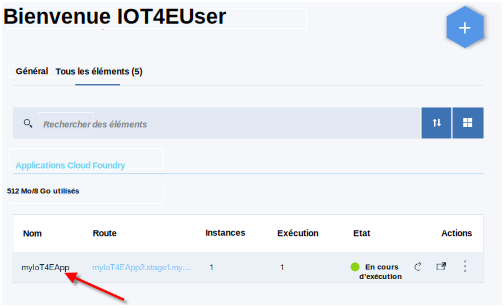
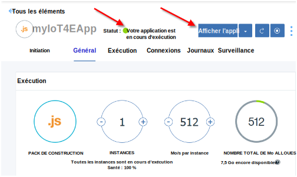
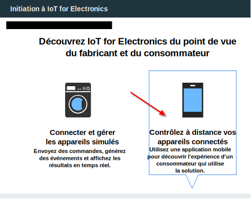
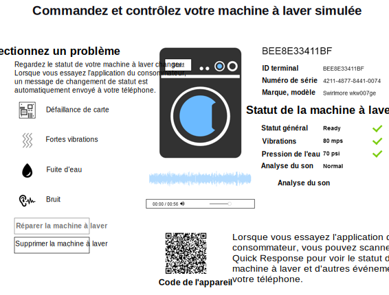

---

copyright:
  years: 2016, 2017
lastupdated: "2017-03-15"
---

<!-- Common attributes used in the template are defined as follows: -->
{:new_window: target="\_blank"}
{:shortdesc: .shortdesc}
{:screen: .screen}
{:codeblock: .codeblock}
{:pre: .pre}

# Utilisation de l'application de démarrage
Créez des appareils simulés dans l'application de démarrage {{site.data.keyword.iotelectronics_full}}. Découvrez comment un fabricant peut surveiller des appareils connectés à {{site.data.keyword.iot_short_notm}}. Interagissez manuellement avec l'appareil simulé pour déclencher des alertes, des notifications et des actions.
{:shortdesc}

## Ouverture de l'application de démarrage
{: #iot4e_openApp}

1. Dans votre tableau de bord {{site.data.keyword.Bluemix_notm}}, lancez votre application de démarrage
{{site.data.keyword.iotelectronics}} en cliquant sur sa vignette.

    

2. Patientez jusqu'à ce que le message de statut *Votre application est en cours d'exécution* s'affiche dans l'en-tête, puis cliquez sur **Afficher l'application** pour afficher l'application de démarrage.

    

## Création d'appareils simulés
{: #create_sim}

Dans l'application de démarrage, vous pouvez créer et contrôler des appareils simulés en tant que fabricant ou consommateur d'appareils. Le statut et les données d'événement pour ces appareils simulés sont stockés et peuvent être affichés dans {{site.data.keyword.iot_full}}.

1. Sélectionnez l'une des options suivantes :
    - **Connectez et gérez les appareils simulés** pour créer des appareils simulés en tant que fabricant d'appareils.
    - **Contrôlez à distance vos appareils connectés** pour créer des appareils simulés et vous connecter au
[modèle d'application mobile](iotelectronics_config_mobile.html) en tant que propriétaire d'appareil.

    

2. Faites défiler la page pour accéder à la section intitulée **Ensuite, choisissez ou ajoutez une machine à laver simulée**, puis cliquez sur l'icône +. Une machine à laver est créée.

    

3. Pour afficher les détails de votre machine à laver, cliquez sur un modèle. Dans la commande et le panneau de commande, démarrez la machine à laver ou cliquez sur les différents types de panne pour afficher les changements de statut. Vous pouvez également afficher les changements de statut et contrôler la machine à laver depuis votre application mobile.

  
