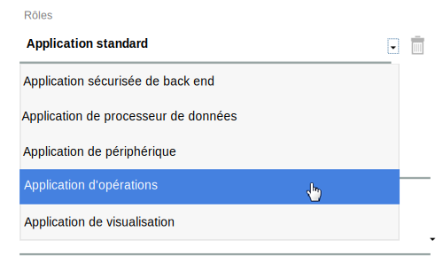
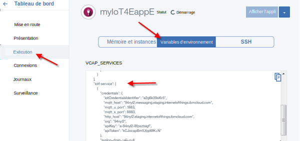
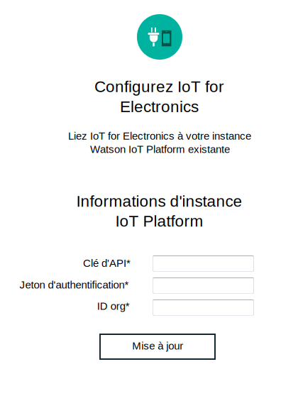

---

copyright:
  years: 2016, 2017
lastupdated: "2017-03-10"
---

<!-- Common attributes used in the template are defined as follows: -->
{:new_window: target="blank"}
{:shortdesc: .shortdesc}
{:screen: .screen}
{:codeblock: .codeblock}
{:pre: .pre}

# Gestion de vos données et périphériques
{: #iot4e_dashboard}
Consultez les données depuis vos périphériques enregistrés et gérez appareils et utilisateurs sur
{{site.data.keyword.iot_full}} à l'aide du tableau de bord {{site.data.keyword.iotelectronics}}.
{:shortdesc}

Utilisez le tableau de bord {{site.data.keyword.iotelectronics}} pour
- Afficher des appareils enregistrés dans votre organisation
- Mapper des utilisateurs à des appareils
- Effectuer des actions par lot, comme l'ajout et la suppression d'un grand nombre d'appareils
- Extraire des données d'appareil

## Ouverture du tableau de bord
{: #iot4e_opendashboard}

**Important :** Pour pouvoir commencer à utiliser le tableau de bord, vous devez d'abord [l'activer](#iot4e_enabledashboard).

Pour ouvrir le tableau de bord
1. Ouvrez votre tableau de bord {{site.data.keyword.Bluemix_notm}} et cliquez sur le nom du service {{site.data.keyword.iot_short_notm}}.  

    **Conseil :** Le nom du service se termine par `iotf-service` et sa description est *Internet of Things Platform* dans la colonne Offre de services.
2. Sur la page d'accueil, cliquez sur **Lancer**.
3. Dans le menu, sélectionnez **Electronics**.

## Activation du tableau de bord
{: #iot4e_enabledashboard}

Activez le tableau de bord {{site.data.keyword.iotelectronics}} dans {{site.data.keyword.iot_full}} en procédant comme suit.

  **Remarque :** Avant de commencer, vous devez déployer une instance du module de démarrage {{site.data.keyword.iotelectronics}} dans votre organisation {{site.data.keyword.Bluemix_notm}}. Cette opération entraîne le déploiement automatique des services et des applications de composant, y compris {{site.data.keyword.iot_short_notm}}.

1. Ajoutez un nouveau rôle à la clé d'API {{site.data.keyword.iot_short_notm}}.
  1. Ouvrez votre tableau de bord {{site.data.keyword.Bluemix_notm}} et cliquez sur le nom du service {{site.data.keyword.iot_short_notm}}.  

    **Conseil :** Le nom du service se termine par `iotf-service` et sa description est *Internet of Things Platform* dans la colonne Offre de services.
  2. Sur la page d'accueil, cliquez sur **Lancer**.
  3. Dans le menu, sélectionnez **Applications** , puis cliquez sur l'icône d'édition  en regard de la clé d'API.
  4. Cliquez sur **Ajouter un autre rôle** et sélectionnez l'**application Opérations**.
  5. Cliquez sur **Sauvegarder**.

    

2. Localisez l'ID organisation, la clé d'API et le code d'authentification {{site.data.keyword.iot_short_notm}}.
  1. Revenez au tableau de bord {{site.data.keyword.Bluemix_notm}}.
  2. Ouvrez l'application {{site.data.keyword.iotelectronics}}.

    **Conseil :** L'application se trouve dans la section Applications de votre tableau de bord {{site.data.keyword.Bluemix_notm}}. Veillez à cliquer sur le nom et non sur le chemin.
  3. Affichez les variables d'environnement en cliquant sur **Exécution** puis en sélectionnant **Variables d'environnement**.
  4. Faites défiler la section intitulée `iotf-service`. Copiez les valeurs suivantes. Elles sont requises à l'étape suivante.

    - `org` - ID organisation {{site.data.keyword.iot_short_notm}}
    - `apiKey` - Clé d'API {{site.data.keyword.iot_short_notm}}
    - `apiToken` - Jeton d'authentification {{site.data.keyword.iot_short_notm}}  

    

3. Entrez les données d'identification {{site.data.keyword.iot_short_notm}} dans le service {{site.data.keyword.iotelectronics}}.

  1. Revenez au tableau de bord {{site.data.keyword.Bluemix_notm}}.
  2. Ouvrez le service {{site.data.keyword.iotelectronics}} en cliquant sur le nom de service.

    **Conseil :** Le nom de service se termine par `ibmiotforelectronics` et sa description est *IoT for Electronics* dans la colonne Offre de services.
  3. Sur la page d'accueil, entrez la clé d'API, le jeton d'authentification et l'ID org que vous avez déterminé à l'étape précédente.
  4. Cliquez sur **Mettre à jour** pour sauvegarder vos entrées.

    

4. Vous pouvez à présent [ouvrir le tableau de bord {{site.data.keyword.iotelectronics}}](#iot4e_opendashboard) dans {{site.data.keyword.iot_short_notm}}.
