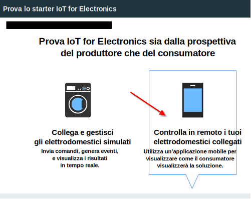
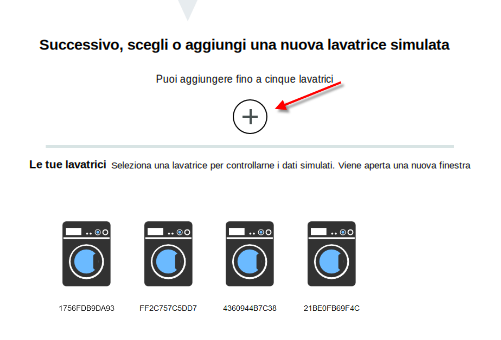

---

copyright:
  years: 2016, 2017
lastupdated: "2017-03-10"
---

<!-- Common attributes used in the template are defined as follows: -->
{:new_window: target="blank"}
{:shortdesc: .shortdesc}
{:screen: .screen}
{:codeblock: .codeblock}
{:pre: .pre}

# Utilizzo dell'applicazione mobile
{: #iot4e_using_mobile}

Introduzione all'applicazione mobile {{site.data.keyword.iotelectronics_full}} per vedere come ricevere avvisi, inviare comandi e controllare lo stato delle tue applicazioni collegate utilizzando il tuo dispositivo mobile, come uno smartphone o un tablet.
{:shortdesc}

Prima di poter utilizzare l'applicazione mobile, devi completare le seguenti attività:
  - Distribuire un'istanza dello starter di {{site.data.keyword.iotelectronics}} nella tua organizzazione {{site.data.keyword.Bluemix_notm}}. La distribuzione di un'istanza dello starter in automatico distribuisce le applicazioni del componente dello starter.
  - [Abilitare la sicurezza e le comunicazioni mobili](iotelectronics_config_mca.html) configurando {{site.data.keyword.amafull}}.

Per un introduzione all'applicazione mobile, completa le seguenti attività:
1. [Scarica l'applicazione mobile](#iot4e_downloadmobile) sul tuo dispositivo mobile.
2. [Collega l'applicazione mobile all'ambiente {{site.data.keyword.iotelectronics}}](#iot4e_connecting_mobile) e registra i tuoi elettrodomestici.

## Scaricamento dell'applicazione mobile
{: #iot4e_downloadmobile}
Puoi ottenere l'applicazione mobile per i dispositivi mobili iOS o Android.
- **Dispositivi iOS** - Scarica l'applicazione dall'Apple App Store.  Sul tuo dispositivo mobile, apri l'App store e cerca "ibm iot". Scegli **IBM IoT for Electronics** e installa.  In alternativa, puoi installarla nel tuo dispositivo mobile utilizzando [iTunes](https://itunes.apple.com/us/app/ibm-iot-for-electronics/id1103404928?ls=1&mt=8).
- **Dispositivi Android** - Scarica l'applicazione dal Google Play Store. Sul tuo dispositivo mobile, apri l'App store e cerca "ibm iot". Scegli **IBM IoT for Electronics** e installa.

## Connessione dell'applicazione mobile
{: #iot4e_connecting_mobile}

Per collegare l'applicazione mobile al tuo ambiente e registrare i tuoi elettrodomestici, completa le seguenti attività:

1. Apri la tua applicazione starter {{site.data.keyword.iotelectronics}}. Per le istruzioni, consulta [Apertura dell'applicazione starter](iot4ecreatingappliances.html#iot4e_openAppMain).

2. Seleziona **Controlla in remoto le tue applicazioni collegate**.

    

3. Crea una o più lavatrici passando nella sezione etichettata **Successivo, scegli o aggiungi una nuova lavatrice simulata** e quindi fai clic sull'icona +. Viene creata una nuova lavatrice.

    

4.	Passa al codice QR di connessione e scansionalo utilizzando il tuo dispositivo mobile. Il codice QR di connessione è posizionato nella sezione etichettata **Per collegare l'applicazione all'ambiente, ti verrà richiesto di scansionare questo codice QR**.

  

5. Nel tuo dispositivo mobile, immetti le credenziali di accesso. I tuoi ID e password possono essere di qualsiasi lunghezza. Ricorda le tue credenziali di accesso per sessioni future. Il tuo dispositivo mobile è ora registrato nel tuo ambiente {{site.data.keyword.iotelectronics}} e sei pronto per registrare elettrodomestici individuali.

6. Sul tuo computer, passa a una rondella simulata e fai clic su di essa per visualizzarne i dati e il codice QR dell'applicazione.

  

7.	Utilizza il tuo dispositivo mobile per scansionare il codice QR della lavatrice. La lavatrice è ora registrata e il suo stato viene visualizzato nel tuo dispositivo mobile.

**Operazioni successive**
Puoi ora visualizzare gli avvisi e controllare la lavatrice utilizzando il tuo dispositivo mobile. Prova come con la seguente procedura:
  - Sul tuo computer, seleziona un problema con la rondella, come Board Failure o Strong Vibration. Il problema invia un avviso al tuo dispositivo mobile.
  - Sul tuo dispositivo mobile, fai clic su **Avvia lavatrice** per avviare la macchina. Puoi visualizzare la modifica dello stato della lavatrice sul tuo computer e i relativi cicli di lavaggio.
