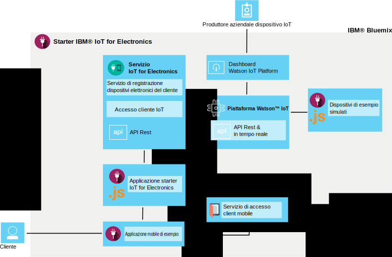

---

copyright:
  years: 2016, 2017
lastupdated: "2017-04-06"
---

<!-- Common attributes used in the template are defined as follows: -->
{:new_window: target="\_blank"}
{:shortdesc: .shortdesc}
{:screen: .screen}
{:codeblock: .codeblock}
{:pre: .pre}

# Informazioni su {{site.data.keyword.iotelectronics}}
{: #iotelectronics_about}

{{site.data.keyword.iotelectronics_full}} è un'istanza di produzione totalmente integrata IoT che permette alle tue applicazioni di comunicare e utilizzare i dati raccolti dalle tue applicazioni, sensori e gateway collegati.
{:shortdesc}

{{site.data.keyword.iotelectronics}} utilizza il servizio {{site.data.keyword.iot_full}} per collegare le tue applicazioni elettroniche smart con le applicazioni che sviluppi. Utilizza anche {{site.data.keyword.iot_short_notm}} per aiutarti nell'analizzare e comprendere i dati dalle tue applicazioni. Puoi stabilire delle regole per identificare delle condizioni che necessitano di attenzione e definire delle risposte automatizzate definite, come l'invio di email, l'esecuzione di un flusso di lavoro Node-RED o il collegamento ai servizi web.

## Ricerca dello starter
{: #iot4eFindingStarter}
Puoi trovare lo starter {{site.data.keyword.iotelectronics}} nella sezione [Contenitori tipo](https://console.{DomainName}/catalog/starters/iot-for-electronics-starter/) del catalogo {{site.data.keyword.Bluemix_notm}}.

## Cosa puoi fare con {{site.data.keyword.iotelectronics}}
{: #Features_iote}
Esplorare velocemente le funzioni della soluzione {{site.data.keyword.iotelectronics}} utilizzando dati e applicazioni simulate.

### Collegamento di applicazioni simulate
Crea applicazioni simulate e collegale alla piattaforma per visualizzare i dati live in streaming. Utilizza un'applicazione basata sul web per simulare come un'applicazione riceve i comandi ed esegue le operazioni. Imita malfunzionamenti per generare avvisi e notifiche. Per scopi dimostrativi, le lavatrici sono utilizzate come elettrodomestici simulati nello starter {{site.data.keyword.iotelectronics}}. L'elettrodomestico che hai scelto di collegare potrebbe essere un qualsiasi tipo di dispositivo elettronico smart.

### Prova un'applicazione mobile utente di esempio
Utilizza il tuo dispositivo mobile iOS o Android per visualizzare come un proprietario dell'elettrodomestico può interagire con l'applicazione. Invia comandi all'elettrodomestico e ricevi aggiornamenti dall'applicazione utilizzando la piattaforma e {{site.data.keyword.Bluemix_notm}}. Imita malfunzionamenti di eventi e visualizza i risultati nell'applicazione mobile.

### Collega i tuoi propri elettrodomestici elettronici
Collega i tuoi propri elettrodomestici in sicurezza al cloud e avvia le tue proprie applicazioni personalizzate. Sono disponibili una serie di 'ricette' e esempi verificati che puoi modificare e utilizzare per prove di concetto, verifica e esperimenti.

## Cosa c'è lo starter {{site.data.keyword.iotelectronics}}
{: #whatsInStarter}
Il contenitore tipo starter distribuisce la soluzione {{site.data.keyword.iotelectronics}} integrata.  Tutti i componenti sono associati e distribuiti automaticamente per te. L'applicazione starter ti permette di esplorare velocemente le funzioni della soluzione utilizzando dati e applicazioni simulate. L'applicazione mobile di esempio ti mostra come un consumatore può registrare, ricevere avvisi e controllare un'applicazione collegata. Puoi utilizzare gli esempi come punti di partenza per la creazione e la raccolta di dati delle tue proprie applicazioni. I seguenti servizi e applicazioni sono inclusi nella soluzione:

Lo starter {{site.data.keyword.iotelectronics}} utilizza le API e il servizio {{site.data.keyword.iotelectronics}} per il collegamento a {{site.data.keyword.iot_short_notm}}. L'applicazione starter e l'applicazione mobile di esempio comunicano con il servizio {{site.data.keyword.iotelectronics}}. I seguenti componenti sono inclusi nello starter:

**Il servizio {{site.data.keyword.iotelectronics}}** supporta le notifiche e la registrazione dell'elettrodomestico e dell'utente.

**{{site.data.keyword.iot_full}}** permette alle tue applicazioni di comunicare e utilizzare i dati raccolti dai tuoi elettrodomestici, sensori e gateway collegati.

**{{site.data.keyword.sdk4nodefull}}** ti abilita a sviluppare, distribuire e ridimensionare le applicazioni JavaScript&reg; lato server e fornisce utilità, sicurezza e prestazioni avanzate.

**{{site.data.keyword.appid_full}}** aggiunge l'autenticazione alle tue applicazioni web e mobile e protegge i tuoi sistemi di backend.

**Applicazione mobile di esempio** ti permette di visualizzare lo stato e comunicare con un'applicazione simulata utilizzando il tuo telefono mobile. Scopri come ottenere l'applicazione mobile in [Utilizzo dell'applicazione mobile](iotelectronics_config_mobile.html).
