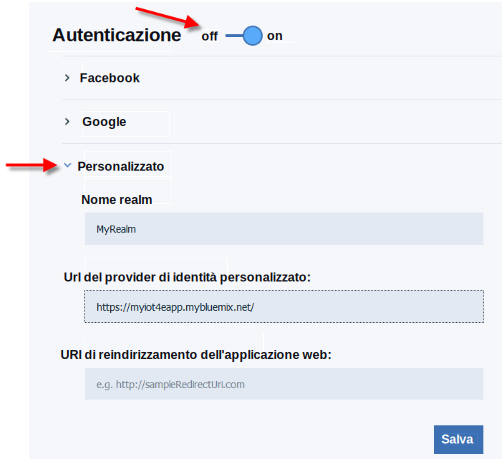

---

copyright:
  years: 2016, 2017
lastupdated: "2017-03-10"
---

<!-- Common attributes used in the template are defined as follows: -->
{:new_window: target="blank"}
{:shortdesc: .shortdesc}
{:screen: .screen}
{:codeblock: .codeblock}
{:pre: .pre}

# Configurazione della sicurezza e della connettività mobili
{: #iot4e_configureMCA}

Abilitare la sicurezza e le comunicazioni mobili configurando {{site.data.keyword.amafull}}. Questa attività è necessaria per utilizzare l'applicazione mobile di esempio e deve essere eseguita solo una volta.
{:shortdesc}

Prima di cominciare, devi distribuire un'istanza dello starter di {{site.data.keyword.iotelectronics}} nella tua organizzazione
{{site.data.keyword.Bluemix_notm}}. La distribuzione di un'istanza dello starter in automatico distribuisce le applicazioni e i servizi del componente, incluso {{site.data.keyword.amafull}}.

1. Nel dashboard {{site.data.keyword.Bluemix_notm}}, apri l'applicazione {{site.data.keyword.iotelectronics}}.

   **Suggerimento:** l'applicazione è ubicata nella sezione Applicazioni del tuo dashboard {{site.data.keyword.Bluemix_notm}}. Assicurati di far clic sul nome e non sulla rotta.

    

2. Copia l'URL dell'applicazione web {{site.data.keyword.iotelectronics}} facendo clic con il tasto destro del mouse su **Visualizza applicazione** e selezionando **Copia posizione link**.

3. Nella scheda **Connessioni**, fai clic sul servizio {{site.data.keyword.amashort}} per aprirlo.

3. Nella pagina di autenticazione {{site.data.keyword.amashort}}, abilita l'autenticazione facendo clic su **Attivo**.

4. Nella sezione **Personalizzato**, immetti le seguenti credenziali di autenticazione:

    - **Nome realm**: `myRealm`

    - **URL provider di identità personalizzato**: incolla l'URL dell'applicazione API che hai copiato nel primo passo nel seguente formato:   **https://<*myIoT4eStarterApp*>.mybluemix.net**.

    **Importante:** assicurati che l'URL utilizzi il protocollo di sicurezza `https` anche se il valore che hai copiato utilizza `http`.

    - **Gli URI di reindirizzamento dell'applicazione web**: lascia questo campo vuoto.

   

5. Salva le tue impostazioni. Puoi ora ritornare alla console del servizio {{site.data.keyword.iotelectronics}} o alla tua console {{site.data.keyword.Bluemix_notm}}.
