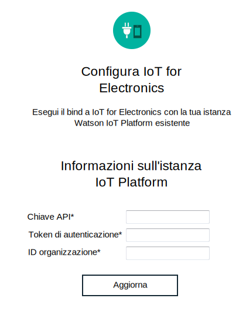

---

copyright:
  years: 2016, 2017
lastupdated: "2017-03-10"
---

<!-- Common attributes used in the template are defined as follows: -->
{:new_window: target="blank"}
{:shortdesc: .shortdesc}
{:screen: .screen}
{:codeblock: .codeblock}
{:pre: .pre}

# Gestione dei tuoi dati e dispositivi
{: #iot4e_dashboard}
Visualizza i dati dai tuoi dispositivi registrati e gestisci i tuoi dispositivi e utenti
{{site.data.keyword.iot_full}} con il dashboard {{site.data.keyword.iotelectronics}}.
{:shortdesc}

Utilizza il dashboard {{site.data.keyword.iotelectronics}} per
- Visualizzare le applicazioni registrate nella tua organizzazione
- Associare utenti alle applicazioni
- Eseguire le azioni in blocco come l'aggiunta e l'eliminazione di un gran numero di applicazioni
- Estrarre i dati dell'applicazione

## Apertura del dashboard
{: #iot4e_opendashboard}

**Importante:** prima di poter utilizzare il dashboard per la prima volta, devi [abilitarlo](#iot4e_enabledashboard).

Per aprire il dashboard
1. Apri il tuo dashboard {{site.data.keyword.Bluemix_notm}} e fai clic sul nome del servizio {{site.data.keyword.iot_short_notm}}.  

    **Suggerimento:** il nome del servizio termina con `iotf-service` ed è descritto come *Piattaforma Internet delle cose* nella colonna dell'offerta di servizi.
2. Nella pagina di benvenuto, fai clic su **Avvia**.
3. Nel menu, seleziona **Electronics**.

## Abilitazione del dashboard
{: #iot4e_enabledashboard}

Abilita il dashboard {{site.data.keyword.iotelectronics}} in {{site.data.keyword.iot_full}} eseguendo i seguenti passi.

  **Nota:** prima di cominciare, devi distribuire un'istanza dello starter di {{site.data.keyword.iotelectronics}} nella tua organizzazione {{site.data.keyword.Bluemix_notm}}. La distribuzione di un'istanza dello starter in automatico distribuisce le applicazioni e i servizi del componente, incluso {{site.data.keyword.iot_short_notm}}.

1. Aggiungi un nuovo ruolo alla chiave API {{site.data.keyword.iot_short_notm}}.
  1. Apri il tuo dashboard {{site.data.keyword.Bluemix_notm}} e fai clic sul nome del servizio {{site.data.keyword.iot_short_notm}}.  

    **Suggerimento:** il nome del servizio termina con `iotf-service` ed è descritto come *Piattaforma Internet delle cose* nella colonna dell'offerta di servizi.
  2. Nella pagina di benvenuto, fai clic su **Avvia**.
  3. Nel menu, seleziona **Applicazioni**  e fai quindi clic sull'icona di modifica  accanto alla chiave API.
  4. Fai clic su **Aggiungi un altro ruolo** e seleziona **Applicazione Operazioni**.
  5. Fai clic su **Salva**.

    

2. Individua il codice di autenticazione, la chiave API e l'ID organizzazione {{site.data.keyword.iot_short_notm}}.
  1. Ritorna al dashboard {{site.data.keyword.Bluemix_notm}}.
  2. Apri l'applicazione {{site.data.keyword.iotelectronics}}.

    **Suggerimento:** l'applicazione è ubicata nella sezione Applicazioni del tuo dashboard {{site.data.keyword.Bluemix_notm}}. Assicurati di far clic sul nome e non sulla rotta.
  3. Visualizza le variabili di ambiente facendo clic su **Runtime** e selezionando **Variabili di ambiente**.
  4. Scorri fino alla sezione etichettata `iotf-service`. Copia i seguenti valori. Sono necessari nel prossimo passo.

    - `org` - l'ID dell'organizzazione {{site.data.keyword.iot_short_notm}}
    - `apiKey` - la chiave API {{site.data.keyword.iot_short_notm}}
    - `apiToken` - il token di autenticazione {{site.data.keyword.iot_short_notm}}  

    

3. Immetti le credenziali {{site.data.keyword.iot_short_notm}} nel servizio {{site.data.keyword.iotelectronics}}.

  1. Ritorna al dashboard {{site.data.keyword.Bluemix_notm}}.
  2. Apri il servizio {{site.data.keyword.iotelectronics}} facendo clic sul nome del servizio.

    **Suggerimento:** il nome del servizio termina con `ibmiotforelectronics` ed è descritto come *IoT for Electronics* nella colonna dell'offerta di servizi.
  3. Nella pagina di benvenuto, immetti la chiave API, il token di autenticazione e l'ID dell'organizzazione che hai individuato nel passo precedente.
  4. Fai clic su **Aggiorna** per salvare le tue immissioni.

    

4. Ora puoi [aprire il dashboard {{site.data.keyword.iotelectronics}}](#iot4e_opendashboard) in {{site.data.keyword.iot_short_notm}}.
