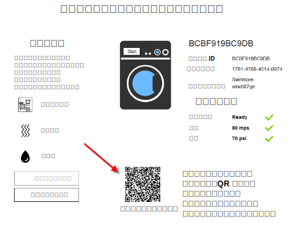

---

copyright:
  years: 2016, 2017
lastupdated: "2017-04-07"
---

<!-- Common attributes used in the template are defined as follows: -->
{:new_window: target="\_blank"}
{:shortdesc: .shortdesc}
{:screen: .screen}
{:codeblock: .codeblock}
{:pre: .pre}

# モバイル・アプリの使用
{: #iot4e_using_mobile}

{{site.data.keyword.iotelectronics_full}} モバイル・アプリの使用を開始して、スマートフォンやタブレットなどのモバイル・デバイスを使用することによって、アラートの受信、コマンドの送信、接続された電気製品の状況の確認をどのように実行できるか確認します。
{:shortdesc}

モバイル・アプリを使用する場合は、その前に、{{site.data.keyword.Bluemix_notm}} 組織の {{site.data.keyword.iotelectronics}} Starter のインスタンスをデプロイする必要があります。Starter のインスタンスをデプロイすると、Starter のコンポーネント・アプリケーションとサービスが自動的にデプロイされます。

モバイル・アプリの使用を開始するには、次のタスクを完了してください。
1. モバイル・デバイスに[モバイル・アプリをダウンロードします](#iot4e_downloadmobile)。
2. [モバイル・アプリを {{site.data.keyword.iotelectronics}} 環境に接続して](#iot4e_connecting_mobile)電気製品を登録します。

## モバイル・アプリをダウンロードする
{: #iot4e_downloadmobile}
iOS または Android のモバイル・デバイス用のモバイル・アプリを入手できます。
- **iOS デバイス** - Apple の App Store からアプリをダウンロードします。モバイル・デバイスで App Store を開き、「ibm iot」を検索します。**「IBM IoT for Electronics」**を選択してインストールします。別の方法として、[iTunes](https://itunes.apple.com/us/app/ibm-iot-for-electronics/id1103404928?ls=1&mt=8) を利用してモバイル・デバイス上にインストールすることもできます。
- **Android デバイス** - Google の Play Store からアプリをダウンロードします。モバイル・デバイスで App Store を開き、「ibm iot」を検索します。**「IBM IoT for Electronics」**を選択してインストールします。

## モバイル・アプリを接続する
{: #iot4e_connecting_mobile}

モバイル・アプリをご使用の環境に接続して電気製品を登録するには、次のタスクを実行します。

1. {{site.data.keyword.iotelectronics}} スターター・アプリを開きます。手順については、[スターター・アプリを開く](iot4ecreatingappliances.html#iot4e_openAppMain)を参照してください。

2. **「接続された電気製品をリモート制御する (Remotely control your connected appliances)」**を選択します。

    

3. **「次にシミュレート洗濯機を選択または追加します (Next, choose or add new simulated washer)」**と表記されたセクションまでスクロールし、「+」アイコンをクリックすることによって、1 つ以上の洗濯機を作成します。新規洗濯機が作成されます。

    

4.	接続 QR コードまでスクロールし、モバイル・デバイスを使用してそれをスキャンします。接続 QR コードは、**「アプリを環境に接続するために、この QR コードのスキャンが必要になります (To connect the app to the environment, you'll be asked to scan this QR Code)」**と表記されたセクションにあります。

  

5. モバイル・デバイスで、オプションで、Facebook または Google+ の資格情報を使用して、ログインします。ログイン・プロセスをスキップして、ログインなしでアプリを試用することもできます。

6. コンピューター上で、シミュレート洗濯機までスクロールし、それをクリックしてそのデータと電気製品 QR コードを表示します。

  

7.	モバイル・デバイスを使用して、洗濯機の QR コードをスキャンします。これで洗濯機が登録され、洗濯機の状況がモバイル・デバイスに表示されます。

**次の手順**
これで、モバイル・デバイスを使用することによって、アラートを確認し、洗濯機を制御できるようになりました。次の手順を試してください。
  - コンピューター上で、ボードの障害や強い振動など、洗濯機の問題を選択します。この問題により、アラートがモバイル・デバイスに送信されます。
  - モバイル・デバイスで、 **「洗濯の開始 (Start wash)」**をクリックして洗濯機を開始します。洗濯サイクルごとに、洗濯機の状況が変わるのをコンピューター上で確認できます。
