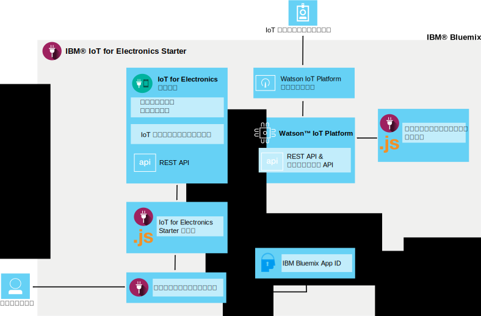

---

copyright:
  years: 2016, 2017
lastupdated: "2017-03-10"
---

<!-- Common attributes used in the template are defined as follows: -->
{:new_window: target="blank"}
{:shortdesc: .shortdesc}
{:screen: .screen}
{:codeblock: .codeblock}
{:pre: .pre}

# {{site.data.keyword.iotelectronics}} について
{: #iotelectronics_about}

{{site.data.keyword.iotelectronics_full}} は、接続された電気製品、センサー、ゲートウェイとの通信や、それらによって収集されたデータの利用をアプリで実行できるようにする、完全に統合された IoT 実動インスタンスです。
{:shortdesc}

{{site.data.keyword.iotelectronics}} では {{site.data.keyword.iot_full}} サービスを使用することで、開発したアプリケーションをスマート家電に接続します。また、{{site.data.keyword.iot_short_notm}} を使用することで、電気製品からのデータを分析して理解できるようにします。注意を必要とする状態を識別するためのルールを設定し、E メールの送信、Node-RED ワークフローの実行、Web サービスへの接続などの自動応答を定義することができます。

## スターターを見つける
{: #iot4eFindingStarter}
{{site.data.keyword.iotelectronics}} Starter は、{{site.data.keyword.Bluemix_notm}} カタログの[ボイラープレート・セクション](https://console.{DomainName}/catalog/starters/iot-for-electronics-starter/)にあります。

## {{site.data.keyword.iotelectronics}} を使用してできること
{: #Features_iote}
シミュレート電気製品とデータを使用して、{{site.data.keyword.iotelectronics}} ソリューションの機能を短時間で体験できます。

### シミュレート電気製品に接続する
シミュレート電気製品を作成し、それをプラットフォームに接続してストリーミング・ライブ・データを表示します。Web ベースのアプリを使用して、電気製品によるコマンドの受信と操作の実行をシミュレートします。模擬的に障害を発生させて、通知とアラートを生成します。{{site.data.keyword.iotelectronics}} Starter 内では、デモンストレーション用のシミュレート電気製品として、洗濯機が使用されます。接続先に選択する電気製品は、どのタイプのスマート電子デバイスでもかまいません。

### サンプルのコンシューマー・モバイル・アプリを試行する
iOS または Android モバイル・デバイスを使用して、電気製品の所有者が電気製品とのやり取りをどのように行えるかを確かめます。プラットフォームと {{site.data.keyword.Bluemix_notm}} を使用して、コマンドを電気製品に送信し、電気製品からの更新情報を受信します。模擬的な障害イベントを発生させ、その結果をモバイル・アプリで表示します。

### 独自の電気製品を接続する
独自の電気製品をクラウドにセキュアに接続し、独自のアプリのカスタマイズに着手します。検証済みの一連のサンプルと手法が用意されており、これらを変更して PoC (概念検証)、テスト、実験に使用することができます。

## {{site.data.keyword.iotelectronics}} Starter の内容
{: #whatsInStarter}
スターター・ボイラープレートにより、統合 {{site.data.keyword.iotelectronics}} ソリューションをデプロイします。すべてのコンポーネントは自動的にバインドされ、デプロイされます。スターター・アプリを利用すると、シミュレート電気製品とデータを使用してこのソリューションの機能を短時間で体験できます。サンプル・モバイル・アプリを利用すると、利用者が登録を行ない、アラートを受信し、接続された電気製品を制御する様子を確認できます。サンプルを開始点として利用することで、独自のアプリケーションを作成し、独自の電気製品からのデータを収集することができます。以下のサービスとアプリケーションがソリューションに組み込まれています。

{{site.data.keyword.iotelectronics}} Starter は、{{site.data.keyword.iotelectronics}} サービスと API を使用して {{site.data.keyword.iot_short_notm}} に接続します。スターター・アプリとサンプル・モバイル・アプリは、{{site.data.keyword.iotelectronics}} サービスと通信し、{{site.data.keyword.amafull}} によって相互に接続されています。以下のコンポーネントが Starter に含まれています。

**{{site.data.keyword.iotelectronics}} サービス**は、ユーザーと電気製品の登録と通知をサポートします。

**{{site.data.keyword.iot_full}}** は、接続された電気製品、センサー、ゲートウェイとの通信や、それらによって収集されたデータの利用をアプリで実行できるようにします。

<!-- **{{site.data.keyword.iotrtinsights_full}}** enables you to enrich and monitor data from your appliances, visualize what's happening now, and respond to emerging conditions by using automated actions. -->

**{{site.data.keyword.amafull}}** は、モバイル・アプリのユーザーが既存のソーシャル・アカウントを使用してログインできるようにし、バックエンド・システムとの通信をセキュアに保ちます。

**{{site.data.keyword.sdk4nodefull}}** は、サーバー・サイド JavaScript&reg; アプリを開発、デプロイ、スケーリングできるようにし、強化されたパフォーマンス、セキュリティー、保守容易性を実現します。

**サンプル・モバイル・アプリ**は、スマートフォンやタブレットなどのモバイル・デバイスを使用することによって、シミュレート電気製品の状況を表示し、その電気製品との通信を行えるようにします。モバイル・アプリの入手方法については、[モバイル・アプリの使用](iotelectronics_config_mobile.html)を参照してください。
