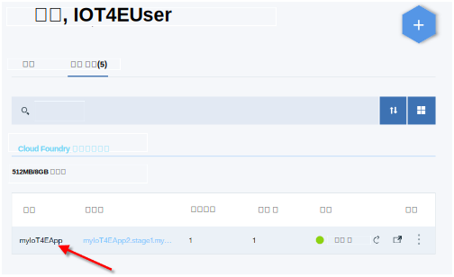
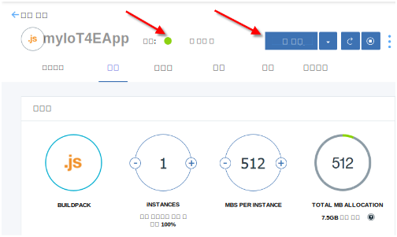
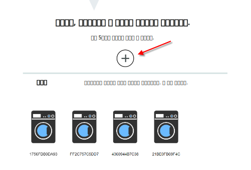
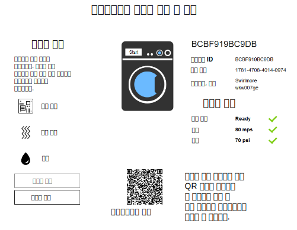

---

copyright:
  years: 2016, 2017
lastupdated: "2017-03-15"
---

<!-- Common attributes used in the template are defined as follows: -->
{:new_window: target="\_blank"}
{:shortdesc: .shortdesc}
{:screen: .screen}
{:codeblock: .codeblock}
{:pre: .pre}

# 스타터 앱 사용
{{site.data.keyword.iotelectronics_full}} 스타터 앱에서 시뮬레이션된 어플라이언스를 작성하십시오. 엔터프라이즈 제조업체에서 {{site.data.keyword.iot_short_notm}}에 연결된 어플라이언스를 어떻게 모니터할 수 있는지 경험할 수 있습니다. 경보, 알림 및 조치가 트리거되도록 시뮬레이션된 어플라이언스와 직접 상호작용하십시오.
{:shortdesc}

## 스타터 앱 열기
{: #iot4e_openApp}

1. {{site.data.keyword.Bluemix_notm}} 대시보드에서 스타터 애플리케이션 타일을 클릭하여 {{site.data.keyword.iotelectronics}} 스타터 애플리케이션을 시작하십시오. 

    

2. *앱 실행 중* 상태 메시지가 헤더에 표시될 때까지 대기한 후, **앱 보기**를 클릭하여 스타터 앱을 표시하십시오. 

    

## 시뮬레이션된 어플라이언스 작성
{: #create_sim}

스타터 앱에서 어플라이언스 제조업체 또는 소비자로 시뮬레이션된 어플라이언스를 작성하고 제어할 수 있습니다. 이러한 시뮬레이션된 어플라이언스의 상태와 이벤트가 저장되고 {{site.data.keyword.iot_full}}에서 볼 수 있습니다. 

1. 다음 옵션 중 하나를 선택하십시오. 
    - **시뮬레이션된 어플라이언스 연결 및 관리**: 어플라이언스 제조업체로서 시뮬레이션된 어플라이언스를 작성합니다. 
    - **연결된 어플라이언스 원격 제어**: 어플라이언스 소유자로서 시뮬레이션된 어플라이언스를 작성하고 [샘플 모바일 앱](iotelectronics_config_mobile.html)에 연결합니다. 

    

2. **다음으로, 시뮬레이션된 새 세탁기 선택 또는 추가**로 레이블이 지정된 섹션까지 스크롤하고 + 아이콘을 클릭하십시오. 새 세탁기가 작성됩니다. 

    

3. 세탁기 세부사항을 보려면 세탁기를 클릭하십시오. 통제 및 제어 패널에서 세탁기를 시작하거나 여러 유형의 장애를 클릭하여 상태 변경을 확인하십시오. 또한 모바일 앱에서 상태 변경을 확인하고 세탁기를 제어할 수 있습니다.

  
