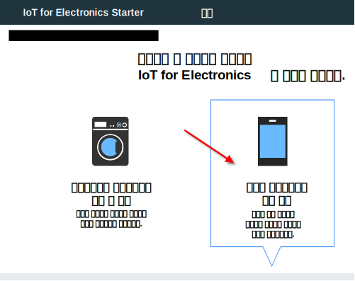
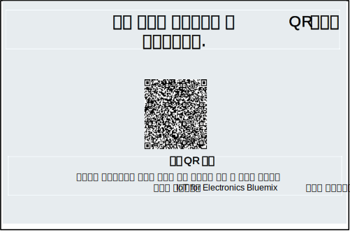
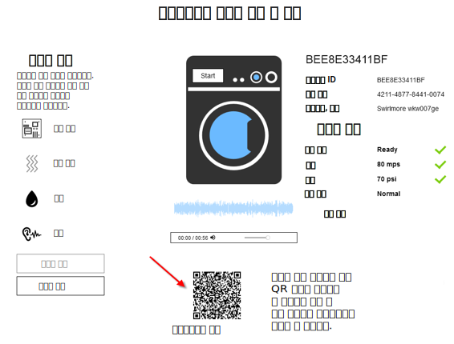

---

copyright:
  years: 2016, 2017
lastupdated: "2017-03-15"
---

<!-- Common attributes used in the template are defined as follows: -->
{:new_window: target="\_blank"}
{:shortdesc: .shortdesc}
{:screen: .screen}
{:codeblock: .codeblock}
{:pre: .pre}

# 모바일 앱 사용
{: #iot4e_using_mobile}

{{site.data.keyword.iotelectronics_full}} 모바일 앱을 시작하여 스마트폰이나 태블릿 같은 모바일 디바이스에서 경보를 수신하고 명령을 전송하며 연결된 애플리케이션의 상태를 확인하는 방법을 알아보십시오.
{:shortdesc}

모바일 앱을 사용하려면, {{site.data.keyword.Bluemix_notm}} 조직에 {{site.data.keyword.iotelectronics}} 스타터의 인스턴스를 배치해야 합니다. 스타터의 인스턴스를 배치하면 스타터의 컴포넌트 애플리케이션 및 서비스가 자동으로 배치됩니다. 

모바일 앱을 시작하려면 다음 태스크를 완료하십시오. 
1. 사용하는 모바일 디바이스에 [모바일 앱을 다운로드](#iot4e_downloadmobile)하십시오.
2. [모바일 앱을 {{site.data.keyword.iotelectronics}} 환경에 연결](#iot4e_connecting_mobile)하고 어플라이언스를 등록하십시오. 

## 모바일 앱 다운로드
{: #iot4e_downloadmobile}
iOS 또는 Android 모바일 디바이스용 모바일 앱을 가져올 수 있습니다. 
- **iOS 디바이스** - Apple 앱 스토어에서 앱을 다운로드하십시오.  모바일 디바이스에서 앱 스토어를 열고 "ibm iot"를 검색하십시오. **IBM IoT for Electronics**를 선택하고 앱을 설치하십시오. 또는 [iTunes](https://itunes.apple.com/us/app/ibm-iot-for-electronics/id1103404928?ls=1&mt=8)를 사용하여 모바일 디바이스에 앱을 설치할 수 있습니다. 
- **Android 디바이스** - Google Play 스토어에서 앱을 다운로드하십시오.  모바일 디바이스에서 앱 스토어를 열고 "ibm iot"를 검색하십시오. **IBM IoT for Electronics**를 선택하고 앱을 설치하십시오. 

## 모바일 앱 연결
{: #iot4e_connecting_mobile}

모바일 앱을 사용자 환경에 연결하고 어플라이언스를 등록하려면 다음 태스크를 수행하십시오. 

1. {{site.data.keyword.iotelectronics}} 스타터 앱을 여십시오. 지시사항은 [스타터 앱 열기](iot4ecreatingappliances.html#iot4e_openAppMain)를 참조하십시오.

2. **연결된 어플라이언스를 원격으로 제어**를 선택하십시오. 

    

3. **다음으로, 시뮬레이션된 새 세탁기 선택 또는 추가**라는 레이블이 지정된 섹션까지 스크롤한 다음 + 아이콘을 클릭하여 하나 이상의 세탁기를 작성하십시오. 새 세탁기가 작성됩니다. 

    

4.	연결 QR 코드까지 스크롤한 후 모바일 디바이스를 사용하여 코드를 스캔하십시오. 연결 QR 코드는 **앱을 환경에 연결하려면 이 QR 코드를 스캔하십시오**로 레이블이 지정된 섹션에 있습니다. 

  

5. 모바일 디바이스에 로그인 신임 정보를 입력하십시오. 사용자 ID와 비밀번호는 길이 제한이 없습니다. 이후 세션을 위해 로그인 신임 정보를 기억하십시오. 이제 모바일 디바이스가 {{site.data.keyword.iotelectronics}} 환경에 등록되었으므로 개별 어플라이언스를 등록할 수 있습니다. 

6. 사용자의 컴퓨터에서, 시뮬레이션된 세탁기까지 스크롤하고 세탁기 데이터 및 어플라이언스 QR 코드를 표시하려면 해당 세탁기를 클릭하십시오. 

  

7.	모바일 디바이스를 사용하여 세탁기의 QR 코드를 스캔하십시오. 이제 세탁기가 등록되었고 세탁기 상태가 모바일 디바이스에 표시됩니다. 

**다음에 수행할 작업**
이제 모바일 디바이스에서 경보를 보고 세탁기를 제어할 수 있습니다. 다음 단계를 수행해 보십시오. 
  - 사용자의 컴퓨터에서, 보드 장애 또는 강한 진동과 같은 세탁기 관련 문제점을 선택하십시오. 문제점이 경보를 모바일 디바이스로 전송합니다. 
  - 모바일 디바이스에서 **세탁 시작**을 클릭하여 세탁기를 시작하십시오. 각 세탁 주기가 진행됨에 따라 컴퓨터에 세탁기 상태 변화가 표시됩니다. 
