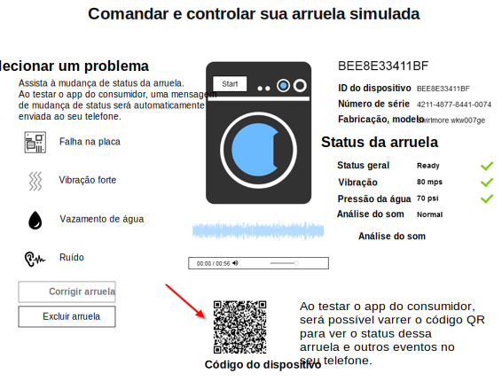

---

copyright:
  years: 2016, 2017
lastupdated: "2017-03-10"
---

<!-- Common attributes used in the template are defined as follows: -->
{:new_window: target="blank"}
{:shortdesc: .shortdesc}
{:screen: .screen}
{:codeblock: .codeblock}
{:pre: .pre}

# Usando o aplicativo móvel
{: #iot4e_using_mobile}

Introdução ao app móvel do {{site.data.keyword.iotelectronics_full}} para ver como é possível receber alertas, enviar comandos e verificar o status dos seus dispositivos conectados usando seu dispositivo móvel, como um telefone inteligente ou tablet.
{:shortdesc}

Antes de poder usar o aplicativo móvel, deve-se concluir as tarefas a seguir:
  - Implemente uma instância do iniciador do {{site.data.keyword.iotelectronics}} em sua organização do {{site.data.keyword.Bluemix_notm}}. Implementar uma instância do iniciador
automaticamente implementa os aplicativos de componente e os serviços do iniciador.
  - [Ative comunicações móveis e segurança](iotelectronics_config_mca.html) configurando {{site.data.keyword.amafull}}.

Para iniciar o aplicativo móvel, conclua as tarefas a seguir:
1. [Faça download do aplicativo móvel](#iot4e_downloadmobile) em seu dispositivo móvel.
2. [Conecte o aplicativo móvel ao ambiente do {{site.data.keyword.iotelectronics}}](#iot4e_connecting_mobile) e registre os seus dispositivos.

## Fazendo download do aplicativo móvel
{: #iot4e_downloadmobile}
É possível obter o app móvel para dispositivos móveis iOS ou Android.
- **Dispositivos iOS** - Faça download do app na App Store da Apple.  Em seu dispositivo móvel, abra a App Store e procure por "ibm iot". Escolha **IBM IoT for Electronics** e
instale.  Como alternativa, é possível instalá-lo em seu dispositivo móvel usando o [iTunes](https://itunes.apple.com/us/app/ibm-iot-for-electronics/id1103404928?ls=1&mt=8).
- **Dispositivos Android** - Faça download do app na Play Store do Google. Em seu dispositivo móvel, abra a App Store e procure por "ibm iot". Escolha **IBM IoT for Electronics** e
instale.

## Conectando o aplicativo móvel
{: #iot4e_connecting_mobile}

Para conectar o aplicativo móvel ao seu ambiente e registrar os seus dispositivos, execute as tarefas a seguir:

1. Abra seu app iniciador do {{site.data.keyword.iotelectronics}}. Para obter instruções, consulte
[Abrindo o app iniciador](iot4ecreatingappliances.html#iot4e_openAppMain).

2. Selecione **Controlar remotamente seus dispositivos conectados**.

    

3. Crie uma ou mais arruelas rolando para a seção que está rotulada **Em seguida, escolha ou inclua a nova arruela simulada** e, em seguida, clicando no ícone +. Uma nova lavadora é criada.

    

4.	Role até o código QR de Conexão e varra-o usando o dispositivo móvel. O código QR de Conexão é localizado na seção rotulada
**Para conectar o aplicativo ao ambiente, será solicitado que varra este Código QR**.

  

5. Em seu dispositivo móvel, insira as credenciais de login. Sua identificação de usuário e senha podem ter qualquer comprimento. Lembre-se de suas credenciais de login para sessões futuras. O seu
dispositivo móvel agora está registrado em seu ambiente do {{site.data.keyword.iotelectronics}} e você está pronto para registrar os dispositivos individuais.

6. Em seu computador, role até uma lavadora simulada e clique nela para exibir seus dados e código QR do Dispositivo.

  

7.	Use o seu dispositivo móvel para varrer o Código Quick Response da arruela. A arruela agora está registrada, e o status da arruela aparece em seu dispositivo móvel.

**O que vem a seguir**
Agora é possível visualizar alertas e controlar a arruela usando seu dispositivo móvel. Tente isso executando as etapas a seguir:
  - Em seu computador, selecione um problema com a lavadora, como Falha da placa ou Vibração forte. O problema envia um alerta para seu dispositivo móvel.
  - Em seu dispositivo móvel, clique em **Iniciar a lavagem** para iniciar a máquina. É possível ver o status da arruela mudar em seu computador conforme ele passa por cada ciclo
de lavagem.
