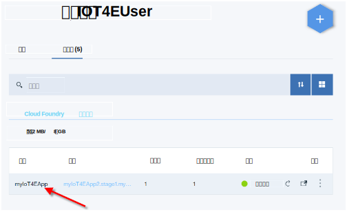
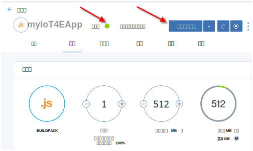
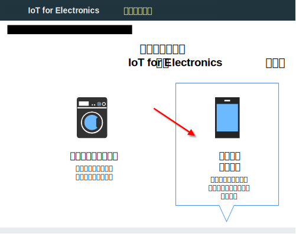
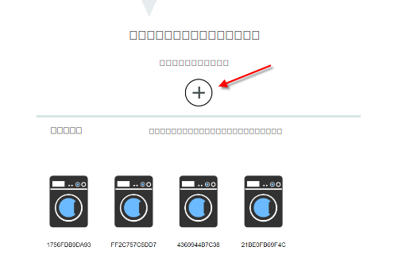
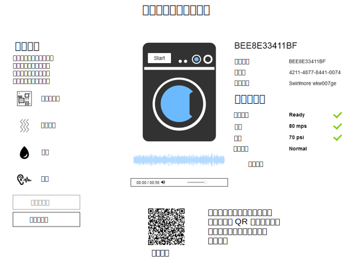

---

copyright:
  years: 2016, 2017
lastupdated: "2017-03-15"
---

<!-- Common attributes used in the template are defined as follows: -->
{:new_window: target="\_blank"}
{:shortdesc: .shortdesc}
{:screen: .screen}
{:codeblock: .codeblock}
{:pre: .pre}

# 使用入门模板应用程序
在 {{site.data.keyword.iotelectronics_full}} Starter 应用程序中创建模拟设备。体验企业制造商可以如何监视连接到 {{site.data.keyword.iot_short_notm}} 的设备。手动与模拟设备进行交互以触发警报、通知和操作。
{:shortdesc}

## 打开入门模板应用程序
{: #iot4e_openApp}

1. 在 {{site.data.keyword.Bluemix_notm}} 仪表板中，通过单击 {{site.data.keyword.iotelectronics}} Starter 应用程序磁贴来启动该入门模板应用程序。

    

2. 等待标题中显示*您的应用程序正在运行*状态信息，然后单击**查看应用程序**，以显示入门模板应用程序。

    

## 创建模拟设备
{: #create_sim}

在入门模板应用程序中，能以设备制造商或消费者身份创建并控制模拟设备。这些模拟设备的状态和事件数据会存储并可在 {{site.data.keyword.iot_full}} 中进行查看。

1. 选择以下某个选项：
    - **连接并管理模拟设备**，以设备制造商身份创建模拟设备。
    - **远程控制连接的设备**，以设备所有者身份创建模拟设备，并通过[样本移动应用程序](iotelectronics_config_mobile.html)进行连接。

    

2. 滚动到标签为**接下来，选择或添加新的模拟洗衣机**的部分，并单击 + 图标。此时将创建新洗衣机。

    

3. 要查看洗衣机详细信息，请单击洗衣机。在命令和控制面板中，启动洗衣机或单击不同类型的故障，以查看状态更改。您还可以从移动应用程序查看状态更改并控制洗衣机。

  
