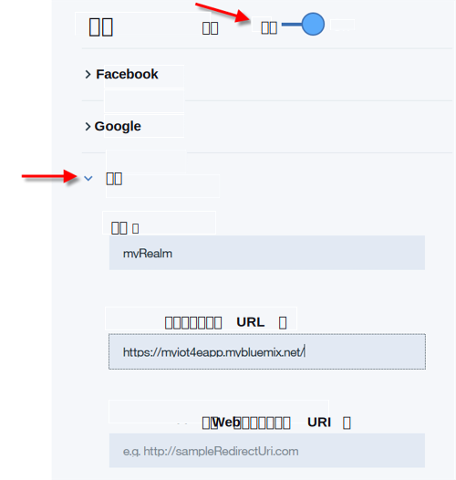

---

copyright:
  years: 2016
lastupdated: "2016-11-29"

---

<!-- Common attributes used in the template are defined as follows: -->
{:new_window: target="\_blank"}
{:shortdesc: .shortdesc}
{:screen:.screen}
{:codeblock:.codeblock}

# 配置移动连接和安全性
{: #iot4e_configureMCA}

通过配置 {{site.data.keyword.amafull}}，启用移动通信和安全性。需要此任务来使用样本移动应用程序，并且此任务只需执行一次。
{:shortdesc}

开始之前，您必须在 {{site.data.keyword.Bluemix_notm}} 组织中部署 {{site.data.keyword.iotelectronics}} Starter 的实例。部署入门模板的实例会自动部署组件应用程序和服务，包括 {{site.data.keyword.amafull}}。

1. 如果刚刚部署了 {{site.data.keyword.iotelectronics}} Starter，那么将显示该入门模板应用程序的“入门”选项卡，您应该继续执行这些指示信息的后续步骤。如果未显示该入门模板应用程序，请打开 {{site.data.keyword.Bluemix_notm}} 仪表板，通过单击 {{site.data.keyword.iotelectronics}} Starter 应用程序名称来启动该入门模板应用程序。

    

2. 通过右键单击**查看应用程序**并选择**复制链接位置**，来复制 {{site.data.keyword.iotelectronics}} Web 应用程序的 URL。

3. 在**连接**选项卡上，单击以打开 {{site.data.keyword.amashort}} 服务。

3. 在 {{site.data.keyword.amashort}}“认证”页面上，通过单击**开启**，以启用认证。

4. 在**定制**部分中，输入以下认证凭证：

    - **域名**：`myRealm`

    - **定制身份提供者 URL**：以下列格式粘贴在第一步中复制的 API 应用程序的 URL：**https://<*myIoT4eStarterApp*>.mybluemix.net**。  

    **重要事项：**请确保 URL 使用安全协议 `https`，即使您所复制的值使用 `http` 也是如此。

    - **您的 Web 应用程序重定向 URI**：使此字段保留空白。

     

5. 保存设置。现在，您可以返回 {{site.data.keyword.iotelectronics}} 服务控制台或您的 {{site.data.keyword.Bluemix_notm}} 控制台。
