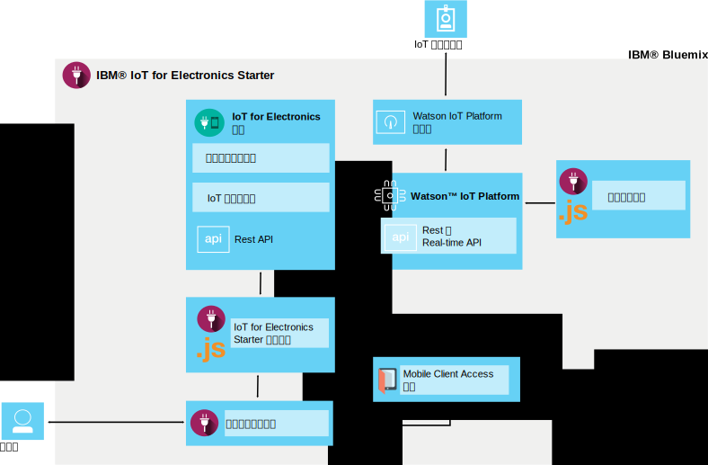

---

copyright:
  years: 2016, 2017
lastupdated: "2017-04-06"
---

<!-- Common attributes used in the template are defined as follows: -->
{:new_window: target="\_blank"}
{:shortdesc: .shortdesc}
{:screen: .screen}
{:codeblock: .codeblock}
{:pre: .pre}

# 关于 {{site.data.keyword.iotelectronics}}
{: #iotelectronics_about}

{{site.data.keyword.iotelectronics_full}} 是完全集成的物联网生产实例，可使应用程序与已连接设备、传感器和网关所收集的数据进行通信，并使用这些数据。
{:shortdesc}

{{site.data.keyword.iotelectronics}} 使用 {{site.data.keyword.iot_full}} 服务，将智能电子设备与您开发的应用程序相连接。它还使用 {{site.data.keyword.iot_short_notm}}，来帮助您分析和了解来自您设备的数据。您可以建立规则，以识别需要注意的条件，并定义自动响应，如发送电子邮件、执行 Node-RED 工作流程或连接到 Web 服务。

## 查找 Starter
{: #iot4eFindingStarter}
您可以在 {{site.data.keyword.Bluemix_notm}} 目录的[样板](https://console.{DomainName}/catalog/starters/iot-for-electronics-starter/)部分中，查找 {{site.data.keyword.iotelectronics}} Starter。

## 使用 {{site.data.keyword.iotelectronics}} 可以执行的操作
{: #Features_iote}
使用模拟设备和数据，快速浏览 {{site.data.keyword.iotelectronics}} 解决方案的功能。

### 连接模拟设备
创建模拟设备，并将它们连接到平台，以查看流式实时数据。使用基于 Web 的应用程序，模拟设备如何接收命令并执行操作。模拟故障，以生成通知和警报。出于演示目的，洗衣机将用作 {{site.data.keyword.iotelectronics}} Starter 内的模拟设备。选择连接的设备可以是任何类型的智能电子设备。

### 尝试样本使用者移动应用程序
使用 iOS 或 Android 移动设备，查看设备所有者可以如何与设备进行交互。使用平台和 {{site.data.keyword.Bluemix_notm}}，向设备发送命令，并从设备接收更新。模拟故障事件，并在移动应用程序中查看结果。

### 连接自己的电子设备
将自己的设备安全地连接到云，并开始定制自己的应用程序。目前提供一组经验证的示例和诀窍，您可用来修改并用于概念验证、测试和实验。

## {{site.data.keyword.iotelectronics}} Starter 中的功能
{: #whatsInStarter}
入门模板样板会部署集成 {{site.data.keyword.iotelectronics}} 解决方案。所有组件都会自动为您绑定和部署。通过入门模板应用程序，使用模拟设备和数据，您可以快速浏览解决方案的功能。样本移动应用程序会显示使用者如何注册、接收警报和控制连接的设备。您可以使用样本作为起点创建自己的应用程序，并从自己的设备收集数据。解决方案中包含下列服务和应用程序：

{{site.data.keyword.iotelectronics}} Starter 使用 {{site.data.keyword.iotelectronics}} 服务和 API 与 {{site.data.keyword.iot_short_notm}} 连接。入门模板应用程序和样本移动应用程序与 {{site.data.keyword.iotelectronics}} 服务进行通信。入门模板中包含以下组件：

**{{site.data.keyword.iotelectronics}} 服务**支持用户和设备注册与通知。

**{{site.data.keyword.iot_full}}** 允许应用程序与连接的设备、传感器和网关进行通信，以及使用这些对象收集的数据。

**{{site.data.keyword.sdk4nodefull}}** 使您能够开发、部署和扩展服务器端 JavaScript&reg; 应用程序，并提供增强的性能、安全性和可维护性。

**{{site.data.keyword.appid_full}}** 会向您的移动应用程序和 Web 应用程序添加认证，从而保护后端系统。

**样本移动应用程序**允许您使用移动设备（如智能手机或平板电脑）查看模拟设备的状态，并与模拟设备进行通信。在[使用移动应用程序](iotelectronics_config_mobile.html)中找到如何获取移动应用程序。
