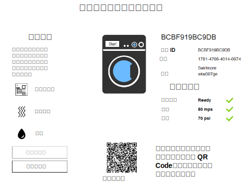

---

copyright:
  years: 2016, 2017
lastupdated: "2017-03-15"
---

<!-- Common attributes used in the template are defined as follows: -->
{:new_window: target="\_blank"}
{:shortdesc: .shortdesc}
{:screen: .screen}
{:codeblock: .codeblock}
{:pre: .pre}

# 使用入門範本應用程式
在 {{site.data.keyword.iotelectronics_full}} 入門範本應用程式中，建立模擬應用裝置。體驗企業製造商如何監視連接至 {{site.data.keyword.iot_short_notm}} 的應用裝置。手動與模擬應用裝置互動，以觸發警示、通知及動作。
{:shortdesc}

## 開啟入門範本應用程式
{: #iot4e_openApp}

1. 在 {{site.data.keyword.Bluemix_notm}} 儀表板中，按一下入門範本應用程式磚，以啟動 {{site.data.keyword.iotelectronics}} 入門範本應用程式。

    

2. 等待標頭中的*您的應用程式正在執行中* 狀態訊息，然後按一下**檢視應用程式**以顯示入門範本應用程式。

    

## 建立模擬應用裝置
{: #create_sim}

在入門範本應用程式中，您可以使用應用裝置製造商或消費者身分來建立及控制模擬應用裝置。會儲存這些模擬應用裝置的狀態及事件資料，而且可以在 {{site.data.keyword.iot_full}} 中進行檢視。

1. 選取下列其中一個選項：
    - 以應用裝置製造商身分**連接及管理模擬應用裝置**，來建立模擬應用裝置
    - 以應用裝置擁有者身分**遠端控制已連接應用裝置**，來建立模擬應用裝置以及與[範例行動應用程式](iotelectronics_config_mobile.html)連接。

    

2. 捲動至標示為**接下來，選擇或新增模擬洗衣機**的區段，然後按一下 + 圖示。即會建立新的洗衣機。

    

3. 若要檢視洗衣機詳細資料，請按一下洗衣機。在命令及控制面板中，啟動洗衣機或按一下不同的故障類型以檢視狀態變更。您也可以從行動應用程式檢視狀態變更並控制洗衣機。

  
