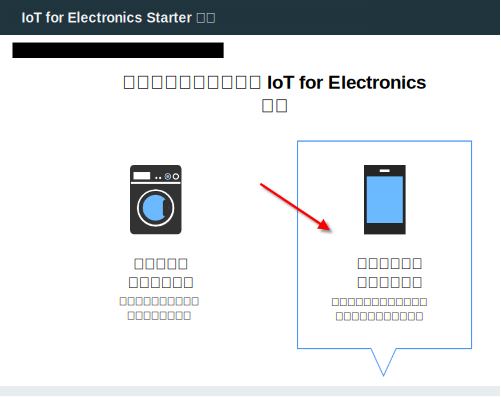
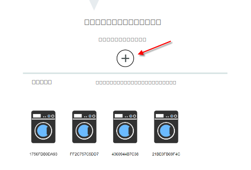
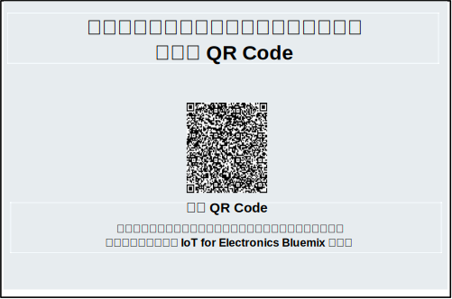
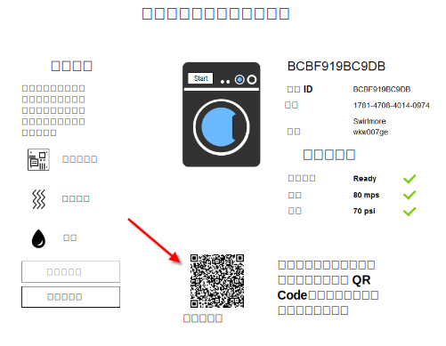

---

copyright:
  years: 2016, 2017
lastupdated: "2017-03-15"
---

<!-- Common attributes used in the template are defined as follows: -->
{:new_window: target="\_blank"}
{:shortdesc: .shortdesc}
{:screen: .screen}
{:codeblock: .codeblock}
{:pre: .pre}

# 使用行動應用程式
{: #iot4e_using_mobile}

開始使用 {{site.data.keyword.iotelectronics_full}} 行動應用程式，以瞭解您如何使用行動裝置（例如智慧型手機或平板電腦）來接收警示、傳送指令，以及檢查已連接應用裝置的狀態。
{:shortdesc}

您必須在 {{site.data.keyword.Bluemix_notm}} 組織中部署 {{site.data.keyword.iotelectronics}} 入門範本實例，才能使用行動應用程式。部署入門範本實例，會自動部署入門範本的元件應用程式及服務。

若要開始使用行動應用程式，請完成下列作業：
1. [下載行動應用程式](#iot4e_downloadmobile)至行動裝置。
2. [將行動應用程式連接至 {{site.data.keyword.iotelectronics}} 環境](#iot4e_connecting_mobile)，並登錄應用裝置。

## 下載行動應用程式
{: #iot4e_downloadmobile}
您可以取得 iOS 或 Android 行動裝置的行動應用程式。
- **iOS 裝置** - 從 Apple App Store 下載應用程式。在行動裝置上，開啟 App Store，然後搜尋 "ibm iot"。選擇 **IBM IoT for Electronics** 然後安裝。或者，您也可以使用 [iTunes](https://itunes.apple.com/us/app/ibm-iot-for-electronics/id1103404928?ls=1&mt=8) 將它安裝到行動裝置。
- **Android 裝置** - 從 Google Play Store 下載應用程式。在行動裝置上，開啟 App Store，然後搜尋 "ibm iot"。選擇 **IBM IoT for Electronics** 然後安裝。

## 連接行動應用程式
{: #iot4e_connecting_mobile}

若要將行動應用程式連接至環境，並登錄應用裝置，請執行下列作業：

1. 開啟 {{site.data.keyword.iotelectronics}} 入門範本應用程式。如需指示，請參閱[開啟入門範本應用程式](iot4ecreatingappliances.html#iot4e_openAppMain)。

2. 選取**遠端控制您的已連接應用裝置**。

    

3. 捲動至標示為**接下來，選擇或新增模擬洗衣機**的區段，然後按一下 + 圖示，以建立一台以上的洗衣機。即會建立新的洗衣機。

    

4.	捲動至連線 QR Code，然後使用您的行動裝置掃描它。連線 QR Code 位於標示**若要將應用程式連接至環境，將會要求您掃描此 QR Code** 的區段。

  

5. 在行動裝置上，輸入登入認證。您的使用者 ID 和密碼可以是任意長度。請記住您的登入認證，以供未來的階段作業使用。您的行動裝置現在已登錄至 {{site.data.keyword.iotelectronics}} 環境，並且您已準備好登錄個別應用裝置。

6. 在電腦上，捲動至模擬洗衣機並按一下它，以顯示其資料和應用裝置 QR Code。

  

7.	使用您的行動裝置掃描洗衣機的 QR Code。現在已登錄洗衣機，而且洗衣機狀態會出現在行動裝置上。

**下一步為何？**
您現在可以使用行動裝置來檢視警示以及控制洗衣機。請執行下列步驟來進行試用：
  - 在電腦上，選取洗衣機的問題，例如主機板故障或強烈振動。問題會將警示傳送至行動裝置。
  - 在行動裝置上，按一下**開始清洗**以啟動機器。您可以在電腦上看到洗衣機經歷每個清洗週期時的狀態變更。
