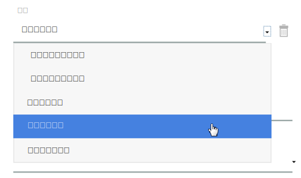
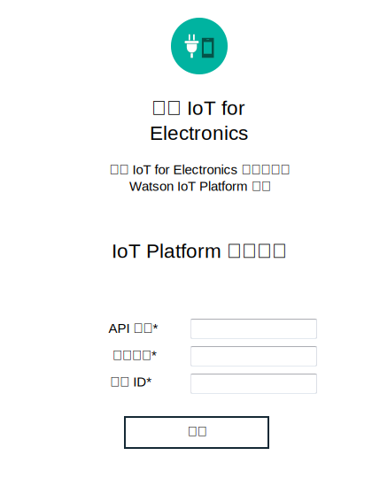

---

copyright:
  years: 2016, 2017
lastupdated: "2017-03-10"
---

<!-- Common attributes used in the template are defined as follows: -->
{:new_window: target="blank"}
{:shortdesc: .shortdesc}
{:screen: .screen}
{:codeblock: .codeblock}
{:pre: .pre}

# 管理資料及裝置
{: #iot4e_dashboard}
從您的已登錄裝置檢視資料，並使用 {{site.data.keyword.iotelectronics}} 儀表板在 {{site.data.keyword.iot_full}} 管理裝置及使用者。
{:shortdesc}

使用 {{site.data.keyword.iotelectronics}} 儀表板來：
- 檢視組織中登錄的應用裝置
- 將使用者對映至應用裝置
- 執行大量動作，例如新增及刪除大量應用裝置
- 擷取應用裝置資料

## 開啟儀表板
{: #iot4e_opendashboard}

**重要事項：**您必須先[啟用儀表板](#iot4e_enabledashboard)，才能第一次使用它。

開啟儀表板
1. 開啟 {{site.data.keyword.Bluemix_notm}} 儀表板，然後按一下 {{site.data.keyword.iot_short_notm}} 服務的名稱。  

    **提示：**服務名稱結尾為 `iotf-service`，並且在「服務供應項目」直欄中說明為 *Internet of Things Platform*。
2. 在「歡迎使用」頁面上，按一下**啟動**。
3. 在功能表上，選取 **Electronics**。

## 啟用儀表板
{: #iot4e_enabledashboard}

執行下列步驟，在 {{site.data.keyword.iot_full}} 內啟用 {{site.data.keyword.iotelectronics}} 儀表板。

  **附註：**開始之前，您必須在 {{site.data.keyword.Bluemix_notm}} 組織中部署 {{site.data.keyword.iotelectronics}} 入門範本實例。部署入門範本實例，會自動部署元件應用程式及服務（包括 {{site.data.keyword.iot_short_notm}}）。

1. 新增角色至 {{site.data.keyword.iot_short_notm}} API 金鑰。
  1. 開啟 {{site.data.keyword.Bluemix_notm}} 儀表板，然後按一下 {{site.data.keyword.iot_short_notm}} 服務的名稱。  

    **提示：**服務名稱結尾為 `iotf-service`，並且在「服務供應項目」直欄中說明為 *Internet of Things Platform*。
  2. 在「歡迎使用」頁面上，按一下**啟動**。
  3. 在功能表上，選取**應用程式** ，然後按一下 API 金鑰旁的編輯圖示 。
  4. 按一下**新增另一個角色**，然後選取**作業應用程式**。
  5. 按一下**儲存**。

    

2. 找到 {{site.data.keyword.iot_short_notm}} 組織 ID、API 金鑰及鑑別代碼。
  1. 回到 {{site.data.keyword.Bluemix_notm}} 儀表板。
  2. 開啟 {{site.data.keyword.iotelectronics}} 應用程式。

    **提示：**應用程式位於 {{site.data.keyword.Bluemix_notm}} 儀表板的「應用程式」區段。請務必按一下名稱，而不是路徑。
  3. 按一下**運行環境**然後選取**環境變數**，以顯示環境變數。
  4. 捲動至標籤為 `iotf-service` 的區段。複製下列值。在下一個步驟中需要它們。

    - `org` - {{site.data.keyword.iot_short_notm}} 組織 ID
    - `apiKey` - {{site.data.keyword.iot_short_notm}} API 金鑰
    - `apiToken` - {{site.data.keyword.iot_short_notm}} 鑑別記號  

    

3. 在 {{site.data.keyword.iotelectronics}} 服務中輸入 {{site.data.keyword.iot_short_notm}} 認證。

  1. 回到 {{site.data.keyword.Bluemix_notm}} 儀表板。
  2. 按一下服務名稱以開啟 {{site.data.keyword.iotelectronics}} 服務。

    **提示：**服務名稱結尾為 `ibmiotforelectronics`，並且在「服務供應項目」直欄中說明為 *IoT for Electronics*。
  3. 在「歡迎使用」頁面上，輸入您在前一個步驟中找到的 API 金鑰、鑑別記號及組織 ID。
  4. 按一下**更新**以儲存您的項目。

    

4. 您現在可以在 {{site.data.keyword.iot_short_notm}} 中[開啟 {{site.data.keyword.iotelectronics}} 儀表板](#iot4e_opendashboard)。
