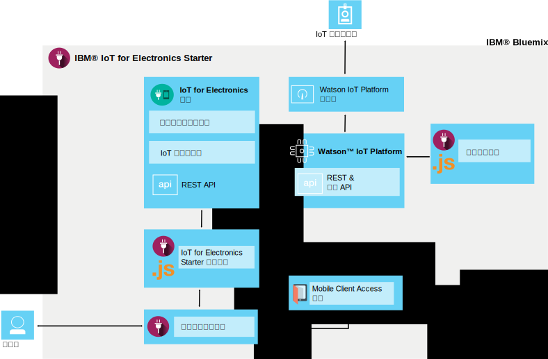

---

copyright:
  years: 2016, 2017
lastupdated: "2017-04-06"
---

<!-- Common attributes used in the template are defined as follows: -->
{:new_window: target="\_blank"}
{:shortdesc: .shortdesc}
{:screen: .screen}
{:codeblock: .codeblock}
{:pre: .pre}

# 關於 {{site.data.keyword.iotelectronics}}
{: #iotelectronics_about}

{{site.data.keyword.iotelectronics_full}} 是完全整合的 IoT 正式作業實例，可讓您的應用程式與已連接的應用裝置、感應器及閘道通訊，並且取用它們所收集的資料。
{:shortdesc}

{{site.data.keyword.iotelectronics}} 使用 {{site.data.keyword.iot_full}} 服務將您的智慧型電子應用裝置連接到您開發的應用程式。它也使用 {{site.data.keyword.iot_short_notm}} 來協助您分析和瞭解來自應用裝置的資料。您可以建立規則以識別需要注意的狀況，以及定義自動回應，例如傳送電子郵件、執行 Node-RED 流程，或是連接至 Web 服務。

## 尋找入門範本
{: #iot4eFindingStarter}
您可以在 {{site.data.keyword.Bluemix_notm}} 型錄的[樣板區段](https://console.{DomainName}/catalog/starters/iot-for-electronics-starter/)，找到 {{site.data.keyword.iotelectronics}} Starter。

## 您可以使用 {{site.data.keyword.iotelectronics}} 做什麼
{: #Features_iote}
使用模擬應用裝置和資料，快速探索 {{site.data.keyword.iotelectronics}} 解決方案的特性。

### 連接模擬應用裝置
建立模擬應用裝置並將它們連接至平台，以查看串流即時資料。使用 Web 應用程式，以模擬應用裝置如何接收指令和執行作業。模擬故障以產生注意事項及警示。會使用洗衣機作為 {{site.data.keyword.iotelectronics}} 入門範本內的模擬應用裝置，來進行示範。您選擇連接的應用裝置可以是任何類型的智慧型電子裝置。

### 試用範例消費者行動應用程式
請使用 iOS 或 Android 行動裝置來查看應用裝置擁有者可以如何與應用裝置互動。使用平台及 {{site.data.keyword.Bluemix_notm}} 傳送指令給應用裝置，以及從應用裝置接收更新。模擬故障事件並在行動應用程式中檢視結果。

### 連接您自己的電子應用裝置
將您自己的應用裝置安全地連接至雲端，然後開始自訂您自己的應用程式。有一組已驗證的範例及秘訣可供使用，您可以修改它們並將它們用於概念證明、測試和試驗。

## {{site.data.keyword.iotelectronics}} Starter 有什麼內容
{: #whatsInStarter}
入門範本樣板會部署整合的 {{site.data.keyword.iotelectronics}} 解決方案。所有元件都已連結，並自動為您部署。入門範本應用程式讓您能使用模擬應用裝置和資料，快速探索解決方案的特性。範例行動應用程式顯示消費者如何登錄、接收警示，以及控制已連接的裝置。您可以使用範例作為起點，建立自己的應用程式，以及從自己的應用裝置收集資料。解決方案中包含下列服務和應用程式：

{{site.data.keyword.iotelectronics}} 入門範本使用 {{site.data.keyword.iotelectronics}} 服務及 API 來與 {{site.data.keyword.iot_short_notm}} 連接。入門範本應用程式及範例行動應用程式可與 {{site.data.keyword.iotelectronics}} 服務進行通訊。入門範本中包括下列元件：

**{{site.data.keyword.iotelectronics}} 服務**支援使用者及應用裝置登錄和通知。

**{{site.data.keyword.iot_full}}** 可讓您的應用程式與已連接的應用裝置、感應器及閘道通訊，並且使用它們所收集的資料。

**{{site.data.keyword.sdk4nodefull}}** 讓您能開發、部署及調整伺服器端的 JavaScript&reg; 應用程式，並提供加強的效能、安全及服務功能。

**{{site.data.keyword.appid_full}}** 為您的行動及 Web 應用程式新增鑑別，並且保護您的後端系統。

**範例行動應用程式**可讓您使用行動裝置（例如智慧型手機或平板電腦）來檢視模擬應用裝置的狀態並與其通訊。請參閱[使用行動應用程式](iotelectronics_config_mobile.html)，以瞭解如何取得行動應用程式。
