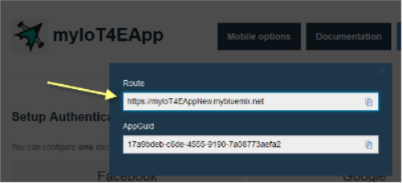
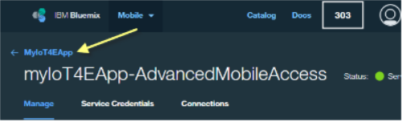
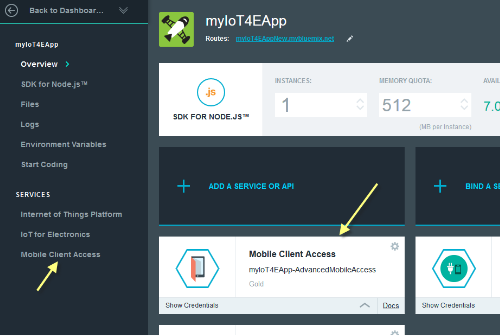

---

copyright:
  years: 2016

---

<!-- Common attributes used in the template are defined as follows: -->
{:new_window: target="\_blank"}
{:shortdesc: .shortdesc}
{:screen:.screen}
{:codeblock:.codeblock}

# Mobile Konnektivität und Sicherheit konfigurieren
{: #iot4e_configureMCA}

*Letzte Aktualisierung: 19. September 2016*
{: .last-updated}

Aktivieren Sie die mobile Kommunikation und Sicherheit durch die Konfiguration von {{site.data.keyword.amafull}}. Diese Task ist erforderlich, damit Sie die mobile Beispiel-App verwenden können. Diese Task muss nur ein Mal durchgeführt werden.
{:shortdesc}

## Vorbereitende Schritte

Bevor Sie damit beginnen, müssen Sie die folgenden Tasks durchführen:
  - Stellen Sie eine Instanz des {{site.data.keyword.iotelectronics}}-Starters in Ihrer {{site.data.keyword.Bluemix_notm}}-Organisation bereit. Mit der Bereitstellung einer Starterinstanz werden automatisch die Komponentenanwendungen und Services, einschließlich {{site.data.keyword.amafull}}, bereitgestellt.

  - Da der Konfigurationsprozess je nach Version Ihrer {{site.data.keyword.Bluemix_notm}}-Konsole variiert, lesen Sie die Anweisungen zur entsprechenden Version.

  Sie können die verwendete Version bestimmen, indem Sie nach den folgenden Optionen suchen:
    - [Neue {{site.data.keyword.Bluemix_notm}}](#configMCAnew)-Ansicht. Wenn Sie die neue {{site.data.keyword.Bluemix_notm}}-Ansicht verwenden, wird die Option **Zur klassischen Ansicht wechseln** im Dashboard oben angezeigt.
    - [Klassische {{site.data.keyword.Bluemix_notm}}](#configMCAclassic)-Ansicht. Wenn Sie die klassische {{site.data.keyword.Bluemix_notm}}-Ansicht verwenden, wird die Option **Try to the New Bluemix** im oben angezeigt.

## {{site.data.keyword.amashort}} in der neuen {{site.data.keyword.Bluemix_notm}}-Ansicht konfigurieren
{: #configMCAnew}

  1. Wenn Sie vor kurzem den {{site.data.keyword.iotelectronics}}-Starter bereitgestellt haben, wird die Registerkarte 'Einführung' der Starter-App angezeigt. Fahren Sie mit dem nächsten Schritt in den Anweisungen fort. Wenn die Starter-App nicht angezeigt wird, öffnen Sie das {{site.data.keyword.Bluemix_notm}}-Dashboard und starten Sie Ihre {{site.data.keyword.iotelectronics}}-Starter-Anwendung, indem Sie auf die Kachel für die Starteranwendung klicken.

    

  2. Klicken Sie auf der Registerkarte **Verbindungen** auf den {{site.data.keyword.amashort}}-Service, um ihn zu öffnen.

    

  3. Suchen Sie auf der Seite **Setup Authentication** die URL zu Ihrer {{site.data.keyword.iotelectronics}}-Starter-App, in dem Sie auf **Mobile Systemerweiterungen** klicken. Kopieren Sie die URL aus dem Feld **Route**.

      

  4. Im **Abschnitt 'Angepasst' der Seite **Setup Authentication** klicken Sie auf **Konfigurieren**.

         

  5. Geben Sie die folgenden Berechtigungsnachweise zur Authentifizierung ein und klicken Sie dann auf **Speichern**:
    - **Realmname**: Geben Sie **myRealm** ein.
    - **Angepasste ID-Provider-URL**: Geben Sie die URL ein, die Sie zuvor kopiert haben, um Ihre {{site.data.keyword.iotelectronics}}-Starter-App im folgenden Format zu identifizieren: **https://<*myIoT4eStarterApp*>.mybluemix.net**
    - **Weiterleitungs-URIs für Webanwendung**: Lassen Sie dieses Feld leer.

        

  6. Kehren Sie zur Registerkarte 'Verbindungen' der {{site.data.keyword.iotelectronics}}-Starter-Konsole zurück, indem Sie auf den Namen der Starter-App klicken, die oben angezeigt wird.

   

## {{site.data.keyword.amashort}} in der klassischen {{site.data.keyword.Bluemix_notm}}-Ansicht konfigurieren
{: #configMCAclassic}

1. Starten Sie im {{site.data.keyword.Bluemix_notm}}-Dashboard Ihre {{site.data.keyword.iotelectronics}}-Starteranwendung, indem Sie auf die Kachel für die Starteranwendung klicken.

    

2. Klicken Sie in Ihrer Instanz von {{site.data.keyword.iotelectronics}} auf den {{site.data.keyword.amashort}}-Service, um ihn zu öffnen.   

  

2. Suchen Sie auf der Seite **Setup Authentication** die URL zu Ihrer {{site.data.keyword.iotelectronics}}-Starter-App, in dem Sie auf **Mobile Systemerweiterungen** klicken. Kopieren Sie die URL aus dem Feld **Route**.

    

3. Im **Abschnitt 'Angepasst' der Seite **Setup Authentication** klicken Sie auf **Konfigurieren**.

   

4. Geben Sie die folgenden Berechtigungsnachweise zur Authentifizierung ein und klicken Sie dann auf **Speichern**:
   - **Realmname**: Geben Sie **myRealm** ein.
   - **Angepasste ID-Provider-URL**: Geben Sie die URL ein, die Sie zuvor kopiert haben, um Ihre {{site.data.keyword.iotelectronics}}-Starter-App im folgenden Format zu identifizieren: **https://<*myIoT4eStarterApp*>.mybluemix.net**
   - **Weiterleitungs-URIs für Webanwendung**: Lassen Sie dieses Feld leer.

      

5. Führen Sie die folgenden Schritte aus, um zur Registerkarte 'Verbindungen' der {{site.data.keyword.iotelectronics}}-Starter-Konsole zurückzukehren:
  1. Klicken Sie zum Anzeigen des Menüs auf die Doppelpfeile neben der Option **Zurück zum Dashboard** im Abschnitt oben.
  2. Klicken Sie auf **Übersicht**, um zur Starter-Konsole zurückzukehren.  

    
