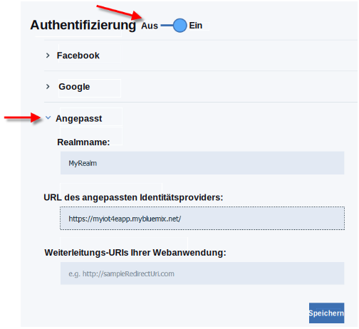
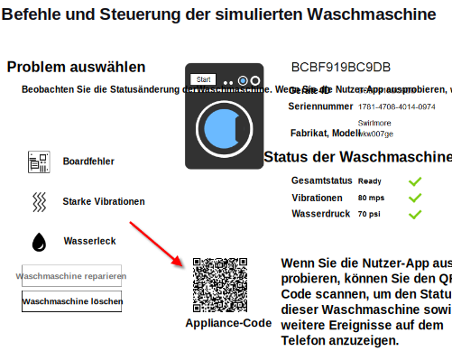

---

copyright:
  years: 2016

---

<!-- Common attributes used in the template are defined as follows: -->
{:new_window: target="_blank"}
{:shortdesc: .shortdesc}
{:screen:.screen}
{:codeblock:.codeblock}

# Mobile App verwenden
{: #iot4e_using_mobile}
*Letzte Aktualisierung: 14. Juni 2016*

Anhand der ersten Schritte mit der mobilen {{site.data.keyword.iotelectronics_full}}-App erfahren Sie, wie Alerts empfangen, Befehle gesendet und der Status Ihrer verbundenen Appliances angezeigt werden.
{:shortdesc}

Führen Sie die folgenden Tasks aus:
1. [Mobile App herunterladen](#iot4e_downloadmobile)
2. [{{site.data.keyword.amafull}} konfigurieren](#iot4e_configureMCA)
3. [Mobiles Gerät mit der {{site.data.keyword.iotelectronics}}-Umgebung verbinden](#iot4e_connecting_mobile)
4. [Eine Appliance auf Ihrem Mobilgerät registrieren und steuern](#iot4e_adding_appliance)

 ## Mobile App herunterladen
 {: #iot4e_downloadmobile}
 Wenn Sie die mobile App wünschen, müssen Sie sie aus dem App-Store von Apple auf Ihr Telefon herunterladen und installieren.  Öffnen Sie den App-Store auf Ihrem Telefon und suchen Sie nach "ibm iot". Wählen Sie **IBM IoT for Electronics** aus und nehmen Sie die Installation vor.

 Alternativ dazu können Sie die App mithilfe von [iTunes](https://itunes.apple.com/de/app/ibm-iot-for-electronics/id1103404928?ls=1&mt=8) auf Ihrem Telefon installieren.

## {{site.data.keyword.amashort}} konfigurieren
{: #iot4e_configureMCA}

Bevor Sie eine Verbindung zur mobilen App herstellen können, müssen Sie {{site.data.keyword.amafull}} konfigurieren.  

  1. Öffnen Sie auf der Registerkarte **Verbindungen** Ihrer {{site.data.keyword.iotelectronics}}-Instanz die Anwendung {{site.data.keyword.amashort}}. (Sie können auf die Anwendung auch über Ihr {{site.data.keyword.Bluemix_notm}}-Dashboard zugreifen.)  

    

  2. Klicken Sie im Abschnitt **Angepasst** auf **Konfigurieren**.

     

  3. Geben Sie die folgenden Authentifizierungsnachweise ein:
    - **Realmname**: Geben Sie **myRealm** ein.
    - **URL**: Geben Sie die URL für die Ermittlung Ihrer {{site.data.keyword.iotelectronics}}-Starter-App im folgenden Format ein: **https://<*myIoT4eStarterApp*>.mybluemix.net**  

      **Tipp:** Stellen Sie sicher, dass Sie in der URL das Präfix für sichere Verbindungen `https://` verwenden. Sie finden die URL Ihrer Starter-App durch Klicken auf **Mobile Optionen** heraus.)

    

  4. Speichern Sie alles.

## Verbindung zwischen mobiler App und eigener {{site.data.keyword.iotelectronics}}-Umgebung herstellen
{: #iot4e_connecting_mobile}

Um die simulierten Geräte auf Ihrer mobilen App anzuzeigen, müssen Sie eine Verbindung zwischen der mobilen App und Ihrer {{site.data.keyword.iotelectronics}} Bluemix-Umgebung herstellen.

Führen Sie die folgenden Schritte aus, um eine Verbindung zur mobilen App herzustellen:

  1. Starten Sie Ihre {{site.data.keyword.iotelectronics}}-Anwendung auf Ihrem Computer und klicken Sie auf **App anzeigen**, um die Starter-App anzuzeigen.  

    
  2. Wählen Sie **Verbundene Appliances über Fernzugriff steuern** aus.

  

  3. Erstellen Sie mindestens eine Waschmaschine. Die mobile App kann erst eine Verbindung herstellen, wenn eine Waschmaschine erstellt wurde.

  4.	Blättern Sie zum QR-Code für die Verbindung und scannen Sie ihn mithilfe Ihres Mobilgeräts. Der QR-Code für die Verbindung befindet sich im Abschnitt `To connect the app to the environment, you'll be asked to scan this QR Code`.

  

  5. Geben Sie die Anmeldeberechtigungsnachweise ein. Ihre Benutzer-ID und Ihr Kennwort können eine beliebige Länge haben. Merken Sie sich Ihre Anmeldeberechtigungsnachweise für zukünftige Sitzungen.  

## Eine Appliance auf Ihrem Mobilgerät registrieren und steuern
{: #iot4e_adding_appliance}

Um den Appliancestatus anzuzeigen und Benachrichtigungen zu empfangen, müssen Sie die Appliance mit Ihrer mobilen App registrieren.

Führen Sie die folgenden Schritte aus, um eine Appliance zu registrieren:

  1. Blättern Sie auf Ihrem Computer zu einer simulierten Waschmaschine und klicken Sie darauf, um die Daten und den Appliance-QR-Code dieser Waschmaschine anzuzeigen.

  3.	Verwenden Sie Ihr Mobilgerät, um den QR-Code der Waschmaschine zu scannen, um diese auf Ihrem Mobiltelefon zu registrieren. Der Status der Waschmaschine wird auf Ihrem Mobiltelefon angezeigt.

  4. Wählen Sie auf Ihrem Computer ein Problem mit der Waschmaschine aus, z. B. 'Boardfehler' oder 'Starke Vibrationen'.  Durch das Problem wird ein Alert an Ihr Mobiltelefon gesendet.
