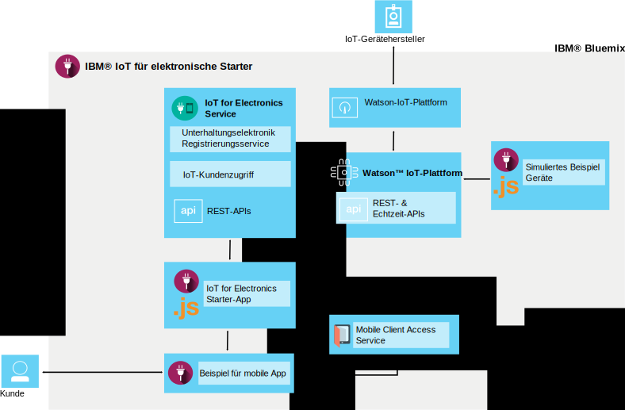

---

copyright:
  years: 2016

---

{:new_window: target="_blank"}
{:shortdesc: .shortdesc}

# Informationen zu {{site.data.keyword.iotelectronics}}
{: #iotelectronics_about}
*Letzte Aktualisierung: 11. Juni 2016*

Bei {{site.data.keyword.iotelectronics_full}} handelt es sich um eine integrierte IoT-Produktionsinstanz, mit der Ihre Apps mit Ihren verbundenen Appliances, Sensoren und Gateways kommunizieren und Daten verarbeiten können, die über diese Komponenten erfasst werden.
{:shortdesc}

{{site.data.keyword.iotelectronics}} nutzt für die Herstellung einer Verbindung zwischen Ihren smarten elektronischen Appliances und den von Ihnen entwickelten Anwendungen den Service {{site.data.keyword.iot_full}}. Außerdem wird {{site.data.keyword.iot_full}} für Ihre Unterstützung bei der Analyse und dem Einblick in die Daten aus Ihren Appliances verwendet. Sie können Regeln erstellen, damit Bedingungen ermittelt werden können, die Ihrer Aufmerksamkeit bedürfen, und um automatische Antworten zu definieren, z. B. das Senden von E-Mails, das Ausführen eines Node-RED-Workflows oder das Herstellen einer Verbindung zu Web-Services.  

## Starter suchen

Der {{site.data.keyword.iotelectronics}}-Starter befindet sich im [Abschnitt 'Boilerplates'](https://console.{DomainName}/catalog/starters/iot-for-electronics-starter/) des {{site.data.keyword.Bluemix_notm}}-Katalogs.  

## Wie {{site.data.keyword.iotelectronics}} genutzt werden kann
{: #Features_iote}
Mithilfe simulierter Appliances und Daten können Sie die Features der {{site.data.keyword.iotelectronics}}-Lösung rasch und unkompliziert kennenlernen.

### Simulierte Appliances verbinden
Sie können simulierte Appliances erstellen und diese mit der Plattform verbinden, um Live-Stream-Daten anzuzeigen. Mithilfe einer webbasierten App können Sie den Empfang von Befehlen und die Durchführung von Operationen für eine Appliance simulieren. Für die Generierung von Bemerkungen und Alerts können Sie Fehler simulieren.

### Beispiel für eine mobile Nutzer-App ausprobieren
Wenn Sie ein iOS-Telefon verwenden, können Sie sehen, wie ein Applianceeigner mit der Appliance interagieren kann. Über die Plattform und mithilfe von {{site.data.keyword.Bluemix_notm}} können Sie Befehle an die Appliance senden und Aktualisierungen aus der Appliance empfangen. Sie können Fehlerereignisse simulieren und die Ergebnisse in der mobilen App anzeigen.

### Eigene elektronische Geräte verbinden
Sie können Ihre eigenen Geräte sicher mit der Cloud verbinden und mit der Anpassung Ihrer eigenen Apps beginnen. Es ist eine Reihe geprüfter Beispiele und Anleitungen verfügbar, die Sie ändern und als Machbarkeitsnachweise, zu Testzwecken und für Versuchsreihen einsetzen können.

## Neuerungen für den {{site.data.keyword.iotelectronics}}-Starter
{: #whatsInStarter}
Die Boilerplate für Starter stellt die integrierte {{site.data.keyword.iotelectronics}}-Lösung bereit.  Alle Komponenten werden für Sie automatisch gebunden und bereitgestellt. Mithilfe simulierter Appliances und Daten können Sie über die Starter-App die Features der Lösung schnell und unkompliziert kennenlernen. Das Beispiel der mobilen App verdeutlicht, wie ein Nutzer die Registrierung durchführen, Alerts empfangen und eine verbundene Appliance steuern kann. Sie können die Beispiele als Ausgangspunkte für die Erstellung eigener Anwendungen und für das Erfassen von Daten aus Ihren eigenen Appliances verwenden. Die Lösung enthält die folgenden Services und Anwendungen:

Der **{{site.data.keyword.iotelectronics}}-Service** unterstützt die Benutzer- und Geräteregistrierung und Benachrichtigungsvorgänge.

Mit **{{site.data.keyword.iot_full}}** können Ihre Apps mit Ihren verbundenen Geräte, Sensoren und Gateways kommunizieren und Daten verarbeiten, die über diese Komponenten erfasst werden.

<!-- **{{site.data.keyword.iotrtinsights_full}}** enables you to enrich and monitor data from your devices, visualize what's happening now, and respond to emerging conditions by using automated actions. -->

**{{site.data.keyword.amafull}}** ermöglicht Benutzern mobiler Apps die Anmeldung mithilfe bereits vorhandener Social Media-Konten und garantiert eine sichere Kommunikation mit Back-End-Systemen.

Mit **{{site.data.keyword.sdk4nodefull}}** können Sie serverseitige JavaScript&reg;-Apps entwickeln, bereitstellen und skalieren; außerdem bietet Ihnen diese Software erweiterte Leistung, Sicherheit und Funktionsfähigkeit.

Mit dem **Beispiel für eine mobile App** können Sie über Ihr iOS-Telefon den Status anzeigen und mit einer simulierten Appliance kommunizieren. [Hier](iotelectronics_config_mobile.html) finden Sie heraus, wie Sie die mobile App abrufen können.

# Zugehörige Links
{: #rellinks}
## Komponenten
{: #general}
* [{{site.data.keyword.iot_short}}](https://new-console.ng.bluemix.net/docs/services/IoT/index.html#gettingstartedtemplate)
* [{{site.data.keyword.iotrtinsights_short}}](https://new-console.ng.bluemix.net/docs/services/iotrtinsights/index.html)   
* [{{site.data.keyword.amafull}}](https://new-console.ng.bluemix.net/docs/services/mobileaccess/index.html)
* [{{site.data.keyword.sdk4nodefull}}](https://new-console.ng.bluemix.net/docs/runtimes/nodejs/index.html#nodejs_runtime)

## API-Dokumentation
{: #api}
*  [{{site.data.keyword.iotelectronics}}](http://ibmiotforelectronics.mybluemix.net/public/iot4eregistrationapi.html)  
* [{{site.data.keyword.iotrtinsights_short}}](https://iotrti-prod.mam.ibmserviceengage.com/apidoc/)
* [{{site.data.keyword.iot_short}}](https://developer.ibm.com/iotfoundation/recipes/api-documentation/)
