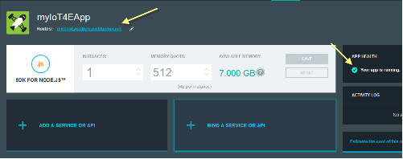

---

copyright:
  years: 2016

---

{:new_window: target="\_blank"}

{:shortdesc: .shortdesc}

# Utilización de la aplicación de inicio
*Última actualización: 15 de septiembre de 2016*
{: .last-updated}

Cree dispositivos simulados en la aplicación de iniciador de {{site.data.keyword.iotelectronics_full}}. Experimente cómo una empresa de producción puede supervisar dispositivos conectados a {{site.data.keyword.iot_short_notm}}. Interactúa manualmente con el dispositivo simulado para desencadenar alertas, notificaciones y acciones.{:shortdesc}

## Apertura de la aplicación de inicio
{: #iot4e_openAppMain}

El método para abrir la aplicación de inicio varía ligeramente en función de la versión de la consola de {{site.data.keyword.Bluemix_notm}} que se utilice, por lo que se recomienda leer las instrucciones de la versión correspondiente.

Puede ver la versión que está utilizando mediante una de las siguientes opciones:
  - [New {{site.data.keyword.Bluemix_notm}}](#iot4e_openApp). Si está utilizando la experiencia New {{site.data.keyword.Bluemix_notm}}, la opción **Probar New Bluemix** *no* aparece en la cabecera de sección.
  - [Classic {{site.data.keyword.Bluemix_notm}}](#iot4e_openApp_c). Si está utilizando la experiencia Classic {{site.data.keyword.Bluemix_notm}}, la opción **Probar New Bluemix** aparece en la cabecera de sección.  

**Consejo:** para cambiar a la experiencia Classic {{site.data.keyword.Bluemix_notm}}, pulse el nombre de usuario en la sección de cabecera y después desplácese hacia abajo y pulse **Cambiar a clásico**. Para cambiar a la experiencia New {{site.data.keyword.Bluemix_notm}}, pulse **Probar New Bluemix** en la sección de cabecera.

### Apertura de la aplicación de inicio en la experiencia New {{site.data.keyword.Bluemix_notm}}.
{: #iot4e_openApp}
1. En el panel de control de {{site.data.keyword.Bluemix_notm}}, inicie la aplicación de inicio de {{site.data.keyword.iotelectronics}} pulsando el mosaico correspondiente.

    

2. Espere a que aparezca el mensaje de estado *La app está ejecutándose* en la cabecera y, a continuación, pulse **Ver app** para mostrar la app del iniciador.   

    

### Apertura de la aplicación de inicio en la experiencia Classic {{site.data.keyword.Bluemix_notm}}.
{: #iot4e_openApp_c}

1. En el panel de control de {{site.data.keyword.Bluemix_notm}}, inicie la aplicación de inicio de {{site.data.keyword.iotelectronics}} pulsando el mosaico correspondiente.

    

2. Espere a que aparezca el mensaje de estado *La app está ejecutándose* en la sección Estado de la app y, a continuación, pulse el URL **Rutas** para mostrar la app del iniciador.   

    

## Creación de dispositivos simulados
{: #iot4eCreateAppliances}

En la app de inicio, puede crear y controlar dispositivos simulados como fabricante de dispositivo o como consumidor. El estado y los datos de sucesos de estos dispositivos simulados se almacenan y se pueden ver en {{site.data.keyword.iot_full}}.

1. Seleccione una
de las opciones siguientes:
    - **Conectar y gestionar dispositivos simulados** para crear dispositivos simulados como fabricante de dispositivo
    - **Controlar de forma remota los dispositivos conectados** para crear dispositivos simulados y conectarse con la [app para móvil de ejemplo](iotelectronics_config_mobile.html) como propietario de dispositivo.

    

2. Desplácese a la sección con la etiqueta **A continuación, elija o añada una nueva arandela simulada** y pulse el icono +. Se crea una nueva arandela.

    

3. Para ver los detalles de la arandela, emitir mandatos y provocar anomalías, pulse una arandela.

  

# Enlaces relacionados
{: #rellinks}

## Documentación de la API
{: #api}
* [{{site.data.keyword.iotelectronics}}API](http://ibmiotforelectronics.mybluemix.net/public/iot4eregistrationapi.html)
* [{{site.data.keyword.iot_short}}API](https://developer.ibm.com/iotfoundation/recipes/api-documentation/)

## Componentes
{: #general}

* [Documentación de {{site.data.keyword.iotelectronics}}](iotelectronics_overview.html)
* [Documentación de {{site.data.keyword.iot_full}}](https://new-console.ng.bluemix.net/docs/services/IoT/index.html)
*  [Documentación de {{site.data.keyword.amashort}}](https://new-console.ng.bluemix.net/docs/services/mobileaccess/overview.html)
* [Documentación de {{site.data.keyword.sdk4nodefull}}](https://new-console.ng.bluemix.net/docs/runtimes/nodejs/index.html#nodejs_runtime)

## Ejemplos
{: #samples}
* [App para móvil de ejemplo](https://new-console.ng.bluemix.net/docs/starters/IotElectronics/iotelectronics_config_mobile.html)
