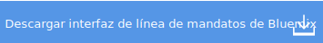
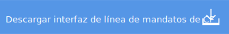
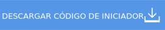

---

 

copyright:

  years: 2015, 2016

 

---

{:new_window: target="_blank"}
{:shortdesc: .shortdesc}
{:prereq: .prereq}
{:download: .download}
{:pre: .pre}
{:app_name: data-hd-keyref="app_name"}
{:app_key: data-hd-keyref="app_key"}
{:app_secret: data-hd-keyref="app_secret"}
{:app_url: data-hd-keyref="app_url"}
{:host: data-hd-keyref="host"}
{:org_name: data-hd-keyref="org_name"}
{:route: data-hd-keyref="route"}
{:space_name: data-hd-keyref="space_name"}
{:service_name: data-hd-keyref="service_name"}
{:service_instance_name: data-hd-keyref="service_instance_name"}
{:user_ID: data-hd-keyref="user_ID"}

# Despliegue de la app con la interfaz de línea de mandatos
*Última actualización: 24 de febrero de 2016*

Puede utilizar la interfaz de línea de mandatos para desplegar y modificar app e instancias de servicio.
{:shortdesc}

Antes de empezar, instale las interfaces de línea de mandatos de {{site.data.keyword.Bluemix}} y Cloud Foundry.

   

**Restricción:** Las herramientas de línea de mandatos no se admiten en Cygwin. Utilice las herramientas en una ventana de línea de mandatos que no sea la ventana de Cygwin.
{:prereq}

Tras instalar las interfaces de línea de mandatos, puede empezar:

  1. {: download} Descargue el código de iniciador. 
      
    
  
  2. Extraiga el paquete en un directorio nuevo para configurar su entorno de desarrollo.
  3. Vaya al nuevo directorio.
  
  <pre class="pre">cd <var class="keyword varname">su_nuevo_directorio</var></pre>
  
   4.  Realice los cambios que considere adecuados al código de su app. Le recomendamos asegurarse de que la app se ejecuta en loca,
antes de volver a desplegarla en {{site.data.keyword.Bluemix}}.  Un archivo que debería anotar es
el archivo `manifest.yml`. Cuando despliegue su app nuevamente en
{{site.data.keyword.Bluemix}}, este archivo se utiliza para determinar el URL de la aplicación, la
asignación de memoria, el número de instancias y otros parámetros cruciales. Puede [leer más sobre el archivo manifest](https://docs.cloudfoundry.org/devguide/deploy-apps/manifest.html){: new_window} en la documentación de Cloud Foundry.
  
  5. Conecte con {{site.data.keyword.Bluemix}}.
  
  <pre class="pre">bluemix api https://api.NombreDominio</pre>
  
  6. Inicie una sesión en {{site.data.keyword.Bluemix_notm}}.
 
  <pre class="pre">bluemix login -u <var class="keyword varname" data-hd-keyref="user_ID">nombre_usuario</var> -o <var class="keyword varname" data-hd-keyref="org_name">nombre_org</var> -s <var class="keyword varname" data-hd-keyref="space_name">nombre_espacio</var></pre>
  
  7. Despliegue la app en {{site.data.keyword.Bluemix_notm}}. Para obtener más información sobre el mandato cf push, consulte [Carga de la aplicación](./upload_app.html).
  
  <pre class="pre">cf push <var class="keyword varname" data-hd-keyref="app_name">nombre_app</var></pre>
  
  8. Acceda a la app especificando el siguiente URL en el navegador:
  
  <pre class="codeblock"><code><var class="keyword varname" data-hd-keyref="host">host</var>.NombreDominioApp</code></pre>
