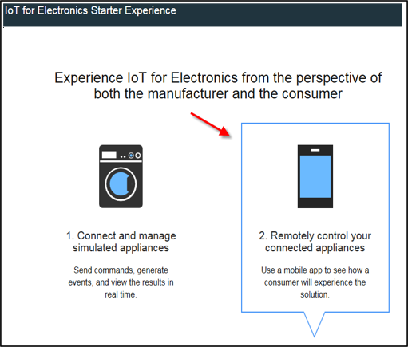
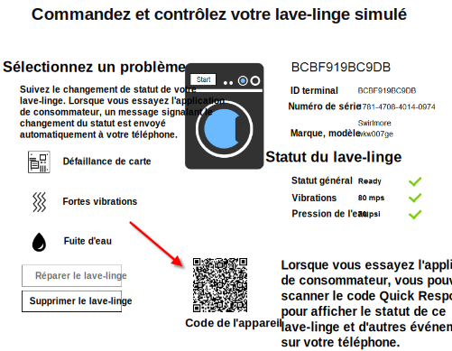

---

copyright:
  years: 2016

---

<!-- Common attributes used in the template are defined as follows: -->
{:new_window: target="_blank"}
{:shortdesc: .shortdesc}
{:screen:.screen}
{:codeblock:.codeblock}

# Utilisation de l'application mobile
{: #iot4e_using_mobile}
*Dernière mise à jour : 14 juin 2016*

Familiarisez-vous avec l'application mobile
{{site.data.keyword.iotelectronics_full}} pour voir comment vous
pouvez recevoir des alertes, envoyer des commandes et vérifier le statut de vos
appareils connectés.
{:shortdesc}

Effectuez les opérations suivantes :
1. [Téléchargez l'application mobile](#iot4e_downloadmobile)
2. [Configurez {{site.data.keyword.amafull}}](#iot4e_configureMCA)
3. [Connectez votre périphérique mobile à l'environnement {{site.data.keyword.iotelectronics}}](#iot4e_connecting_mobile)
4. [Enregistrez et contrôlez un
appareil sur votre périphérique mobile](#iot4e_adding_appliance)

 ## Téléchargement de l'application mobile
 {: #iot4e_downloadmobile}
Pour obtenir l'application mobile, téléchargez-la et installez-la sur votre
téléphone depuis l'App store d'Apple. Sur votre téléphone, ouvrez l'App store
et recherchez "ibm iot". Sélectionnez **IBM IoT for
Electronics** et installez l'application. 

 Sinon, vous pouvez l'installer sur votre téléphone via [iTunes](https://itunes.apple.com/us/app/ibm-iot-for-electronics/id1103404928?ls=1&mt=8).

## Configuration de {{site.data.keyword.amashort}}
{: #iot4e_configureMCA}

Pour pouvoir connecter l'application mobile, vous devez configurer
{{site.data.keyword.amafull}}.  

  1. Dans l'onglet **Connexions**
d'{{site.data.keyword.iotelectronics}}, ouvrez l'application {{site.data.keyword.amashort}}. 
(Vous pouvez également accéder à l'application à partir de votre tableau de
bord {{site.data.keyword.Bluemix_notm}}.)  

    

  2. Dans la section **Personnalisé**, cliquez sur
**Configurer**.

     

  3. Indiquez les données d'authentification suivantes : 
    - **Nom de domaine** : entrez **myRealm**.
    - **URL** : entrez l'URL identifiant votre
application de démarrage {{site.data.keyword.iotelectronics}}
au format suivant : **https://<*monAppDémarrageIoT4e*>.mybluemix.net**  

      **Conseil :** Veillez à employer le préfixe
sécurisé `https://` dans l'URL. Vous trouverez l'URL de votre
application de démarrage en cliquant sur **Options pour application mobile**.)

    

  4. Enregistrez.

## Connexion de l'application mobile à votre environnement {{site.data.keyword.iotelectronics}}
{: #iot4e_connecting_mobile}

Pour visualiser les périphériques simulés sur votre application mobile,
vous devez connecter cette dernière à votre environnement Bluemix {{site.data.keyword.iotelectronics}}.

Pour connecter l'application mobile, procédez comme suit : 

  1. Sur votre ordinateur, démarrez votre application
{{site.data.keyword.iotelectronics}} et cliquez sur **Afficher
l'appli** pour afficher l'application de démarrage.   

    

  2. Sélectionnez **Contrôlez à distance vos appareils connectés**.

  

  3. Créez un ou plusieurs lave-linge. L'application mobile ne peut pas se connecter tant qu'un lave-linge n'est pas créé. 

  4.	Faites défiler l'écran jusqu'au code Quick Response de connexion et
scannez-le à l'aide de votre périphérique mobile. Le code Quick Response de
connexion se trouve dans la section intitulée `Pour connecter l'application à l'environnement, vous devez scanner ce code Quick Response`.

  

  5. Entrez vos données d'identification. Votre ID utilisateur et votre
mot de passe ne sont pas limités en longueur. Mémorisez vos données
d'identification pour les sessions ultérieures.   

## Enregistrement et contrôle d'un appareil sur votre périphérique mobile 
{: #iot4e_adding_appliance}

Pour afficher le statut d'un appareil et recevoir les notifications
associées, vous devez enregistrer l'appareil à l'aide de votre application mobile. 

Pour enregistrer un appareil, procédez comme suit : 

  1. Sur votre ordinateur, accédez à un lave-linge simulé et cliquez
dessus pour afficher ses données et son code Quick Response d'appareil. 

  3.	A l'aide de votre périphérique mobile, scannez le code Quick
Response du lave-linge pour l'enregistrer sur votre téléphone portable. Le
statut du lave-linge s'affiche sur votre téléphone portable. 

  4. Sur votre ordinateur, sélectionnez un problème lié au lave-linge,
par exemple, Défaillance de carte ou Fortes vibrations. Le problème envoie
alors une alerte à votre téléphone portable. 
