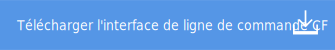

---

 

copyright:

  years: 2015, 2016

 

---

{:new_window: target="_blank"}
{:shortdesc: .shortdesc}

# Téléchargement de votre application
*Dernière mise à jour : 17 février 2016*

Une fois que vous êtes connecté à {{site.data.keyword.Bluemix}}, vous pouvez télécharger votre application avec la commande cf push.
{:shortdesc}

Avant de commencer, effectuez les opérations suivantes :
  1. Installez les interfaces de ligne de commande {{site.data.keyword.Bluemix}} et Cloud Foundry.

    

  2. Connectez-vous à {{site.data.keyword.Bluemix}}.

  <pre class="pre">bluemix api https://api.nom_domaine</pre>
  
  3. Connectez-vous à {{site.data.keyword.Bluemix_notm}}.

  <pre class="pre">bluemix login -u <var class="keyword varname" data-hd-keyref="user_ID">nom_utilisateur</var> -o
<var class="keyword varname" data-hd-keyref="org_name">nom_org</var> -s <var class="keyword varname" data-hd-keyref="space_name">nom_espace</var></pre>

Lorsqu'une commande **cf push** est émise, l'interface de ligne de commande **cf** met le répertoire de travail à disposition de l'environnement {{site.data.keyword.Bluemix_notm}}, qui utilise un pack de construction pour construire et exécuter l'application.

  1. Depuis le répertoire de votre application, entrez la commande **cf push** avec le nom de l'application. Le nom de l'application doit
être unique dans l'environnement {{site.data.keyword.Bluemix_notm}}.
  
  <pre class="pre">cf push <var class="keyword varname" data-hd-keyref="app_name">nom_app</var> -m 512m</pre>
  
  {{site.data.keyword.Bluemix_notm}} inclut des packs de construction intégrés. Dans certains cas, même pour les packs de construction
intégrés, vous devez indiquer l'option -c afin de spécifier la commande qui est utilisée pour démarrer votre application. Par exemple, vous devez utiliser l'option -c pour envoyer votre application Node.js par commande push :
  
  <pre class="pre">cf push <var class="keyword varname" data-hd-keyref="app_name">nom_app</var> -c commande_démarrage</pre>
  
  De plus, l'application Node.js doit contenir un fichier package.json valide.

  Tous les autres packs de construction externes doivent être envoyés par commande push avec l'option -b. Par exemple :

  <pre class="pre">cf push <var class="keyword varname" data-hd-keyref="app_name">nom_app</var> -b URL_pack_construction</pre>
  
  **Astuce :** lorsque vous utilisez la commande **cf push**, l'interface de ligne de commande
**cf** copie tous les fichiers et les répertoires depuis votre répertoire de travail vers Bluemix. Assurez-vous que votre répertoire de travail contient uniquement les fichiers requis.

  La commande cf push télécharge et déploie votre application dans {{site.data.keyword.Bluemix_notm}}. Voir
[Commandes cf](../cli/reference/cfcommands/index.html) pour plus d'informations sur cf push. Voir
[Utilisation de packs de construction de communauté](../cfapps/byob.html) pour des informations sur les packs de construction.

  2. Si vous modifiez votre application, vous pouvez télécharger ces modifications en entrant à nouveau la commande cf push. L'interface de ligne de
commande cf utilise vos options précédentes et vos réponses aux invites pour mettre à jour n'importe quelle instance en cours d'exécution de votre application avec
les nouvelles parties de code.

**Astuce :** vous pouvez également télécharger ou déployer une application à partir de DevOps Services. Voir [Developing a {{site.data.keyword.Bluemix_notm}} application in Node.js with the Web IDE](https://hub.jazz.net/tutorials/devopsweb/){: new_window}.
