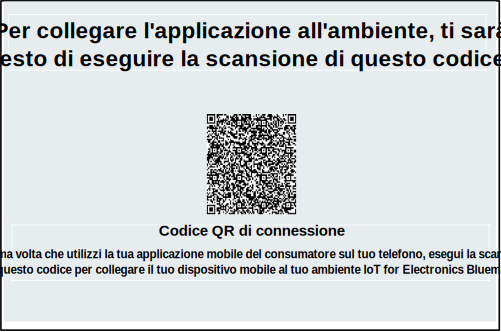
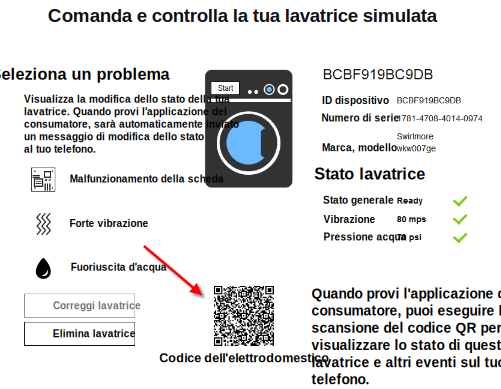

---

copyright:
  years: 2016

---

<!-- Common attributes used in the template are defined as follows: -->
{:new_window: target="_blank"}
{:shortdesc: .shortdesc}
{:screen:.screen}
{:codeblock:.codeblock}

# Utilizzo dell'applicazione mobile
{: #iot4e_using_mobile}
*Ultimo aggiornamento: 14 giugno 2016*

Introduzione all'applicazione mobile {{site.data.keyword.iotelectronics_full}} per vedere come ricevere avvisi, inviare comandi e controllare lo stato delle tue applicazioni collegate.
{:shortdesc}

Completare le seguenti attività:
1. [Scarica l'applicazione mobile di esempio](#iot4e_downloadmobile)
2. [Configura {{site.data.keyword.amafull}}](#iot4e_configureMCA)
3. [Collega il tuo dispositivo mobile all'ambiente {{site.data.keyword.iotelectronics}}](#iot4e_connecting_mobile)
4. [Registra e controlla un'applicazione sul tuo dispositivo mobile](#iot4e_adding_appliance)

 ## Scaricamento dell'applicazione mobile
 {: #iot4e_downloadmobile}
 Per ottenere l'applicazione mobile, scaricala e installala sul tuo telefono dall'Apple App store.  Sul tuo telefono, apri l'App store e cerca "ibm iot". Scegli **IBM IoT for Electronics** e installa.

 In alternativa, puoi installarla nel tuo telefono utilizzando [iTunes](https://itunes.apple.com/us/app/ibm-iot-for-electronics/id1103404928?ls=1&mt=8).

## Configurazione di {{site.data.keyword.amashort}}
{: #iot4e_configureMCA}

Prima di poterti collegare all'applicazione mobile, devi configurare {{site.data.keyword.amafull}}.  

  1. Nella scheda **Connessioni** nel tuo {{site.data.keyword.iotelectronics}}, apri l'applicazione {{site.data.keyword.amashort}}. (Puoi anche accedere all'applicazione dal dashboard {{site.data.keyword.Bluemix_notm}}.)  

    

  2. Nella sezione **Personalizzato**, fai clic su **Configura**.

     

  3. Immetti le seguenti credenziali di autenticazione:
    - **Nome realm**: immetti **myRealm**.
    - **URL**: immetti l'URL per identificare la tua applicazione starter {{site.data.keyword.iotelectronics}} nel seguente formato: **https://<*myIoT4eStarterApp*>.mybluemix.net**  

      **Suggerimento:** assicurati di utilizzare il prefisso sicuro `https://` nell'URL. Puoi trovare l'URL della tua applicazione starter facendo clic su **Opzioni per dispositivi mobili**.) 

    

  4. Salva.

## Collegamento dell'applicazione mobile al tuo ambiente {{site.data.keyword.iotelectronics}}
{: #iot4e_connecting_mobile}

Per visualizzare i dispositivi simulati sulla tua applicazione mobile, devi collegare l'applicazione mobile al tuo ambiente Bluemix {{site.data.keyword.iotelectronics}}.

Per collegare l'applicazione mobile, completa la seguente procedura:

  1. Sul tuo computer, avvia la tua applicazione {{site.data.keyword.iotelectronics}} e fai clic su **Visualizza applicazione** per visualizzare l'applicazione starter.  

    
  2. Seleziona **Controlla in remoto le tue applicazioni collegate**.

  

  3. Crea una o più rondelle. L'applicazione mobile non può collegarsi finché non viene creata una rondella.

  4.	Passa al codice QR di connessione e scansionalo utilizzando il tuo dispositivo mobile. Il codice QR di connessione è posizionato nella sezione etichettata `Per collegare l'applicazione all'ambiente, ti verrà richiesto di scansionare questo codice QR`.

  

  5. Immetti le credenziali di accesso. I tuoi ID e password possono essere di qualsiasi lunghezza. Ricorda le tue credenziali di accesso per sessioni future.  

## Registrazione e controllo di un'applicazione sul tuo dispositivo mobile
{: #iot4e_adding_appliance}

Per visualizzare lo stato dell'applicazione e ricevere notifiche, devi registrare l'applicazione utilizzando l'applicazione mobile.

Per registrare un'applicazione, completa la seguente procedura:

  1. Sul tuo computer, passa a una rondella simulata e fai clic su di essa per visualizzarne i dati e il codice QR dell'applicazione.

  3.	Utilizza il tuo dispositivo mobile per scansionare il codice QR della rondella per registrarla sul tuo cellulare. Vedrai lo stato della rondella sul tuo cellulare.

  4. Sul tuo computer, seleziona un problema con la rondella, come Board Failure o Strong Vibration.  Il problema invia un avviso al tuo cellulare.
