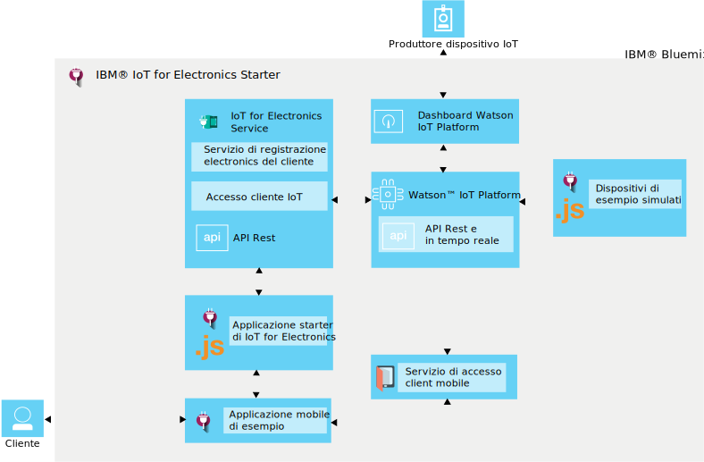

---

copyright:
  years: 2016

---

{:new_window: target="_blank"}
{:shortdesc: .shortdesc}

# Informazioni su {{site.data.keyword.iotelectronics}}
{: #iotelectronics_about}
*Ultimo aggiornamento: 11 giugno 2016*

{{site.data.keyword.iotelectronics_full}} è un'istanza di produzione totalmente integrata IoT che permette alle tue applicazioni di comunicare e utilizzare i dati raccolti dalle tue applicazioni, sensori e gateway collegati.
{:shortdesc}

{{site.data.keyword.iotelectronics}} utilizza il servizio {{site.data.keyword.iot_full}} per collegare le tue applicazioni elettroniche smart con le applicazioni che sviluppi. Utilizza anche {{site.data.keyword.iot_full}} per aiutarti nell'analizzare e comprendere i dati dalle tue applicazioni. Puoi stabilire delle regole per identificare delle condizioni che necessitano di attenzione e definire delle risposte automatizzate definite, come l'invio di email, l'esecuzione di un flusso di lavoro Node-RED o il collegamento ai servizi web.  

## Ricerca dello starter

Puoi trovare lo starter {{site.data.keyword.iotelectronics}} nella sezione [Contenitori tipo](https://console.{DomainName}/catalog/starters/iot-for-electronics-starter/) del catalogo {{site.data.keyword.Bluemix_notm}}.  

## Cosa puoi fare con {{site.data.keyword.iotelectronics}}
{: #Features_iote}
Esplorare velocemente le funzioni della soluzione {{site.data.keyword.iotelectronics}} utilizzando dati e applicazioni simulate.

### Collegamento di applicazioni simulate
Crea applicazioni simulate e collegale alla piattaforma per visualizzare i dati live in streaming. Utilizza un'applicazione basata sul web per simulare come un'applicazione riceve i comandi ed esegue le operazioni. Imita malfunzionamenti per generare avvisi e notifiche.

### Prova un'applicazione mobile utente di esempio
Utilizza un telefono iOS per visualizzare come un proprietario dell'applicazione può interagire con l'applicazione. Invia comandi all'applicazione e ricevi aggiornamenti dall'applicazione utilizzando la piattaforma e {{site.data.keyword.Bluemix_notm}}. Imita malfunzionamenti di eventi e visualizza i risultati nell'applicazione mobile.

### Collega i tuoi propri dispositivi mobili
Collega i tuoi propri dispositivi in sicurezza al cloud e avvia le tue proprie applicazioni personalizzate. Sono disponibili una serie di 'ricette' e esempi verificati che puoi modificare e utilizzare per prove di concetto, verifica e esperimenti.

## Cosa c'è lo starter {{site.data.keyword.iotelectronics}}
{: #whatsInStarter}
Il contenitore tipo starter distribuisce la soluzione {{site.data.keyword.iotelectronics}} integrata.  Tutti i componenti sono associati e distribuiti automaticamente per te. L'applicazione starter ti permette di esplorare velocemente le funzioni della soluzione utilizzando dati e applicazioni simulate. L'applicazione mobile di esempio ti mostra come un consumatore può registrare, ricevere avvisi e controllare un'applicazione collegata. Puoi utilizzare gli esempi come punti di partenza per la creazione e la raccolta di dati delle tue proprie applicazioni. I seguenti servizi e applicazioni sono inclusi nella soluzione:

**Servizio {{site.data.keyword.iotelectronics}}** supporta le notifiche e la registrazione dispositivo e utente.

**{{site.data.keyword.iot_full}}** permette alle tue applicazioni di comunicare e utilizzare i dati raccolti dai tuoi dispositivi, sensori e gateway collegati.

<!-- **{{site.data.keyword.iotrtinsights_full}}** enables you to enrich and monitor data from your devices, visualize what's happening now, and respond to emerging conditions by using automated actions. -->

**{{site.data.keyword.amafull}}** abilita gli utenti delle applicazioni mobili ad accedere utilizzando gli account social esistenti e verifica che le comunicazioni con i sistemi di backend siano sicure.

**{{site.data.keyword.sdk4nodefull}}** ti abilita a sviluppare, distribuire e ridimensionare le applicazioni JavaScript&reg; lato server e fornisce utilità, sicurezza e prestazioni avanzate.

**Applicazione mobile di esempio** ti permette di visualizzare lo stato e comunicare con un'applicazione simulata utilizzando il tuo telefono iOS. Scopri come ottenere l'applicazione mobile [qui](iotelectronics_config_mobile.html).

# Link correlati
{: #rellinks}
## Componenti
{: #general}
* [{{site.data.keyword.iot_short}}](https://new-console.ng.bluemix.net/docs/services/IoT/index.html#gettingstartedtemplate)
* [{{site.data.keyword.iotrtinsights_short}}](https://new-console.ng.bluemix.net/docs/services/iotrtinsights/index.html)   
* [{{site.data.keyword.amafull}}](https://new-console.ng.bluemix.net/docs/services/mobileaccess/index.html)
* [{{site.data.keyword.sdk4nodefull}}](https://new-console.ng.bluemix.net/docs/runtimes/nodejs/index.html#nodejs_runtime)

## Documentazione API
{: #api}
*  [{{site.data.keyword.iotelectronics}}](http://ibmiotforelectronics.mybluemix.net/public/iot4eregistrationapi.html)  
* [{{site.data.keyword.iotrtinsights_short}}](https://iotrti-prod.mam.ibmserviceengage.com/apidoc/)
* [{{site.data.keyword.iot_short}}](https://developer.ibm.com/iotfoundation/recipes/api-documentation/)
