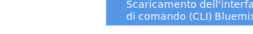

---

 

copyright:

  years: 2015, 2016

 

---

{:new_window: target="_blank"}
{:shortdesc: .shortdesc}
{:prereq: .prereq}
{:download: .download}
{:pre: .pre}
{:app_name: data-hd-keyref="app_name"}
{:app_key: data-hd-keyref="app_key"}
{:app_secret: data-hd-keyref="app_secret"}
{:app_url: data-hd-keyref="app_url"}
{:host: data-hd-keyref="host"}
{:org_name: data-hd-keyref="org_name"}
{:route: data-hd-keyref="route"}
{:space_name: data-hd-keyref="space_name"}
{:service_name: data-hd-keyref="service_name"}
{:service_instance_name: data-hd-keyref="service_instance_name"}
{:user_ID: data-hd-keyref="user_ID"}

# Distribuzione della tua applicazione con l'interfaccia riga di comando
*Ultimo aggiornamento: 24 febbraio 2016*

Puoi usare l'interfaccia riga di comando per distribuire e modificare applicazioni e istanze del servizio.
{:shortdesc}

Prima di iniziare, installa le interfacce riga di comando Cloud Foundry e {{site.data.keyword.Bluemix}}.

   

**Limitazione:** gli strumenti della riga di comando non sono supportati da Cygwin. Utilizzali in una finestra della riga di comando diversa da quella di Cygwin.
{:prereq}

Una volta installate le interfacce riga di comando, puoi iniziare a lavorare:

  1. {: download} Scarica il tuo codice starter. 
      
    
  
  2. Estrai il pacchetto in una nuova directory per configurare il tuo ambiente di sviluppo.
  3. Passa alla tua nuova directory.
  
  <pre class="pre">cd <var class="keyword varname">your_new_directory</var></pre>
  
   4.  Apporta le modifiche al codice della tua applicazione, adattandolo. Ti suggeriamo di accertarti che l'applicazione venga eseguita in locale prima di eseguirne la distribuzione a {{site.data.keyword.Bluemix}}.  Presta particolare attenzione al file `manifest.yml`. Quando ridistribuisci la tua applicazione a {{site.data.keyword.Bluemix}}, questo file viene utilizzato per determinare l'URL, l'allocazione di memoria, il numero di istanze e altri parametri fondamentali della tua applicazione. Per [ulteriori informazioni sul file manifest](https://docs.cloudfoundry.org/devguide/deploy-apps/manifest.html){: new_window}, consulta la documentazione Cloud Foundry.
  
  5. Stabilisci una connessione a {{site.data.keyword.Bluemix}}.
  
  <pre class="pre">bluemix api https://api.DomainName</pre>
  
  6. Accedi a {{site.data.keyword.Bluemix_notm}}.
 
  <pre class="pre">bluemix login -u <var class="keyword varname" data-hd-keyref="user_ID">nome_utente</var> -o <var class="keyword varname" data-hd-keyref="org_name">nome_organizzazione</var> -s <var class="keyword varname" data-hd-keyref="space_name">nome_spazio</var></pre>
  
  7. Distribuisci la tua applicazione a {{site.data.keyword.Bluemix_notm}}. Per ulteriori informazioni sul comando cf push, vedi [Caricamento della tua applicazione](./upload_app.html).
  
  <pre class="pre">cf push <var class="keyword varname" data-hd-keyref="app_name">nomeapplicazione</var></pre>
  
  8. Accedi alla tua applicazione immettendo il seguente URL
nel browser:
  
  <pre class="codeblock"><code><var class="keyword varname" data-hd-keyref="host">host</var>.AppDomainName</code></pre>
