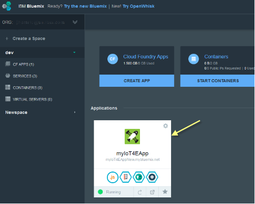

---

copyright:
  years: 2016

---

<!-- Common attributes used in the template are defined as follows: -->
{:new_window: target="\_blank"}
{:shortdesc: .shortdesc}
{:screen:.screen}
{:codeblock:.codeblock}

# モバイルの接続およびセキュリティーの構成
{: #iot4e_configureMCA}

*最終更新日: 2016 年 9 月 19 日*
{: .last-updated}

{{site.data.keyword.amafull}} を構成することによって、モバイル通信およびセキュリティーを有効にします。このタスクは、サンプル・モバイル・アプリを使用するために必要であり、1 回だけ実行すればすみます。
{:shortdesc}

## 始める前に

開始する前に、以下のタスクを完了しておく必要があります。
  - {{site.data.keyword.iotelectronics}} スターターのインスタンスを {{site.data.keyword.Bluemix_notm}} 組織にデプロイします。スターターのインスタンスをデプロイすると、{{site.data.keyword.amafull}} を含めて、コンポーネント・アプリケーションおよびサービスが自動的にデプロイされます。

  - 構成プロセスは、どのバージョンの {{site.data.keyword.Bluemix_notm}} コンソールを使用しているのかによって少し異なるため、該当のバージョンの手順を参照する必要があります。

  使用しているバージョンは、以下のオプションを探すことによって判別できます。
    - [新しい {{site.data.keyword.Bluemix_notm}}](#configMCAnew)。新しい {{site.data.keyword.Bluemix_notm}} エクスペリエンスを使用している場合、ダッシュボードのヘッダー・セクションに**「クラシック・エクスペリエンスに進む (Go to the Classic Experience)」**というオプションが表示されます。
    - [クラシック {{site.data.keyword.Bluemix_notm}}](#configMCAclassic)。クラシック {{site.data.keyword.Bluemix_notm}} エクスペリエンスを使用している場合、ヘッダー・セクションに**「Try the New Bluemix」**というオプションが表示されます。

## 新しい {{site.data.keyword.Bluemix_notm}} エクスペリエンスでの {{site.data.keyword.amashort}} の構成
{: #configMCAnew}

  1. {{site.data.keyword.iotelectronics}} スターターをデプロイしたばかりの場合、スターター・アプリの「開始」タブが表示されます。この場合は次のステップに進んでください。スターター・アプリが表示されていない場合、{{site.data.keyword.Bluemix_notm}} ダッシュボードを開き、{{site.data.keyword.iotelectronics}} スターター・アプリケーションのタイルをクリックして、このアプリケーションを開始します。

    

  2. **「接続」**タブで、{{site.data.keyword.amashort}} サービスをクリックして開きます。

    

  3. **「認証のセットアップ」**ページで、**「モバイル・オプション」**をクリックして {{site.data.keyword.iotelectronics}} スターター・アプリの URL を見つけます。見つかった URL を**「経路」**フィールドにコピーします。

      

  4. **「**認証のセットアップのカスタム・セクション」**ページで、**「構成」**をクリックします。

         

  5. 以下の認証資格情報を入力し、**「保存」**をクリックします。
    - **レルム名**: **myRealm** を入力します。
    - **カスタム ID プロバイダー**: 前にコピーした、{{site.data.keyword.iotelectronics}} スターター・アプリを識別するための URL を、**https://<*myIoT4eStarterApp*>.mybluemix.net** の形式で入力します。
    - **Web アプリケーションのリダイレクト URI (Your Web Application Redirect URIs)**: このフィールドはブランクのままにします。

        

  6. ヘッダー・セクションにあるスターター・アプリの名前をクリックして、{{site.data.keyword.iotelectronics}} スターター・コンソールの「接続」タブに戻ります。

   

## クラシック {{site.data.keyword.Bluemix_notm}} エクスペリエンスでの {{site.data.keyword.amashort}} の構成
{: #configMCAclassic}

1. {{site.data.keyword.Bluemix_notm}} ダッシュボードで {{site.data.keyword.iotelectronics}} スターター・アプリケーションのタイルをクリックして、このアプリケーションを開始します。

    

2. {{site.data.keyword.iotelectronics}} のインスタンスで、{{site.data.keyword.amashort}} サービスをクリックして開きます。   

  

2. **「認証のセットアップ」**ページで、**「モバイル・オプション」**をクリックして {{site.data.keyword.iotelectronics}} スターター・アプリの URL を見つけます。見つかった URL を**「経路」**フィールドにコピーします。

    

3. **「**認証のセットアップのカスタム・セクション」**ページで、**「構成」**をクリックします。

   

4. 以下の認証資格情報を入力し、**「保存」**をクリックします。
   - **レルム名**: **myRealm** を入力します。
   - **カスタム ID プロバイダー**: 前にコピーした、{{site.data.keyword.iotelectronics}} スターター・アプリを識別するための URL を、**https://<*myIoT4eStarterApp*>.mybluemix.net** の形式で入力します。
   - **Web アプリケーションのリダイレクト URI (Your Web Application Redirect URIs)**: このフィールドはブランクのままにします。

      

5. 次のように、{{site.data.keyword.iotelectronics}} スターター・コンソールの「接続」タブに戻ります。
  1. ヘッダー・セクションの**「ダッシュボードに戻る (Back to the Dashboard)」**オプションの横にある二重矢印をクリックして、メニューを表示します。
  2. **「概要」**をクリックして、スターター・コンソールに戻ります。  

    
