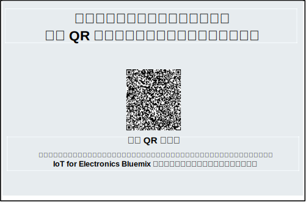
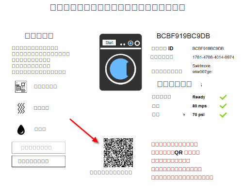

---

copyright:
  years: 2016

---

<!-- Common attributes used in the template are defined as follows: -->
{:new_window: target="_blank"}
{:shortdesc: .shortdesc}
{:screen:.screen}
{:codeblock:.codeblock}

# モバイル・アプリの使用
{: #iot4e_using_mobile}
*最終更新日: 2016 年 6 月 14 日*

{{site.data.keyword.iotelectronics_full}} モバイル・アプリの使用を開始して、アラートの受信、コマンドの送信、接続された電気製品の状況のチェックをどのように実行できるか確認します。
{:shortdesc}

以下の作業を実行します。
1. [モバイル・アプリをダウンロードする](#iot4e_downloadmobile)
2. [{{site.data.keyword.amafull}} を構成する](#iot4e_configureMCA)
3. [モバイル・デバイスを {{site.data.keyword.iotelectronics}} 環境に接続する](#iot4e_connecting_mobile)
4. [モバイル・デバイス上で電気製品を登録して制御する](#iot4e_adding_appliance)

 ## モバイル・アプリをダウンロードする
 {: #iot4e_downloadmobile}
モバイル・アプリを入手するには、Apple App Store からデバイス上にダウンロードしてインストールします。デバイス上で App Store を開き、「ibm iot」を検索します。**「IBM IoT for Electronics」**を選択してインストールします。

 別の方法として、[iTunes](https://itunes.apple.com/us/app/ibm-iot-for-electronics/id1103404928?ls=1&mt=8) を利用してデバイス上にインストールすることもできます。

## {{site.data.keyword.amashort}} を構成する
{: #iot4e_configureMCA}

モバイル・アプリを接続するには、その前に {{site.data.keyword.amafull}} を構成する必要があります。  

  1. {{site.data.keyword.iotelectronics}} の**「接続」**タブで、{{site.data.keyword.amashort}} アプリケーションを開きます。({{site.data.keyword.Bluemix_notm}} ダッシュボードからこのアプリケーションにアクセスすることもできます。)  

    

  2. **「カスタム」**セクションで、**「構成」**をクリックします。

     

  3. 以下の認証資格情報を入力します。
    - **レルム名**: **myRealm** を入力します。
    - **URL**: {{site.data.keyword.iotelectronics}} スターター・アプリを指定するための URL を次の形式で入力します。**https://<*myIoT4eStarterApp*>.mybluemix.net**  

      **ヒント:** URL ではセキュアな `https://` 接頭部を必ず使用してください。スターター・アプリの URL を確認するには、**「モバイル・オプション」**をクリックします。

    

  4. 保存します。

## モバイル・アプリを {{site.data.keyword.iotelectronics}} 環境に接続する
{: #iot4e_connecting_mobile}

モバイル・アプリでシミュレート装置を表示するには、モバイル・アプリを {{site.data.keyword.iotelectronics}} Bluemix 環境に接続する必要があります。

モバイル・アプリを接続するには、以下のステップを実行します。

  1. コンピューター上で {{site.data.keyword.iotelectronics}} アプリケーションを開始し、**「アプリの表示 (View App)」**をクリックしてスターター・アプリを表示します。  

  」")  
  2. **「接続された電気製品をリモート制御する (Remotely control your connected appliances)」**を選択します。

  ")

  3. 洗濯機を 1 つ以上作成します。洗濯機が作成されるまではモバイル・アプリを接続できません。

  4.	接続 QR コードまでスクロールし、モバイル・デバイスを使用してそれをスキャンします。接続 QR コードは、`「アプリを環境に接続するために、この QR コードのスキャンが必要になります (To connect the app to the environment, you'll be asked to scan this QR Code)」`と表記されたセクションにあります。

  

  5. ログイン資格情報を入力します。ユーザー ID とパスワードの長さに制限はありません。後のセッションのために、ログイン資格情報を忘れないようにしてください。  

## モバイル・デバイス上で電気製品を登録して制御する
{: #iot4e_adding_appliance}

電気製品の状況を表示し、通知を受信するには、モバイル・アプリを使用して電気製品を登録する必要があります。

電気製品を登録するには、以下のステップを実行します。

  1. コンピューター上で、シミュレート洗濯機までスクロールし、それをクリックしてそのデータと電気製品 QR コードを表示します。

  3.	モバイル・デバイスで洗濯機の QR コードをスキャンして、モバイル・デバイスに洗濯機を登録します。モバイル・デバイスに洗濯機の状況が表示されます。

  4. コンピューター上で、ボードの障害や強い振動など、洗濯機の問題を選択します。この問題により、アラートがモバイル・デバイスに送信されます。
