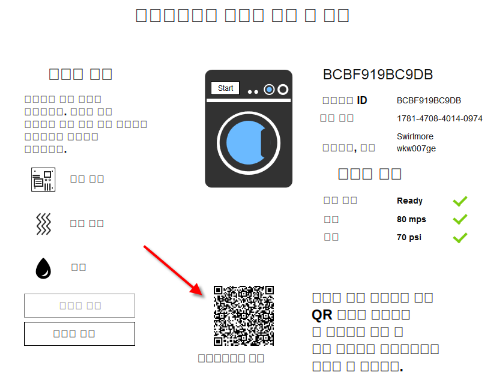

---

copyright:
  years: 2016

---

<!-- Common attributes used in the template are defined as follows: -->
{:new_window: target="_blank"}
{:shortdesc: .shortdesc}
{:screen:.screen}
{:codeblock:.codeblock}

# 모바일 앱 사용
{: #iot4e_using_mobile}
*마지막 업데이트 날짜: 2016년 6월 14일*

{{site.data.keyword.iotelectronics_full}} 모바일 앱을 시작하여 어떻게 경보를 수신하고, 명령을 전송하며, 연결된 어플라이언스의 상태를 확인하는지 알아보십시오.
{:shortdesc}

다음 태스크를 완료하십시오. 
1. [모바일 앱 다운로드](#iot4e_downloadmobile)
2. [{{site.data.keyword.amafull}} 구성](#iot4e_configureMCA)
3. [모바일 디바이스를 {{site.data.keyword.iotelectronics}} 환경에 연결](#iot4e_connecting_mobile)
4. [모바일 디바이스의 어플라이언스 등록 및 제어](#iot4e_adding_appliance)

 ## 모바일 앱 다운로드
 {: #iot4e_downloadmobile}
 모바일 앱을 가져오려면, 휴대전화에 Apple App store의 앱을 다운로드하고 설치하십시오. 휴대전화에서 App store를 열고 "ibm iot"를 검색하십시오. **IBM IoT for Electronics**를 선택하고 앱을 설치하십시오. 

 또는 [iTunes](https://itunes.apple.com/us/app/ibm-iot-for-electronics/id1103404928?ls=1&mt=8)를 사용하여 휴대전화에 앱을 설치할 수 있습니다. 

## {{site.data.keyword.amashort}} 구성 
{: #iot4e_configureMCA}

모바일 앱에 연결하기 전에 {{site.data.keyword.amafull}}를 구성해야 합니다.  

  1. {{site.data.keyword.iotelectronics}}의 **연결** 탭에서 {{site.data.keyword.amashort}} 애플리케이션을 여십시오. ({{site.data.keyword.Bluemix_notm}} 대시보드에서도 애플리케이션에 액세스할 수 있습니다.)  

    

  2. **사용자 정의** 섹션에서 **구성**을 클릭하십시오. 

     

  3. 다음 인증 신임 정보를 입력하십시오. 
    - **영역 이름**: **myRealm**을 입력하십시오.
    - **URL**: {{site.data.keyword.iotelectronics}} 스타터 앱을 식별하려면 다음 형식으로 URL을 입력하십시오. **https://<*myIoT4eStarterApp*>.mybluemix.net**  

      **팁:** URL에 보안 `https://` 접두부를 사용해야 합니다. **모바일 옵션**을 클릭하면 스타터의 URL을 확인할 수 있습니다. 

    

  4. 저장하십시오. 

## 모바일 앱을 {{site.data.keyword.iotelectronics}} 환경에 연결
{: #iot4e_connecting_mobile}

모바일 앱에서 시뮬레이션된 디바이스를 보려면, 모바일 앱을 {{site.data.keyword.iotelectronics}} Bluemix 환경에 연결해야 합니다. 

모바일 앱을 연결하려면, 다음 단계를 따르십시오. 

  1. 컴퓨터에서 {{site.data.keyword.iotelectronics}} 애플리케이션을 시작하고 **앱 보기**를 클릭하여 스타터 앱을 표시하십시오.   

    
  2. **연결된 어플라이언스를 원격으로 제어**를 선택하십시오. 

  

  3. 하나 이상의 와셔를 작성하십시오. 와셔가 작성될 때까지 모바일 앱을 연결할 수 없습니다. 

  4.	연결 QR 코드까지 스크롤한 후 모바일 디바이스를 사용하여 코드를 스캔하십시오. 연결 QR 코드는 `앱을 환경에 연결하기 위해, 이 QR 코드를 스캔하도록 요청됩니다.`라는 레이블이 지정된 섹션에 있습니다. 

  

  5. 로그인 신임 정보를 입력하십시오. 사용자 ID 및 비밀번호의 길이는 제한되지 않습니다. 이후 세션을 위해 로그인 신임 정보를 기억하십시오.   

## 모바일 디바이스의 어플라이언스 등록 및 제어
{: #iot4e_adding_appliance}

어플라이언스 상태를 보고 알림을 수신하려면, 모바일 앱을 사용하여 어플라이언스를 등록해야 합니다. 

어플라이언스를 등록하려면, 다음 단계를 완료하십시오. 

  1. 컴퓨터에서 시뮬레이션된 와셔까지 스크롤하고 와셔 데이터 및 어플라이언스 QR 코드를 표시하려면 해당 와셔를 클릭하십시오. 

  3.	모바일 디바이스를 사용하여 휴대전화에서 와셔를 등록하려면 해당 와셔의 QR 코드를 스캔하십시오. 휴대전화에 와셔 상태가 표시됩니다. 

  4. 컴퓨터에서 보드 장애 또는 강한 진동과 같은 와셔 관련 문제점을 선택하십시오. 문제가 발생하면 휴대전화로 경보가 전송됩니다. 
