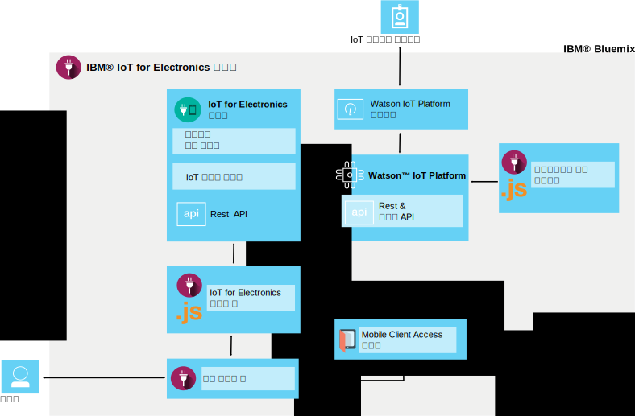

---

copyright:
  years: 2016

---

{:new_window: target="_blank"}
{:shortdesc: .shortdesc}

# {{site.data.keyword.iotelectronics}} 정보
{: #iotelectronics_about}
*마지막 업데이트 날짜: 2016년 6월 11일*

{{site.data.keyword.iotelectronics_full}}는 연결된 어플라이언스, 센서 및 게이트웨이에서 수집한 데이터를 앱이 이용하고 통신할 수 있는 완전하게 통합된 IoT 프로덕션 인스턴스입니다.
{:shortdesc}

{{site.data.keyword.iotelectronics}}는 {{site.data.keyword.iot_full}} 서비스를 사용하여 사용자가 개발하는 애플리케이션과 스마트 전자 어플라이언스를 연결합니다. 또한 어플라이언스의 데이터를 분석하고 이해하는 데 도움을 주기 위해 {{site.data.keyword.iot_full}}을 사용합니다. 주의가 필요한 상태를 식별하고, 이메일 전송, Node-RED 워크플로우 실행 또는 웹 서비스에 연결과 같은 자동화된 응답을 정의하기 위해 규칙을 설정할 수 있습니다.   

## 스타터 찾기

{{site.data.keyword.Bluemix_notm}} 카탈로그의 [표준 유형 섹션](https://console.{DomainName}/catalog/starters/iot-for-electronics-starter/)에서 {{site.data.keyword.iotelectronics}} 스타터를 찾을 수 있습니다.   

## {{site.data.keyword.iotelectronics}}를 사용하여 수행할 수 있는 작업
{: #Features_iote}
시뮬레이션된 어플라이언스 및 데이터를 사용하여 {{site.data.keyword.iotelectronics}} 솔루션의 기능을 빠르게 탐색할 수 있습니다. 

### 시뮬레이션된 어플라이언스 연결
시뮬레이션된 어플라이언스를 작성하고 스트리밍 라이브 데이터를 보기 위해 어플라이언스를 플랫폼에 연결합니다. 웹 기반 앱을 사용하여 어플라이언스가 어떻게 명령을 수신하고 오퍼레이션을 수행하는지 시뮬레이션합니다. 모의 실험에서는 알림 및 경보 생성에 실패합니다. 

### 샘플 소비자 모바일 앱 시도
iOS 휴대전화를 사용하여 어플라이언스 소유자가 어떻게 어플라이언스와 상호작용할 수 있는지 확인합니다. 어플라이언스에 명령을 전송하고 플랫폼 및 {{site.data.keyword.Bluemix_notm}}를 사용하여 어플라이언스에서 업데이트를 수신합니다. 모의 실험에서는 이벤트 장애가 발생하고 모바일 앱에서 결과를 확인합니다. 

### 고유 전자 디바이스 연결
고유 디바이스를 클라우드에 안전하게 연결하고 사용자 고유 앱의 사용자 정의를 시작합니다. 검증된 예제 및 구성 요소 세트가 사용 가능하며 개념 증명, 테스트 및 실험을 위해 이를 사용하고 수정할 수 있습니다. 

## {{site.data.keyword.iotelectronics}} 스타터에 포함된 내용
{: #whatsInStarter}
스타터 표준 유형은 통합 {{site.data.keyword.iotelectronics}} 솔루션을 배치합니다. 모든 컴포넌트가 자동으로 바인드되고 배치됩니다. 스타터 앱은 시뮬레이션된 어플라이언스 및 데이터를 사용하여 솔루션의 기능을 빠르게 탐색할 수 있습니다. 샘플 모바일 앱에서는 이용자가 어떻게 등록하고, 경보를 수신하며, 연결된 어플라이언스를 제어하는지를 보여줍니다. 고유 애플리케이션을 작성하고 고유 어플라이언스에서 데이터를 수집하기 위한 시작점으로 샘플을 사용할 수 있습니다. 다음 서비스 및 애플리케이션이 솔루션에 포함되어 있습니다. 

**{{site.data.keyword.iotelectronics}} 서비스**는 사용자와 디바이스의 등록 및 알림 기능을 지원합니다. 

**{{site.data.keyword.iot_full}}**은 연결된 디바이스, 센서 및 게이트웨이에서 수집한 데이터를 앱에서 사용하고 통신하도록 지원합니다. 

<!-- **{{site.data.keyword.iotrtinsights_full}}** enables you to enrich and monitor data from your devices, visualize what's happening now, and respond to emerging conditions by using automated actions. -->

**{{site.data.keyword.amafull}}**는 모바일 앱 사용자가 기존의 소셜 계정을 사용하여 로그인할 수 있도록 지원하고 백엔드 시스템과의 해당 통신을 안전하게 보호합니다. 

**{{site.data.keyword.sdk4nodefull}}**를 통해 서버 측 JavaScript&reg; 앱을 개발, 배치 및 확장할 수 있으며 사용자에게 향상된 성능, 보안 및 서비스 가능성을 제공합니다. 

**샘플 모바일 앱**을 통해 사용자는 상태를 확인할 수 있으며 iOS 휴대전화를 사용하여 시뮬레이션된 어플라이언스와 통신할 수 있습니다. 모바일 앱을 가져오는 방법은 [여기](iotelectronics_config_mobile.html)를 참조하십시오. 

# 관련 링크
{: #rellinks}
## 컴포넌트
{: #general}
* [{{site.data.keyword.iot_short}}](https://new-console.ng.bluemix.net/docs/services/IoT/index.html#gettingstartedtemplate)
* [{{site.data.keyword.iotrtinsights_short}}](https://new-console.ng.bluemix.net/docs/services/iotrtinsights/index.html)   
* [{{site.data.keyword.amafull}}](https://new-console.ng.bluemix.net/docs/services/mobileaccess/index.html)
* [{{site.data.keyword.sdk4nodefull}}](https://new-console.ng.bluemix.net/docs/runtimes/nodejs/index.html#nodejs_runtime)

## API 문서
{: #api}
*  [{{site.data.keyword.iotelectronics}}](http://ibmiotforelectronics.mybluemix.net/public/iot4eregistrationapi.html)  
* [{{site.data.keyword.iotrtinsights_short}}](https://iotrti-prod.mam.ibmserviceengage.com/apidoc/)
* [{{site.data.keyword.iot_short}}](https://developer.ibm.com/iotfoundation/recipes/api-documentation/)
