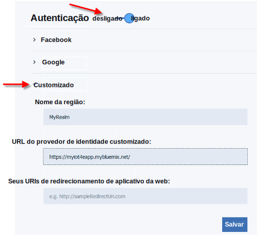
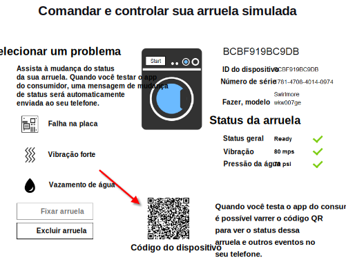

---

copyright:
  years: 2016

---

<!-- Common attributes used in the template are defined as follows: -->
{:new_window: target="_blank"}
{:shortdesc: .shortdesc}
{:screen:.screen}
{:codeblock:.codeblock}

# Usando o aplicativo móvel
{: #iot4e_using_mobile}
*Última atualização: 14 de junho de 2016*

Inicie com o aplicativo móvel do {{site.data.keyword.iotelectronics_full}} para ver como é possível receber alertas, enviar comandos e verificar o status dos seus dispositivos conectados.
{:shortdesc}

Conclua as seguintes tarefas:
1. [Fazer download do aplicativo móvel](#iot4e_downloadmobile)
2. [Configurar
o {{site.data.keyword.amafull}}](#iot4e_configureMCA)
3. [Conecte seu dispositivo móvel ao ambiente {{site.data.keyword.iotelectronics}}](#iot4e_connecting_mobile)
4. [Registre e controle um dispositivo em seu dispositivo móvel](#iot4e_adding_appliance)

 ## Fazendo download do aplicativo móvel
 {: #iot4e_downloadmobile}
Para chegar ao aplicativo móvel, faça download e instale-o em seu telefone a partir da Apple App store.
Em seu telefone, abra a App store e procure por "ibm iot". Escolha **IBM IoT for Electronics** e instale.

 Como alternativa, é possível instalá-lo em seu telefone usando o [iTunes](https://itunes.apple.com/us/app/ibm-iot-for-electronics/id1103404928?ls=1&mt=8).

## Configurando o {{site.data.keyword.amashort}}
{: #iot4e_configureMCA}

Antes de poder conectar-se ao aplicativo móvel, deve-se configurar {{site.data.keyword.amafull}}.  

  1. Na guia **Conexões** em seu {{site.data.keyword.iotelectronics}}, abra o aplicativo {{site.data.keyword.amashort}}. (Também é possível acessar o aplicativo a partir do seu painel {{site.data.keyword.Bluemix_notm}}.)  

    

  2. Na seção **Customizado**, clique em **Configurar**.

     

  3. Insira as credenciais de autenticação a seguir:
    - **Nome da região**: insira **myRealm**.
    - **URL**: insira a URL para identificar seu aplicativo iniciador {{site.data.keyword.iotelectronics}} no
formato a seguir: **https://<*myIoT4eStarterApp*>.mybluemix.net**  

      **Dica:** assegure-se de usar o prefixo seguro `https://` na URL. É possível localizar a URL do seu aplicativo iniciador clicando em **Opções móveis**.)

    

  4. Salve.

## Conectando o aplicativo móvel ao seu ambiente {{site.data.keyword.iotelectronics}}
{: #iot4e_connecting_mobile}

Para visualizar seus dispositivos simulados em seu aplicativo móvel, deve-se conectar o aplicativo móvel ao seu ambiente {{site.data.keyword.iotelectronics}} Bluemix.

Para conectar o aplicativo móvel, siga estas etapas:

  1. Em seu computador, inicie seu aplicativo {{site.data.keyword.iotelectronics}} e clique em **Visualizar aplicativo** para exibir o aplicativo iniciador.  

    
  2. Selecione **Controlar remotamente seus dispositivos conectados**.

  

  3. Crie uma ou mais lavadoras. O aplicativo móvel não pode se conectar até que uma lavadora seja criada.

  4.	Role até o código QR de Conexão e varra-o usando o dispositivo móvel. O código QR de Conexão é localizado na seção rotulada
`Para conectar o aplicativo ao ambiente, será solicitado que varra este Código QR`.

  

  5. Insira as credenciais de login. Sua identificação de usuário e senha podem ter qualquer comprimento. Lembre-se de suas credenciais de login para sessões futuras.  

## Registrando e controlando um dispositivo em seu dispositivo móvel
{: #iot4e_adding_appliance}

Para visualizar o status do dispositivo e receber notificações, deve-se registrar o dispositivo usando seu aplicativo móvel.

Para registrar um dispositivo, conclua as etapas a seguir:

  1. Em seu computador, role até uma lavadora simulada e clique nela para exibir seus dados e código QR do Dispositivo.

  3.	Use seu dispositivo móvel para varrer o código QR da lavadora para registrá-la em seu telefone celular. Você verá o status da lavadora em seu telefone celular.

  4. Em seu computador, selecione um problema com a lavadora, como Falha da placa ou Vibração forte. O problema envia um alerta ao seu telefone celular.
